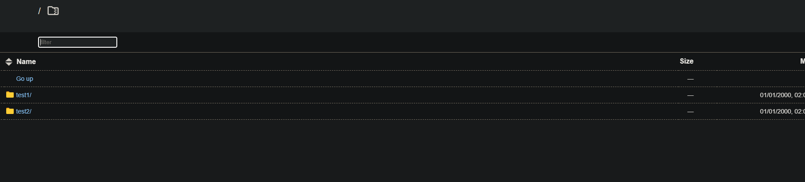
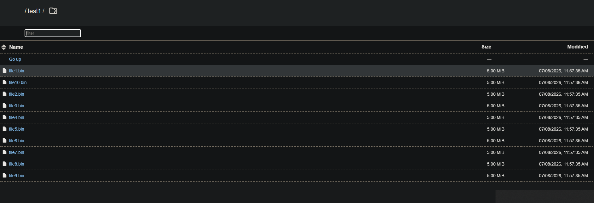
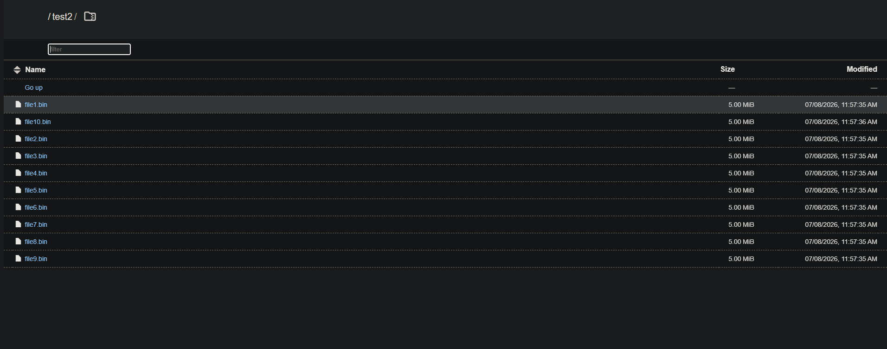

# 🗄️ rclone & Amazon S3 — Bulut Depolama ve Güvenli Erişim

Bu fazda rclone'u inceledim, Amazon S3'e bağlandım. S3'ü daha önce hiç kullanmamıştım, bu faz hem S3'ü hem rclone'u aynı anda öğretti.

---

## S3 Nedir

Amazon S3 (Simple Storage Service), bulut tabanlı bir dosya depolama servisi. Normal bir disk gibi değil — dosyalar internette, her yerden URL ile erişilebilir. İşlemci veya işletim sistemi yok, sadece depolama var. Ne kadar dosya koyarsan koy Amazon halleder, kullandığın kadar ödersin.

S3'teki her bucket varsayılan olarak **private** — kimlik bilgisi olmadan kimse erişemez. Bu kimlik bilgileri AWS Access Key + Secret Key ikilisidir.

---

## rclone Nedir

Bulut depolama servisleri için köprü — Google Drive, S3, Dropbox gibi onlarca servisi destekliyor. Dosya kopyalama, senkronizasyon, şifreleme gibi işlemler yapıyor.

**Örnek:** Evde bir bilgisayar, ofiste bir bilgisayar var — ikisinde de aynı dosyalar olsun istiyorsun. USB taşımak yerine rclone ile ikisini de S3 ile eşitlersin, S3 ortada köprü görevi görür.

---

## Kurulum ve S3 Bağlantısı

```bash
curl https://rclone.org/install.sh | sudo bash
rclone config
```

Yapılandırma sırasında region `eu-central-1` (Frankfurt) seçtim. Burada bir hata yaptım — location constraint için `EU` yazdım, `eu-central-1` yazmam gerekirken. `EU` yazdığımda AB'nin tüm bölgelerini kapsar zannediyordum ama öyle değilmiş — region ile location constraint birebir eşleşmesi gerekiyor. İlk yükleme denemesinde şu hatayı aldım:

```
api error IllegalLocationConstraintException: The EU location constraint is incompatible
for the region specific endpoint this request was sent to.
```

`eu-central-1` yazınca düzeldi.

Bağlantıyı test etmek için:

```bash
rclone ls s3:alifurkan-devops
# (boş bucket, çıktı yok — bağlantı çalışıyor)
```

---

## Performans Parametreleri

### `--transfers N` — Paralel Transfer Sayısı

Aynı anda kaç dosyanın aktarıldığını belirler. Varsayılan 4.

**Örnek:** Kütüphanede tek görevli mi çalışsın, 16 görevli mi? Tek kişi sırayla her kitabı taşır, 16 kişi aynı anda 16 kitap taşır. `--transfers 16` demek 16 görevli çalışsın demek. S3 ve benzeri servisler 16-32 paralel transferi rahatça kaldırır.

### `--checkers N` — Paralel Kontrol Sayısı

Kaç dosyanın aynı anda kontrol edileceğini belirler. Varsayılan 8. Büyük dizinlerde senkronizasyon yaparken bottleneck genellikle transfer değil, kontrol aşamasıdır.

**Bottleneck ne demek:** Bazen dosyaları taşımak değil, hangi dosyaların eksik veya değişmiş olduğunu bulmak daha uzun sürüyor. Tıpkı kütüphanede kitapları taşımaktan önce hangi kitapların eksik olduğunu bulmak gibi — bu arama süreci yavaşsa, taşıma ne kadar hızlı olursa olsun fark etmez.

### `--buffer-size SIZE` — Bellek Tamponu

Her transfer için bellekte tutulacak veri miktarı. Varsayılan 16MB.

**Örnek:** Her görevlinin taşıdığı sepetin büyüklüğü — sepet çok büyük olursa taşımak zorlaşır. 64MB denerken 10 dosya × 64MB = 640MB RAM ayrılmaya çalışıldı ve overhead yarattı, daha yavaş oldu. 16MB daha dengeli.

### `--fast-list` — Hızlı Listeleme

Dizin listelemeyi tek bir API isteğiyle yapar. Milyonlarca dosya olan bucket'larda dakikalar kazandırır ama daha fazla RAM kullanır.

**Örnek:** Normalde rclone klasör klasör geziyor, her adımda deponun bir bölümüne bakıyor. `--fast-list` ile tüm listeyi tek seferde alıyor — hızlı ama o listeyi RAM'de tutmak zorunda. Tıpkı ihtiyacın olacak eşyaları önceden yakına almak gibi — ulaşması kolay ama yer kaplıyor.

### `--bwlimit` — Bant Genişliği Sınırı

**Dikkat:** birim Byte/s, bit/s değil.

```
10 Mbit/s bağlantının yarısını kullanmak istiyorsan:
5 Mbit/s ÷ 8 = 0.625 MB/s → --bwlimit 0.625M
```

**Örnek:** Evde tek bir su borusu var, hem içme suyu hem bahçe sulaması kullanıyor. Bahçeye tam kapasiteyle açarsan içeride su kalmaz. rclone'u sınırlamazsan sunucudaki diğer işlemlere bant genişliği kalmaz — `--bwlimit` ile "şu kadarını kullan, geri kalanını bırak" diyorsun.

### Test Sonuçları

10 tane 5MB'lık dosya (toplam 50MB) ile testler:

**Test 1 — Varsayılan vs Performans parametreleri:**

```bash
time rclone copy ~/test-files s3:alifurkan-devops/test1 -P
# Elapsed time: 1.1s / real: 1.507s

time rclone copy ~/test-files s3:alifurkan-devops/test2 -P \
  --transfers 16 --checkers 16 --buffer-size 16M --fast-list
# Elapsed time: 1.0s / real: 1.373s
```

**Test 2 — `--fast-list` izole test:**

```bash
time rclone copy ~/test-files s3:alifurkan-devops/test1 -P --transfers 4
# Elapsed time: 1.4s / real: 1.851s / Hız: 39 MB/s

time rclone copy ~/test-files s3:alifurkan-devops/test2 -P --transfers 4 --fast-list
# Elapsed time: 1.0s / real: 1.400s / Hız: 50 MB/s
```

|          | `--fast-list` olmadan | `--fast-list` ile |
| -------- | --------------------- | ----------------- |
| **Süre** | 1.851s                | 1.400s            |
| **Hız**  | 39 MB/s               | 50 MB/s           |

`--fast-list` az sayıda dosyada bile %25 fark yarattı — listeleme overhead'i beklenenden büyükmüş.

Fark küçük çünkü dosyalar küçük ve az. İlk denemede `--buffer-size 64M` kullanmıştım, bu sefer daha yavaş oldu — 640MB RAM ayrılmaya çalışılması overhead yarattı. 16M'a düşürünce dengelendi.

**Performans parametreleri yüzlerce dosya veya GB seviyesinde dosyalarda fark yaratır.** Parametreleri körü körüne değil, dosya boyutuna ve bağlantıya göre ayarlamak gerekiyor.

---

## `rclone serve http` — Private S3'ü Dışarıya Açmak

S3 bucket'ı private — kimlik bilgisi olmadan erişilemiyor. Ama bazı kullanıcıların dosyalara erişmesi gerekiyor. Her kullanıcıya AWS kimlik bilgisi vermek riskli ve zahmetli — biri işten çıksa key'i iptal etmen gerekir.

Çözüm: rclone ortaya koyulur.

```
Kullanıcı → rclone (HTTP) → Private S3 (AWS kimlik bilgileriyle)
```

**Örnek:** Özel bir kütüphane var, içeri girmek için üyelik kartı gerekiyor. Önüne bir görevli koydun — görevli üyelik kartına sahip (AWS kimlik bilgileri), içeri girip istenen dosyayı getiriyor. Dışarıdakiler kartı olmadan kütüphaneye giremez, ama görevliye "şu dosyayı getir" diyebiliyorlar. Kullanıcılar S3'ün varlığından haberdar bile olmuyor.

```bash
rclone serve http s3:alifurkan-devops --addr :8090
```

Windows'tan tarayıcıda `http://91.151.88.38:8090` adresine gidince S3'teki klasörler ve dosyalar görüntülendi — kimse AWS kimlik bilgisi kullanmadı, S3'ü bilmiyordu.

```
http://91.151.88.38:8090           → test1/ ve test2/ klasörleri listelendi
http://91.151.88.38:8090/test1/    → 10 × 5.00 MiB dosya görüntülendi (file1.bin - file10.bin)
http://91.151.88.38:8090/test2/    → aynı dosyalar, farklı klasör
```





S3 bucket'ı hâlâ private — ama rclone üzerinden herkes erişebildi.

**Neden önemli:**

- AWS kimlik bilgileri sadece sunucuda, rclone'da — kullanıcılar S3'ü hiç görmüyor
- Kim ne zaman bağlandığı rclone loglarında görünüyor
- Erişimi kapatmak için sadece rclone'u durdurmak yeterli — AWS key'e dokunmana gerek yok

İnsanların elinde erişim bilgileri olmadan sadece rclone ile bağlandırıp hem güvenliği sağlayabilirsin hem de kim nereden bağlanmış görebilirsin.

Bu mantık Nginx'teki reverse proxy ile aynı — kullanıcı arkadaki sistemi görmüyor, sadece önündeki katmanla konuşuyor.

---

## `rclone mount` — S3'ü Yerel Disk Gibi Kullanmak

`rclone serve http` S3'ü HTTP üzerinden sunarken, `rclone mount` S3'ü sanki yerel bir disk gibi sisteme bağlar. `/mnt/s3`'e girdiğinde S3'teki dosyaları kendi diskindeymiş gibi görürsün.

### Kurulum

```bash
sudo mkdir -p /mnt/s3
sudo chown altun:altun /mnt/s3
```

### Cache Olmadan Mount

```bash
rclone mount s3:alifurkan-devops /mnt/s3 --daemon
```

**`--daemon`** — arka planda çalıştır demek. Terminali bloke etmez, komut verince geri döner.

```bash
ls /mnt/s3
# test1  test2
```

Her okumada S3'e istek gidiyor:

```bash
time cat /mnt/s3/test1/file1.bin > /dev/null
# real 0m1.247s
```

### Cache ile Mount

```bash
fusermount3 -u /mnt/s3   # önce kapat

rclone mount s3:alifurkan-devops /mnt/s3 \
  --vfs-cache-mode full \
  --vfs-cache-max-size 2G \
  --vfs-cache-max-age 24h \
  --daemon
```

- **`--vfs-cache-mode full`** → hem okuma hem yazma cache'le
- **`--vfs-cache-max-size 2G`** → cache için maksimum 2GB disk kullan
- **`--vfs-cache-max-age 24h`** → 24 saat erişilmeyen cache'i sil

**Örnek:** Deponun derinlerinden bir eşyayı alıp yakındaki rafa koyuyorsun — ilk seferinde depoya gidiyorsun (zaman alır), sonrasında hep yakındaki raftan alıyorsun (hızlı). `--vfs-cache-max-age` ise "yakındaki rafta ne kadar kalsın" — süre dolunca raftan kaldır, lazım olunca tekrar depoya git. Redis'teki TTL mantığıyla aynı.

### Test Sonuçları

```bash
time cat /mnt/s3/test1/file1.bin > /dev/null   # ilk okuma
# real 0m2.047s  → S3'ten indirdi, cache'e yazdı

time cat /mnt/s3/test1/file1.bin > /dev/null   # ikinci okuma
# real 0m0.030s  → cache'den geldi (42x daha hızlı)
```

`--vfs-cache-max-age 10s` ile test edildi — 10 saniye sonra cache doldu, dosya tekrar S3'ten indirildi:

| Okuma | Süre    | Ne oldu                                              |
| ----- | ------- | ---------------------------------------------------- |
| 1.    | 2.322s  | S3'ten indirdi, cache'e yazdı                        |
| 2-7.  | ~0.030s | Cache'den geldi                                      |
| 8.    | 1.354s  | 10 saniye geçti, cache doldu, S3'ten yeniden indirdi |

### Mount'u Kapatmak

```bash
fusermount3 -u /mnt/s3
```

### Temel Komutlar

```bash
# Bucket içeriğini listele
rclone ls s3:alifurkan-devops

# Klasör içeriğini listele (alt klasörler dahil)
rclone lsd s3:alifurkan-devops

# Yerel dosyaları S3'e yükle
rclone copy ~/test-files s3:alifurkan-devops/test -P

# S3'ten yerel diske indir
rclone copy s3:alifurkan-devops/test ~/indirilen -P

# Kaynak ile hedefi eşitle (hedefte fazla dosya varsa sil)
rclone sync ~/test-files s3:alifurkan-devops/backup -P

# S3'teki bir klasörü sil
rclone delete s3:alifurkan-devops/test --rmdirs

# Private S3'ü HTTP üzerinden sun
rclone serve http s3:alifurkan-devops --addr :8090

# S3'ü yerel disk olarak bağla
rclone mount s3:alifurkan-devops /mnt/s3 --daemon

# Cache ile bağla
rclone mount s3:alifurkan-devops /mnt/s3 \
  --vfs-cache-mode full \
  --vfs-cache-max-size 2G \
  --vfs-cache-max-age 24h \
  --daemon

# Mount'u kapat
fusermount3 -u /mnt/s3
```

### Performans Parametreleriyle Yükleme

```bash
# Yüksek performanslı yükleme
rclone copy ~/buyuk-klasor s3:alifurkan-devops/yedek -P \
  --transfers 16 \
  --checkers 16 \
  --buffer-size 16M \
  --fast-list

# Bant genişliği sınırlı yükleme (sunucuyu yormamak için)
rclone copy ~/klasor s3:alifurkan-devops/yedek \
  --bwlimit 5M \
  --transfers 4
```

### Parametre Referansı

| Parametre            | Varsayılan | Amacı                          |
| -------------------- | ---------- | ------------------------------ |
| `--transfers N`      | 4          | Paralel dosya transferi sayısı |
| `--checkers N`       | 8          | Paralel dosya kontrol sayısı   |
| `--buffer-size SIZE` | 16M        | Transfer başına bellek tamponu |
| `--fast-list`        | —          | Tek API çağrısıyla listeleme   |
| `--bwlimit`          | —          | Bant genişliği sınırı (Byte/s) |
| `-P`                 | —          | İlerlemeyi göster              |

---

ℹ️ _Tüm testler gerçek bir Ubuntu VDS ve Amazon S3 (eu-central-1) üzerinde yapılmıştır._
