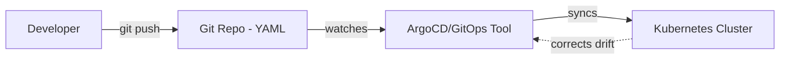
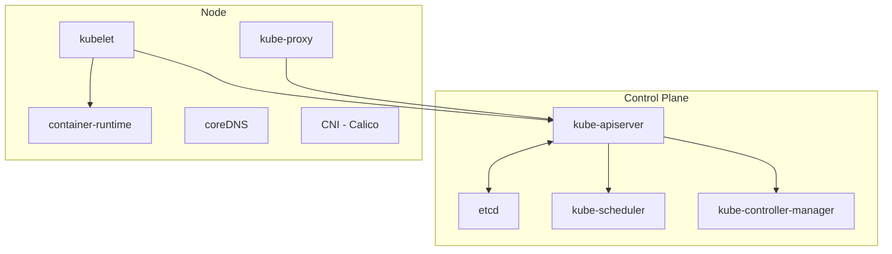

# ☸️ Kubernetes Fundamentals — GitOps, Why Containers, Docker, Cluster Architecture

27th phase covered Docker's alternatives (Podman, containerd, CRI-O, Buildah). This phase I moved on to Kubernetes — following the k8s-tr.github.io roadmap, I worked through the Fundamental Concepts section (GitOps, Why Containers, Docker, Cluster Architecture) start to finish.

**A framework worth keeping in mind from the start:** Kubernetes can be thought of as an all-in-one datacenter running on top of servers — network, storage, CPU, RAM, all managed logically.

---

## 1. GitOps

**Software example:** Like a CI/CD pipeline automatically triggering a build/deploy on every push to the repo — except here what's being "deployed" isn't an application, it's the cluster's own **desired state**.

**Real function:** Instead of running commands directly against the cluster (like `kubectl apply`), the "desired state" is written as YAML into a Git repo. A tool (like ArgoCD) continuously watches this repo and automatically closes the gap between the repo and the cluster's actual state — just like a Terraform `apply` loop continuously syncing defined infrastructure state with actual state.

**Cross-reference:** I understood this as the same "document everything and push it" habit I already have with my own GitHub repo, applied to real running infrastructure — Git history becomes the change record, `git revert` makes rollback easy.



---

## 2. Why Containers?

### Container History

Learned that the container idea goes back to **1979 (chroot)** — 34 years before Docker (2013):

```
chroot (Unix)     → 1979
FreeBSD Jails     → 2000
LXC (Linux)       → 2008
Docker            → 2013
Kubernetes        → 2014
Openshift         → 2011, 2015
```

**Software example:** Like a JVM (Java Virtual Machine) being able to run code compiled for a specific bytecode version — each new version was built layer by layer on top of the previous one, never starting from scratch.

### Why We Need Containers

Covered eight points — agile app deployment, CI/CD, immutability (eliminates the "worked on my machine" problem), observability, application-centric management, microservices, resource isolation, resource utilization efficiency.

### Why We Use Kubernetes

Saw seven main headings: service discovery and load balancing, storage management, automated rollouts/rollbacks (the foundation of GitOps), automated bin packing (scheduling), self-healing, secret and configuration management, extensibility.

**Self-healing** stood out to me specifically — learned that Kubernetes restarts failed containers, kills ones that don't respond to health checks, and never sends traffic to a container until it's ready.

**Cross-reference:** Connected this to the `healthy`/`unhealthy` states I tested with HEALTHCHECK back in Phase 26 (IaC Scanning) — a health check detects a container's status and intervention can be taken based on that status; I had only ever _seen_ the status in `docker ps`, Kubernetes actually _acts_ on it automatically.

---

## 3. Docker (k8s-tr's Angle)

This page mostly covered commands I already knew. The one genuinely new technique was **`envsubst`**:

```dockerfile
FROM nginx
ENV APP_LOCATION google
ENV NGINX_PORT 8080
COPY config/orig.conf /etc/nginx/conf.d/orig.conf
RUN envsubst < /etc/nginx/conf.d/orig.conf > /etc/nginx/conf.d/default.conf
RUN rm /etc/nginx/conf.d/orig.conf
```

**Software example:** Similar to defining a variable in code — the config file uses variables like `${NGINX_PORT}`, and `envsubst` fills these placeholders with the real values defined via `ENV`.

**Real function:** The same Dockerfile can be built with different `ENV` values to get the same image structure configured differently for different environments (dev/test/prod).

**Cross-reference:** I think of this as a simplified precursor to Kubernetes ConfigMaps (which I covered in depth in Phase 30) — both are applications of "separating config from code" at different levels.

---

## 4. Cluster Architecture



### The Three-Plane Split

**Software example:** Like a web application split into **frontend/backend/database** layers — the control plane (backend, business logic) and management plane (admin panel) both serve the data plane (the actual service the frontend delivers to the user).

**Real function:** The data plane carries the actual service traffic, the control and management planes serve/manage that plane.

### Control Plane Components

**kube-apiserver — Software example:** Like an **API Gateway** (Kong, nginx) that every incoming request passes through, handling authentication/authorization — no request can reach backend services directly.

**Real function:** Accepts and validates every REST request coming into the cluster, is the single connection point to etcd. Runs as a static pod: `/etc/kubernetes/manifests/kube-apiserver.yaml`.

**etcd — Software example:** Like a distributed key-value database (Consul, Zookeeper — which I researched in depth in Phase 30) doing multi-node replication + leader election (Raft).

**Real function:** Multiple copies (odd-numbered membership), all holding the same information, no one can unilaterally decide — majority approval is required, preventing split-brain. Every change gets a revision number (like Git commit order), changes are notified via the watch mechanism (not polling).

**Cross-reference:** In `additionals/kubernetes-terim-derinlesmesi` I researched etcd's general (not Kubernetes-specific) mechanics, the Raft protocol, and its alternatives (Zookeeper, Consul) in further depth.

**A critical warning:** if etcd becomes unstable (insufficient resources, network issues), no clear majority/leader can be elected — no changes at all can be made to the cluster, not even a new pod can be created. In a version control system (Git), even a corrupted commit still leaves earlier commits recoverable — but etcd has no such "previous version" backup at all; if it goes down, nothing in the system remembers that state, because the entire cluster's "memory" depends entirely on it.

**kube-controller-manager — Software example:** Like a **cron job** or a **reconciliation loop** (seen in tools like Terraform, Ansible) periodically checking the gap between desired and actual state and fixing it.

**Real function:** Continuously closes the gap between desired and actual state — saw in Phase 30 that the ReplicaSet controller is an example of this.

**kube-scheduler — Software example:** Like a **cloud provider** (AWS, GCP) deciding which physical server to place a new VM request on, based on that server's available resources.

**Real function:** Decides which node a pod runs on, based on criteria like resource needs/affinity/taints. The language of the app inside the pod doesn't matter — it just checks whether resource requirements can be met.

### Node Components

**kubelet — Software example:** Like a **process supervisor** (systemd, supervisord) watching services running on a local machine, reporting their status centrally, and restarting them if needed.

**Real function:** Registers the node with the API Server, runs pods assigned to its node, runs liveness probes (the cluster-level version of Phase 26's HEALTHCHECK).

**coreDNS — Software example:** Like a **service discovery** tool (Consul's DNS interface) automatically resolving service names to real IPs — can also be thought of like an `/etc/hosts` file that keeps itself updated automatically.

**Real function:** This mandatory DNS system inside Kubernetes helps keep services consistently discoverable/reachable — runs as a deployment in the `kube-system` namespace.

**Cross-reference:** I had already covered general DNS mechanics (resolver chain, TTL, record types) in depth back in Phase 18 (Linux Networking Fundamentals) — coreDNS is Kubernetes' automatically-managed application of that general DNS architecture. Later, when working through Service in Phase 30, I proved with a real test how coreDNS resolves Service names to pod IPs.

**kube-proxy — Software example:** Like a **reverse proxy** (nginx's upstream/load balancing config) distributing incoming traffic to real backend servers, except here it's not centralized — it runs **on each node itself** (like each edge node of a CDN managing its own traffic).

**Real function:** Ensures Service/Endpoint reachability, sets node network rules (via iptables/IPVS). Runs as a DaemonSet (one copy per node).

**Cross-reference:** In Phase 30 I dug deep into kube-proxy's `iptables`/`IPVS` mechanism and the hairpin NAT issue (the relative meaning of 127.0.0.1) with a real test.

**container-runtime — Software example:** Like a runtime that provides process isolation directly on the OS kernel, without a hypervisor (the CRI-O/containerd I compared in Phase 27).

**CNI (Calico) — Software example:** Like **VPN software** (WireGuard) setting up a virtual network layer between different physical machines.

**Real function:** Provides the cluster's network infrastructure, connectivity between pods. Alternatives: Cilium, Weave.

**Cross-reference:** In `additionals/kubernetes-terim-derinlesmesi` I dug deep into CNI's VXLAN (overlay) vs BGP (direct routing) approaches, with real proof by finding the `vxlan.calico` interface on my own VDS.

### 🔍 A Real Trap: The "Runs Everywhere" Claim

Realized that "Docker runs everywhere" doesn't mean "runs on any operating system" — it means "runs consistently within the same kernel family." This is also why Docker Desktop on Mac/Windows can run Linux containers — it quietly sets up a hidden Linux virtual machine in the background, and the containers actually run inside that VM's Linux kernel.

Learned that Docker Desktop on Windows also has a "Windows containers" mode — in this mode Windows containers can run directly on the host's Windows kernel without a VM.

**Also researched the real use case:** used for containerizing legacy enterprise applications tied to old .NET Framework that can't be ported to Linux.

---

## 📊 Summary

| Topic             | What I Learned                                                                                      |
| ----------------- | --------------------------------------------------------------------------------------------------- |
| GitOps            | Like a Terraform apply loop — a tool automatically applies the target written to Git                |
| Container history | Goes back to 1979 (chroot), 34 years before Docker                                                  |
| envsubst          | The technique that fills config variables with ENV values — a precursor to ConfigMap                |
| kube-apiserver    | Like an API Gateway — every request passes through it first                                         |
| etcd              | Distributed key-value DB (Consul/Zookeeper-like) — split-brain prevention, revision/watch mechanism |
| kube-scheduler    | Like a cloud provider placing VMs — resource-based, language-independent                            |
| kubelet           | Like a process supervisor (systemd) — watches pods on the node                                      |
| coreDNS           | Like a service discovery tool — keeps services consistently discoverable via DNS                    |
| kube-proxy        | Like a distributed reverse proxy — each node manages its own traffic                                |
| CNI               | Like VPN software — sets up a virtual network layer between pods                                    |
| self-healing      | Automatic intervention based on health check status — the cluster-level version of HEALTHCHECK      |

---

ℹ️ _This phase was entirely conceptual — terminology and architecture were reinforced with software-ecosystem examples by following the k8s-tr.github.io roadmap before setting up an actual cluster. Hands-on setup and tests were done in Phases 29/30._
