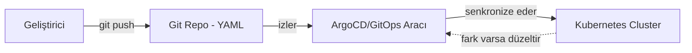
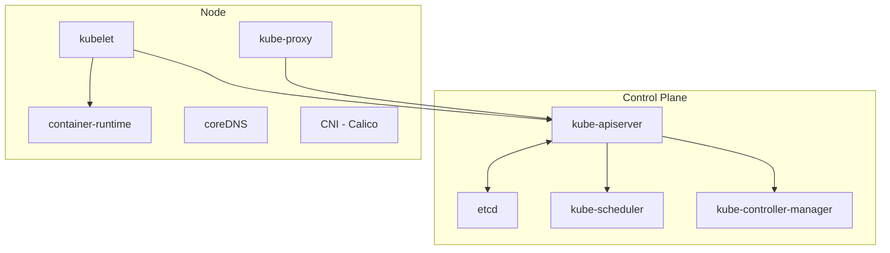

# ☸️ Kubernetes Temel Kavramlar — GitOps, Neden Konteynerlar, Docker, Küme Mimarisi

27. fazda Docker'ın alternatiflerini (Podman, containerd, CRI-O, Buildah) araştırdım. Bu fazda Kubernetes'e geçtim — k8s-tr.github.io roadmap'ini takip ederek Temel Kavramlar bölümünü (GitOps, Neden Konteynerlar, Docker, Küme Mimarisi) baştan sona işledim.

**Baştan akılda tutulması gereken bir çerçeve:** Kubernetes, sunucular üzerinde çalışan all-in-one bir datacenter gibi düşünülebilir — network, storage, CPU, RAM hepsi mantıksal olarak yönetiliyor.

---

## 1. GitOps

**Yazılım örneği:** Bir CI/CD pipeline'ının, kod deposuna her push'ta otomatik build/deploy tetiklemesi gibi — ama burada "deploy edilen" bir uygulama değil, cluster'ın kendisinin **istenen durumu.**

**Gerçek işlevi:** Cluster'a doğrudan komut çalıştırmak (`kubectl apply` gibi) yerine, "olması gereken hal" bir Git repo'suna YAML olarak yazılıyor. Bir araç (ArgoCD gibi) bu repo'yu sürekli izleyip, repo ile cluster'ın gerçek hali arasındaki farkı otomatik kapatıyor — tıpkı bir Terraform `apply` döngüsünün, tanımlanan altyapı durumuyla gerçek durum arasındaki farkı sürekli senkronize etmesi gibi.

**Çapraz referans:** Bunu kendi GitHub repomda yaptığım "her şeyi belgeleyip push et" alışkanlığının, gerçek çalışan altyapıya uygulanmış hali gibi anladım — Git geçmişi değişiklik kaydı oluyor, `git revert` ile geri alma kolaylaşıyor.



---

## 2. Neden Konteynerlar?

### Konteyner Tarihi

Konteyner fikrinin **1979'a (chroot)** kadar gittiğini öğrendim — Docker'dan (2013) 34 yıl önceye dayanıyor:

```
chroot (Unix)     → 1979
FreeBSD Jails     → 2000
LXC (Linux)       → 2008
Docker            → 2013
Kubernetes        → 2014
Openshift         → 2011, 2015
```

**Yazılım örneği:** Bir JVM'in (Java Virtual Machine), belirli bir bytecode versiyonu için derlenmiş kodu çalıştırabilmesi gibi — her yeni sürüm, öncekinin üzerine katman katman gelişerek inşa edilmiş, sıfırdan başlamamış.

### Neden Konteynerlere İhtiyaç Duyarız

Sekiz maddeyi işledim — çevik uygulama dağıtımı, CI/CD, değişmezlik (immutability, "benim makinemde çalışıyordu" sorununu ortadan kaldırıyor), gözlemlenebilirlik, uygulama merkezli yönetim, mikroservisler, kaynak yalıtımı, kaynak kullanım verimliliği.

### Neden Kubernetes Kullanırız

Yedi ana başlığı gördüm: servis keşfi ve yük dengeleme, depolama yönetimi, otomatik dağıtım/geri alma (GitOps'un temeli), otomatik yerleştirme (scheduling), kendi kendine iyileştirme (self-healing), gizli bilgi yönetimi, genişletilebilirlik.

**Self-healing** kısmı özellikle dikkatimi çekti — Kubernetes'in başarısız container'ları yeniden başlattığını, sağlık kontrolüne yanıt vermeyenleri öldürdüğünü, hazır olana kadar trafiğe hiç açmadığını öğrendim.

**Çapraz referans:** Bunu, Faz 26'da (IaC Scanning) test ettiğim HEALTHCHECK'in `healthy`/`unhealthy` durumuyla bağlantılandırdım — bir health check container'ın durumunu tespit eder ve durumuna göre müdahale yapılabilir; ben sadece `docker ps`'te durumu görmüştüm, Kubernetes bu bilgiye göre otomatik aksiyon alıyor.

---

## 3. Docker (k8s-tr Bakış Açısı)

Bu sayfada büyük kısmını zaten bildiğim komutlar vardı. Yeni öğrendiğim tek teknik **`envsubst`** oldu:

```dockerfile
FROM nginx
ENV APP_LOCATION google
ENV NGINX_PORT 8080
COPY config/orig.conf /etc/nginx/conf.d/orig.conf
RUN envsubst < /etc/nginx/conf.d/orig.conf > /etc/nginx/conf.d/default.conf
RUN rm /etc/nginx/conf.d/orig.conf
```

**Yazılım örneği:** Kod yazarken değişken tanımlamaya benzer — config dosyasında `${NGINX_PORT}` gibi değişkenler kullanılıyor, `envsubst` bu yer tutucuları `ENV` ile tanımlanan gerçek değerlerle dolduruyor.

**Gerçek işlevi:** Aynı Dockerfile'ı farklı `ENV` değerleriyle build edip, aynı image yapısını farklı ortamlar (dev/test/prod) için kullanabiliyorsun.

**Çapraz referans:** Bunun, Kubernetes'teki ConfigMap'lerin (Faz 30'da derinlemesine işlediğim) basitleştirilmiş bir öncülü olduğunu düşünüyorum — ikisi de "config'i koddan ayırma" fikrinin farklı seviyelerdeki uygulamaları.

---

## 4. Küme Mimarisi



### Üç Düzlem Ayrımı

**Yazılım örneği:** Bir web uygulamasının **frontend/backend/veritabanı** katmanlarına ayrılması gibi — kontrol düzlemi (backend, iş mantığı) ve yönetim düzlemi (admin panel) her ikisi de veri düzlemine (frontend'in kullanıcıya sunduğu asıl hizmete) hizmet ediyor.

**Gerçek işlevi:** Veri düzlemi asıl hizmet trafiğini taşıyor, kontrol ve yönetim düzlemi bu düzleme hizmet ediyor/yönetiyor.

### Kontrol Düzlemi Bileşenleri

**kube-apiserver — Yazılım örneği:** Bir **API Gateway**'in (Kong, nginx gibi) tüm gelen isteklerin önünden geçmesi, kimlik doğrulama/yetkilendirme yapması gibi — hiçbir istek doğrudan arka servislere ulaşamıyor.

**Gerçek işlevi:** Cluster'a gelen tüm REST isteklerini kabul edip doğruluyor, etcd'ye tek bağlantı noktası. Static pod olarak kurulur: `/etc/kubernetes/manifests/kube-apiserver.yaml`.

**etcd — Yazılım örneği:** Dağıtık bir key-value veritabanının (Consul, Zookeeper gibi — Faz 30'da derinlemesine araştırdığım) çoklu-node replikasyon + lider seçimi (Raft) yapması gibi.

**Gerçek işlevi:** Birden fazla kopya (tek sayı üye), hepsinde aynı bilgi, kimse tek başına karar veremiyor, çoğunluk onayı şart — split-brain önleniyor. Her değişikliğe bir revision numarası (Git commit sırası gibi) veriliyor, watch mekanizmasıyla değişiklikler bildiriliyor (polling değil).

**Çapraz referans:** `additionals/kubernetes-terim-derinlesmesi` belgesinde etcd'nin genel (Kubernetes'e özel olmayan) çalışma mantığını, Raft protokolünü ve alternatiflerini (Zookeeper, Consul) ayrıca derinlemesine araştırdım.

**Kritik bir uyarı:** etcd kararsız hale gelirse (yetersiz kaynak, ağ sorunu), net bir çoğunluk/lider seçilemiyor — cluster'da hiçbir değişiklik yapılamıyor, yeni pod bile oluşturulamıyor. Bir versiyon kontrol sisteminde (Git) bozulan bir commit olsa bile önceki commit'ler hâlâ geri yüklenebilir — ama etcd'de böyle bir "önceki sürüm" yedeği hiç yok, çökerse sistemde hiçbir şey o durumu hatırlamıyor, çünkü tüm cluster'ın "hafızası" tamamen buna bağlı.

**kube-controller-manager — Yazılım örneği:** Bir **cron job**'ın ya da bir **reconciliation loop**'un (Terraform, Ansible gibi araçlarda görülen), istenen durum ile gerçek durum arasındaki farkı periyodik olarak kontrol edip düzeltmesi gibi.

**Gerçek işlevi:** İstenen durum ile gerçek durum arasındaki farkı sürekli kapatıyor — Faz 30'da ReplicaSet controller'ın bunun bir örneği olduğunu gördüm.

**kube-scheduler — Yazılım örneği:** Bir **bulut sağlayıcının** (AWS, GCP), yeni bir VM isteğini fiziksel sunuculardan hangisine yerleştireceğine, o sunucunun boş kaynaklarına göre karar vermesi gibi.

**Gerçek işlevi:** Bir pod'un hangi node'da çalışacağına, kaynak ihtiyacı/affinity/taints gibi kriterlere göre karar veriyor. Pod'un içindeki uygulamanın dili önemli değil — sadece kaynak gereksinimi karşılanabiliyor mu diye bakıyor.

### Düğüm (Node) Bileşenleri

**kubelet — Yazılım örneği:** Bir **process supervisor**'ın (systemd, supervisord gibi) yerel makinede çalışan servisleri izleyip, durumlarını merkeze raporlaması, gerekirse yeniden başlatması gibi.

**Gerçek işlevi:** Node'u API Server'a kaydettiriyor, kendi node'una atanan pod'ları çalıştırıyor, liveness probe'ları (Faz 26'daki HEALTHCHECK'in cluster seviyesi) çalıştırıyor.

**coreDNS — Yazılım örneği:** Bir **service discovery** aracının (Consul'un DNS arayüzü gibi) servis isimlerini gerçek IP'lere otomatik çözmesi gibi — bir `/etc/hosts` dosyasının kendini otomatik güncellemesi gibi de düşünülebilir.

**Gerçek işlevi:** Kubernetes içindeki zorunlu gelen bu DNS sistemi, servisleri sürekli bulunur/erişilebilir yapmaya yardımcı oluyor — `kube-system` namespace'inde deployment olarak çalışıyor.

**Çapraz referans:** Faz 18'de (Linux Networking Fundamentals) DNS'in genel çalışma mantığını (resolver zinciri, TTL, kayıt tipleri) zaten derinlemesine işlemiştim — coreDNS, o genel DNS mimarisinin Kubernetes'e özel, otomatik yönetilen bir uygulaması. İleride Faz 30'da Service'i işlerken, coreDNS'in Service isimlerini pod IP'lerine nasıl çözdüğünü gerçek testle kanıtladım.

**kube-proxy — Yazılım örneği:** Bir **reverse proxy**'nin (nginx'in upstream/load balancing yapılandırması gibi) gelen trafiği arka uçtaki gerçek sunuculara dağıtması gibi, ama burada merkezi değil, **her node'un kendi üzerinde** çalışıyor (bir CDN'in edge node'larının her birinin kendi trafiğini yönetmesi gibi).

**Gerçek işlevi:** Service/Endpoint'lerin erişilebilirliğini sağlıyor, node network kurallarını (iptables/IPVS ile) ayarlıyor. DaemonSet olarak (her node'da bir kopya) çalışıyor.

**Çapraz referans:** Faz 30'da kube-proxy'nin `iptables`/`IPVS` mekanizmasını, hairpin NAT sorununu (127.0.0.1'in göreceli anlamı) gerçek testle derinlemesine inceledim.

**container-runtime — Yazılım örneği:** Bir **hipervizör** olmadan, doğrudan işletim sistemi çekirdeği üzerinde process izolasyonu sağlayan bir çalışma zamanı (Faz 27'de karşılaştırdığım CRI-O/containerd) gibi.

**CNI (Calico) — Yazılım örneği:** Bir **VPN yazılımının** (WireGuard gibi) farklı fiziksel makineler arasında sanal bir ağ katmanı kurması gibi.

**Gerçek işlevi:** Cluster'ın network altyapısını, pod'lar arası bağlantıyı sağlıyor. Alternatifleri: Cilium, Weave.

**Çapraz referans:** `additionals/kubernetes-terim-derinlesmesi` belgesinde CNI'nin VXLAN (overlay) vs BGP (direct routing) yöntemlerini, kendi VDS'imde `vxlan.calico` arayüzünü bularak gerçek kanıtla derinlemesine araştırdım.

### 🔍 Gerçek Bir Tuzak: "Her Yerde Çalışır" İfadesi

"Docker her yerde çalışır" ifadesinin, "herhangi bir işletim sistemi üzerinde çalışır" değil, "aynı kernel ailesi içinde tutarlı çalışır" anlamına geldiğini fark ettim. Mac/Windows'ta Docker Desktop'ın Linux container'ları çalıştırabilmesinin sebebi de bu — arka planda gizli bir Linux sanal makinesi kuruluyor, container'lar aslında o VM'in Linux kernel'inde çalışıyor.

Windows'ta Docker Desktop'ın ayrıca bir "Windows containers" modu da olduğunu öğrendim — bu modda Windows container'lar VM'e gerek kalmadan, doğrudan host'un Windows kernel'inde çalışabiliyor.

**Gerçek kullanım alanını da araştırdım:** Linux'a taşınamayan, eski .NET Framework'e bağımlı kurumsal uygulamaları containerize etmek için kullanılıyor.

---

## 📊 Özet

| Konu             | Ne Öğrendim                                                                                     |
| ---------------- | ----------------------------------------------------------------------------------------------- |
| GitOps           | Terraform apply döngüsü gibi — Git'e yazılan hedefi bir aracın otomatik uyguladığı yaklaşım     |
| Konteyner tarihi | 1979'a (chroot) kadar gidiyor, Docker'dan 34 yıl önce                                           |
| envsubst         | Config'teki değişkenleri Dockerfile'daki ENV değerleriyle dolduran teknik — ConfigMap'in öncülü |
| kube-apiserver   | API Gateway gibi — tüm istekler önce buradan geçiyor                                            |
| etcd             | Dağıtık key-value DB (Consul/Zookeeper gibi) — split-brain önleme, revision/watch mekanizması   |
| kube-scheduler   | Bulut sağlayıcının VM yerleştirmesi gibi — kaynak bazlı, dil bağımsız                           |
| kubelet          | Process supervisor (systemd) gibi — node'daki pod'ları izliyor                                  |
| coreDNS          | Service discovery aracı gibi — DNS ile servisleri sürekli bulunur kılıyor                       |
| kube-proxy       | Dağıtık reverse proxy gibi — her node kendi trafiğini yönetiyor                                 |
| CNI              | VPN yazılımı gibi — pod'lar arası sanal ağ katmanı kuruyor                                      |
| self-healing     | Health check durumuna göre otomatik müdahale — HEALTHCHECK'in cluster seviyesindeki hali        |

---

ℹ️ _Bu faz tamamen kavramsal işlendi — k8s-tr.github.io roadmap'i takip edilerek gerçek bir cluster kurulmadan önce temel terminoloji ve mimari, yazılım ekosisteminden örneklerle pekiştirildi. Uygulamalı kurulum ve testler Faz 29/30'da yapıldı._
