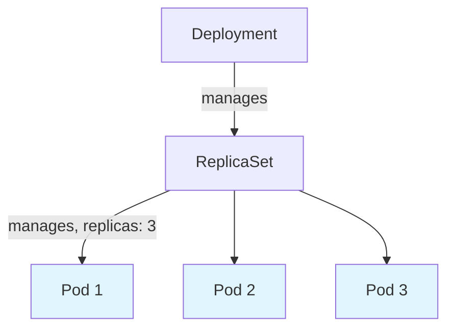
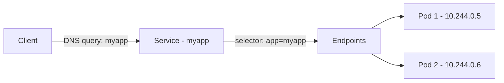
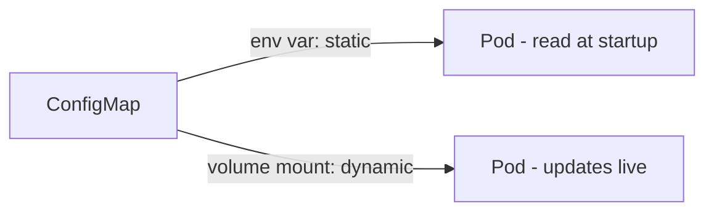
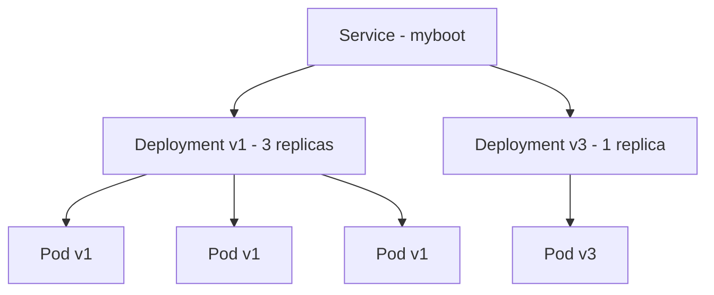

# ☸️ Kubernetes Basic Resources — Pod, ReplicaSet, Deployment, Service, ConfigMaps, Secrets, Canary Deployment

29th phase compared five installation methods. This phase I worked through the roadmap's Basic Resources section — each concept with a software-ecosystem example, its real function, cross-references to related topics, and real YAML/tests.

---

## 1. Pod, ReplicaSet, Deployment



**Software example:** Like `systemd` monitoring a service — if a process crashes (with `Restart=always`), `systemd` restarts it automatically. ReplicaSet works the same way, except it watches **multiple pod replicas** instead of one process.

**Real function:** ReplicaSet continuously counts "how many pods match this label" via a label-based `selector`, and if short, creates a new pod (not a revival of the deleted one, a new name/IP). This is a loop inside kube-controller-manager (which I covered in Phase 28) — closing the gap between desired and actual state.

**Cross-reference:** This is a concrete application of the concept I described as a "thermostat" for kube-controller-manager in Phase 28 — there it was abstract, here I'm seeing it through a real resource (ReplicaSet).

**YAML — ReplicaSet:**

```yaml
apiVersion: apps/v1
kind: ReplicaSet
metadata:
  name: myapp-rs
spec:
  replicas: 3
  selector:
    matchLabels:
      app: myapp
  template:
    metadata:
      labels:
        app: myapp
    spec:
      containers:
        - name: myapp
          image: quay.io/rhdevelopers/quarkus-demo:v1
```

**Rolling Update — Deployment:**

When ReplicaSet's `template` field changes (anything, even an environment variable, not just the image), Deployment treats it as a "new version" and automatically triggers a rolling update — like a CI/CD pipeline automatically triggering a build/deploy on every push to the repo.

Proved this with a real test: used `kubectl set image` to go from v1 to v2, watched live with `-w` — the new pod became `Running` first, only then did the old pod move to `Terminating`, never a moment with zero pods.

```bash
kubectl set image deployment/myapp quarkus-demo=quay.io/rhdevelopers/myboot:v2
kubectl get pods -w
```

---

## 2. Service



### Core Mechanism — Selector, Endpoints, DNS

**Software example:** Like an `nginx` reverse proxy (which I covered in Phase 19) managing backend servers as an **upstream pool** rather than individual IPs — routing to whichever server is up, the client never needs to know the real IPs.

**Real function:** Service provides a fixed name/IP; the actual work is done by **coreDNS** — once the Service exists, a name record is created automatically, resolving to whichever pods currently match the label.

**Cross-reference:** This is the real-world use case for the service I described in Phase 28 as "provides in-cluster DNS resolution" — this mandatory DNS system in Kubernetes helps keep services consistently discoverable. I had already covered general DNS mechanics (resolver chain, TTL, record types) in depth back in Phase 18 (Linux Networking Fundamentals) — coreDNS is Kubernetes' automatically-managed application of that general DNS architecture.

Proved this with the **Label Magic** test: set up a Service looking for a label no pod had initially, `endpoints` came back empty; manually adding and removing the label updated `endpoints` instantly.

**YAML — Service (ClusterIP):**

```yaml
apiVersion: v1
kind: Service
metadata:
  name: myapp
spec:
  selector:
    app: myapp
  ports:
    - port: 8080
      targetPort: 8080
```

### NodePort and LoadBalancer

**Software example:** Like an application listening on a specific port and having it exposed externally (`nginx` listening on 80/443) — NodePort is every node opening and listening on a specific port (30000-32767). LoadBalancer is like round-robin DNS pointing a single domain at multiple servers — except here real hardware/service (the cloud provider's load balancer) actually distributes traffic.

**Real function:** LoadBalancer is built on top of NodePort — on my own VDS (no cloud provider integration), `EXTERNAL-IP` stays `<pending>` forever, but NodePort works fine over the real IP.

**Cross-reference:** MetalLB (which I'll see in the roadmap's "Additional Tools" section) exists specifically to fill this gap — LoadBalancer support without a cloud provider, on VDS/bare-metal environments.

Also solved a puzzle: `curl localhost:31720` failed but `curl 91.151.88.38:31720` worked. The cause is `127.0.0.1`'s relative meaning — "the server itself" to the sender, "the pod itself" to the pod. If this isn't corrected during NAT (missing masquerade), the pod's reply goes to the wrong place — **hairpin NAT**. Confirmed via an empty `ss -tlnp | grep 31720` result that NodePort is iptables/DNAT-based routing, not a real "listener."

**YAML — LoadBalancer:**

```yaml
apiVersion: v1
kind: Service
metadata:
  name: myapp-lb
spec:
  selector:
    app: myapp
  ports:
    - port: 80
      targetPort: 8080
  type: LoadBalancer
```

### ExternalName

**Software example:** Like an application defining an environment variable such as `DATABASE_HOST=external-db.example.com` in its config — the app doesn't know where the real database is, it just looks at a name, DNS handles the rest.

**Real function:** Has none of the other Service types' `selector`/`endpoints` — it only creates a DNS CNAME record and never carries any traffic itself.

**Cross-reference:** This is a DNS-level application of the "separate config from code" principle (12 Factor App) I'll cover under ConfigMaps (next section) — managing an external service's address through Kubernetes' own object instead of hardcoding it into the app.

Pointed an ExternalName Service at `google.com`, ran a DNS query from inside a test pod — got real Google IPs back, `kube-proxy`/`iptables` never got involved.

**YAML — ExternalName:**

```yaml
apiVersion: v1
kind: Service
metadata:
  name: external-db
spec:
  type: ExternalName
  externalName: postgres.example.com
```

---

## 3. ConfigMaps



**Software example:** Like keeping an application's `.env` file separate from the code — able to change behavior by editing just the config file, without touching the code.

**Real function:** A centralized resource multiple Deployments can reference. Researched the **12 Factor App** methodology (Heroku, 2011) — its 3rd principle says exactly this: "don't embed config in code, take it from the environment." ConfigMap is Kubernetes' implementation of that general principle.

**Cross-reference:** This same principle also applies to Secrets (next section) — both are applications of "separating config from code," just at different sensitivity levels.

**Proved a critical asymmetry:** ConfigMap used as an environment variable is static (needs pod restart), mounted as a volume is dynamic (kubelet checks every ~60 seconds and updates it live). Proved this with a real test — a pod's file content changed without it ever restarting.

**YAML — ConfigMap and Volume Mount:**

```yaml
apiVersion: v1
kind: ConfigMap
metadata:
  name: app-config
data:
  greeting: "Hello"
---
apiVersion: v1
kind: Pod
metadata:
  name: demo-pod
spec:
  containers:
    - name: demo
      image: busybox
      volumeMounts:
        - name: config
          mountPath: "/config"
  volumes:
    - name: config
      configMap:
        name: app-config
```

Also tested bulk-creating a ConfigMap with `--from-env-file`, and mounting a shell script inside a ConfigMap as an executable file.

---

## 4. Secrets

**Software example:** Like a password manager keeping passwords encrypted rather than plaintext — but the key difference is a Secret's **default state** isn't as secure as an actual password manager.

**Real function:** Noticed a contradiction on the page (one part said "encrypted," another said "not encrypted"). Resolved it with a real test — `base64` is the RFC 4648 standard, not a "secret code" specific to Kubernetes, a universal encoding everyone knows. Decoded the output of `kubectl get secret -o yaml` with `base64 --decode`, with no key at all, and got the real password back. Also looked directly at etcd's raw data via `etcdctl` and got the same result (plaintext).

**Cross-reference:** This connects to the section where I described etcd as a "board of directors" in Phase 28 — anyone with access to etcd (or `kubectl get secrets` permission) can read a Secret with no additional work at all.

**YAML — Secret:**

```yaml
apiVersion: v1
kind: Secret
metadata:
  name: db-credentials
type: Opaque
data:
  password: U3VwZXJHaXpsaVNpZnJlMTIz
```

**Real Encryption — EncryptionConfiguration:**

Can be thought of like an application doing a TLS handshake before connecting to a database — the default connection (base64) is close to plaintext, there's no real protection without an additional layer (encryption at rest).

Set up `EncryptionConfiguration` and compared before/after — the old Secret (written before encryption) stayed plaintext in etcd (doesn't apply retroactively), the new Secret appeared with a `k8s:enc:aescbc:v1:key1:` prefix, completely meaningless cryptographic data.

```bash
kubectl create secret generic mysecret --from-literal=password='ShouldBeEncrypted'
sudo ETCDCTL_API=3 etcdctl --endpoints=https://127.0.0.1:2379 \
  --cacert=/etc/ssl/etcd/ssl/ca.pem --cert=/etc/ssl/etcd/ssl/node-node1.pem \
  --key=/etc/ssl/etcd/ssl/node-node1-key.pem \
  get /registry/secrets/default/mysecret
```

Also tested that volume-mounted Secrets update live, just like ConfigMaps.

---

## 5. Canary Deployment



**Software example:** Very close to A/B testing (a common method in software/product development) — a portion of users see the new feature while the rest stay on the old version, and results get compared.

**Real function:** Two Deployments with the same label (many replicas of the stable version + few replicas of the test version) sit permanently side by side in the same Service's pool. The difference from rolling update — rolling update fully replaces old with new, canary keeps both running together.

**Cross-reference:** This is a sub-branch of the "Continuous Updates" topic I'll see in the roadmap's "Important Resources" section — rolling update and canary are both Deployment update strategies, for different risk tolerances.

Proved this with a real test: 3 replicas of v1 + 1 replica of v3, both connected to the same Service. Of 10 requests, 8 went to v1, 2 went to v3 — roughly a 3:1 ratio, matching replica count.

**YAML — Canary Setup:**

```yaml
apiVersion: apps/v1
kind: Deployment
metadata:
  name: myboot-v1
spec:
  replicas: 3
  selector:
    matchLabels:
      app: myboot
  template:
    metadata:
      labels:
        app: myboot
        version: v1
    spec:
      containers:
        - name: myboot
          image: quay.io/rhdevelopers/myboot:v1
---
apiVersion: apps/v1
kind: Deployment
metadata:
  name: myboot-v3
spec:
  replicas: 1
  selector:
    matchLabels:
      app: myboot
  template:
    metadata:
      labels:
        app: myboot
        version: v3
    spec:
      containers:
        - name: myboot
          image: quay.io/rhdevelopers/myboot:v3
```

---

## 📊 Summary

| Topic                     | What I Learned                                                                             |
| ------------------------- | ------------------------------------------------------------------------------------------ |
| ReplicaSet                | A deleted pod isn't revived, a new one is created — a loop inside kube-controller-manager  |
| Rolling update            | New pod comes up first, then old one shuts down — zero downtime                            |
| Service/DNS               | coreDNS does the actual work, selector→endpoints updates live                              |
| NodePort/LoadBalancer     | LoadBalancer sits on top of NodePort; hairpin NAT comes from 127.0.0.1's relative meaning  |
| ExternalName              | No selector/endpoints, just a DNS CNAME — carries no traffic at all                        |
| ConfigMap env vs volume   | Environment variable is static (needs pod restart), volume is dynamic (updates live)       |
| Secret base64             | Not encryption, a universal encoding — anyone can decode it                                |
| Secret encryption at rest | Off by default, enabled via EncryptionConfiguration, doesn't apply retroactively           |
| Canary Deployment         | Two same-labeled Deployments sit permanently side by side, traffic splits by replica ratio |

---

ℹ️ _All tests were performed on a real Ubuntu VPS (on the Kubespray cluster) — each topic proven with a software-ecosystem example, its real function, cross-references to related phases, and real YAML/kubectl/etcdctl tests._
