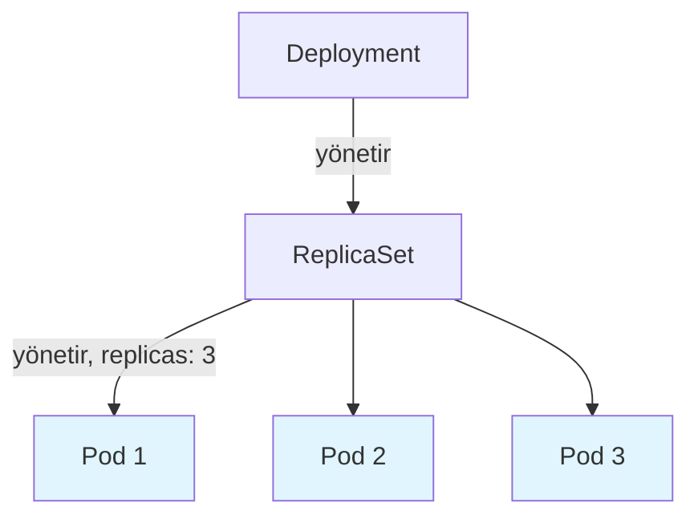
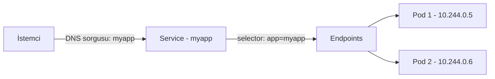
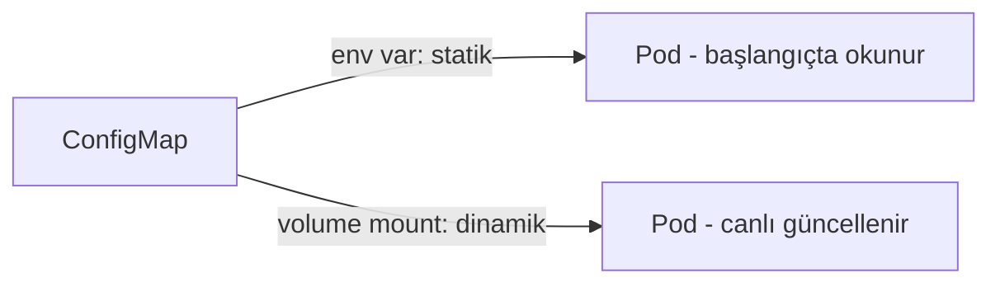
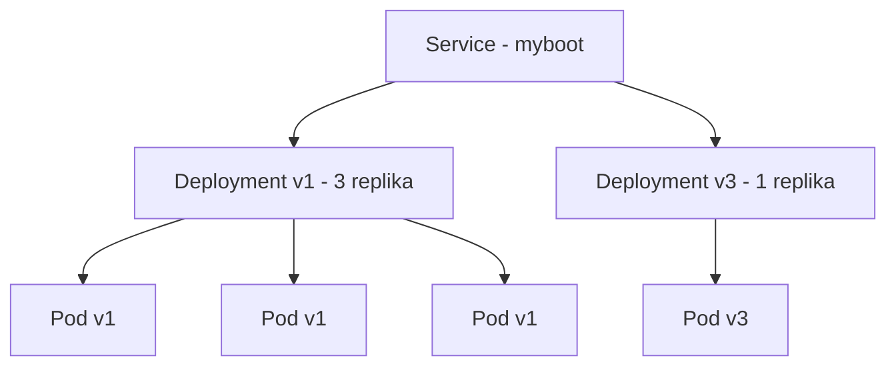

# ☸️ Kubernetes Temel Kaynaklar — Pod, ReplicaSet, Deployment, Service, ConfigMaps, Secrets, Kanarya Deployment

29. fazda beş kurulum yöntemini karşılaştırmıştım. Bu fazda roadmap'in Temel Kaynaklar bölümünü işledim — her kavramı yazılım ekosisteminden bir örnekle, gerçek işleviyle, ilgili olduğu diğer konulara referans vererek, ve gerçek YAML/testlerle.

---

## 1. Pod, ReplicaSet, Deployment



**Yazılım örneği:** `systemd`'in bir servisi izlemesi gibi — `systemd`, bir process çökerse (`Restart=always` ayarıyla) otomatik yeniden başlatır. ReplicaSet de aynı mantıkla çalışıyor, ama tek bir process yerine **birden fazla pod kopyasını** izliyor.

**Gerçek işlevi:** ReplicaSet, etiket bazlı bir `selector` ile "kaç pod bu etikete uyuyor" diye sürekli sayıyor, eksikse yeni bir pod yaratıyor (silinenin aynısı değil, yeni isim/IP ile). Bu, kube-controller-manager'ın (Faz 28'de işlediğim) içindeki bir döngü — istenen durumla gerçek durum arasındaki farkı kapatıyor.

**Çapraz referans:** Bu, Faz 28'de kube-controller-manager'ı "termostat" mantığıyla anlattığım kavramın somut bir uygulaması — orada soyut olarak anlatmıştım, burada gerçek bir kaynak (ReplicaSet) üzerinden görüyoruz.

**YAML — ReplicaSet:**

```yaml
apiVersion: apps/v1
kind: ReplicaSet
metadata:
  name: myapp-rs
spec:
  replicas: 3
  selector:
    matchLabels:
      app: myapp
  template:
    metadata:
      labels:
        app: myapp
    spec:
      containers:
        - name: myapp
          image: quay.io/rhdevelopers/quarkus-demo:v1
```

**Rolling Update — Deployment:**

ReplicaSet'in `template` alanı değişince (image dahil **herhangi bir şey**, ortam değişkeni bile), Deployment bunu "yeni versiyon" sayıp otomatik bir rolling update tetikliyor — tıpkı bir CI/CD pipeline'ının, kod deposuna her push'ta otomatik bir build/deploy tetiklemesi gibi.

Gerçek testle kanıtladım: `kubectl set image` ile v1'den v2'ye geçtim, `-w` ile canlı izledim — önce yeni pod `Running` oldu, ancak ondan sonra eski pod `Terminating`'e geçti, hiç sıfır pod anı olmadı.

```bash
kubectl set image deployment/myapp quarkus-demo=quay.io/rhdevelopers/myboot:v2
kubectl get pods -w
```

---

## 2. Service



### Temel Mekanizma — Selector, Endpoints, DNS

**Yazılım örneği:** Bir `nginx` reverse proxy'nin (Faz 19'da işlediğim), arkadaki sunucuları tek tek IP ile değil, bir **upstream havuzu** olarak yönetmesi gibi — hangi sunucu ayaktaysa ona yönlendiriyor, istemci hiçbir zaman gerçek IP'leri bilmek zorunda kalmıyor.

**Gerçek işlevi:** Service, sabit bir isim/IP sağlıyor; asıl işi yapan **coreDNS** — Service oluşunca otomatik bir isim kaydı oluşuyor, o an etikete uyan pod'ların IP'lerine çözümleniyor.

**Çapraz referans:** Bu, Faz 28'de coreDNS'i "cluster içi DNS çözümlemesi sağlar" diye tanımladığım servisin gerçek kullanım alanı — Kubernetes'teki zorunlu gelen bu DNS sistemi, servisleri sürekli bulunur kılmaya yarıyor. Faz 18'de (Linux Networking Fundamentals) DNS'in genel çalışma mantığını (resolver zinciri, TTL, kayıt tipleri) zaten derinlemesine işlemiştim — coreDNS, o genel DNS mimarisinin Kubernetes'e özel, otomatik yönetilen bir uygulaması.

Bunu **Label Yetenekleri** testiyle kanıtladım: hiçbir pod'un başta sahip olmadığı bir etiketi arayan bir Service kurdum, `endpoints` boş çıktı; pod'lara elle etiketi ekleyip çıkarınca `endpoints` anında güncellendi.

**YAML — Service (ClusterIP):**

```yaml
apiVersion: v1
kind: Service
metadata:
  name: myapp
spec:
  selector:
    app: myapp
  ports:
    - port: 8080
      targetPort: 8080
```

### NodePort ve LoadBalancer

**Yazılım örneği:** Bir uygulamanın belirli bir portta dinlemesi ve bu portun dışarıya açık olması gibi (`nginx`'in 80/443'ü dinlemesi) — NodePort, her node'un belirli bir portu (30000-32767 arası) açıp dinlemesi. LoadBalancer ise, DNS'in tek bir domain adını birden fazla sunucuya yönlendirmesi (round-robin DNS) gibi — ama burada gerçek bir donanım/servis (bulut sağlayıcının load balancer'ı) trafiği dağıtıyor.

**Gerçek işlevi:** LoadBalancer, NodePort'un üstüne kurulu — kendi VDS'imde (bulut sağlayıcı entegrasyonu olmadan) `EXTERNAL-IP` sonsuza kadar `<pending>` kalıyor, ama NodePort gerçek IP üzerinden çalışıyor.

**Çapraz referans:** MetalLB (roadmap'in "Ek Araçlar" bölümünde göreceğim), tam olarak bu eksikliği (bulut sağlayıcısız LoadBalancer desteği) VDS/bare-metal ortamlarda gidermek için var.

Bir bilmece de çözdüm: `curl localhost:31720` başarısız oldu ama `curl 91.151.88.38:31720` çalıştı. Sebebi `127.0.0.1`'in göreceli anlamı — isteği gönderen için "sunucunun kendisi", pod'un bakış açısından "pod'un kendisi." NAT sırasında bu düzeltilmezse (masquerade eksikse), pod'un cevabı yanlış yere gidiyor — **hairpin NAT**. `ss -tlnp | grep 31720`'nin boş dönmesiyle, NodePort'un iptables/DNAT tabanlı bir yönlendirme olduğunu (gerçek bir "dinleme" değil) kanıtladım.

**YAML — LoadBalancer:**

```yaml
apiVersion: v1
kind: Service
metadata:
  name: myapp-lb
spec:
  selector:
    app: myapp
  ports:
    - port: 80
      targetPort: 8080
  type: LoadBalancer
```

### ExternalName

**Yazılım örneği:** Bir uygulamanın config'inde `DATABASE_HOST=external-db.example.com` gibi bir ortam değişkeni tanımlamasına benziyor — uygulama, gerçek veritabanının nerede olduğunu bilmiyor, sadece bir isme bakıyor, DNS gerisini hallediyor.

**Gerçek işlevi:** Diğer Service türlerinin (`selector`/`endpoints`) hiçbirini içermiyor — sadece bir DNS CNAME kaydı oluşturuyor, hiçbir trafiği kendisi taşımıyor.

**Çapraz referans:** Bu, ConfigMap'te (bir sonraki bölüm) göreceğim "config'i koddan ayırma" prensibinin (12 Factor App) DNS seviyesindeki bir uygulaması — dış bir servisin adresini, kodun içine gömmek yerine, Kubernetes'in kendi objesi üzerinden yönetmek.

`google.com`'a yönlendiren bir ExternalName Service kurup, bir test pod'u içinden DNS sorgusu attım — gerçek Google IP'leri döndü, `kube-proxy`/`iptables` hiç dahil olmadı.

**YAML — ExternalName:**

```yaml
apiVersion: v1
kind: Service
metadata:
  name: external-db
spec:
  type: ExternalName
  externalName: postgres.example.com
```

---

## 3. ConfigMaps



**Yazılım örneği:** Bir uygulamanın `.env` dosyasını koddan ayrı tutması gibi — kodu değiştirmeden, sadece ayar dosyasını değiştirerek davranışı değiştirebilme.

**Gerçek işlevi:** Merkezi, birden fazla Deployment'ın referans verebildiği bir kaynak. Araştırdığım **12 Factor App** metodolojisinin (Heroku, 2011) 3. maddesi tam bunu söylüyor: "config'i kodun içine gömme, ortamdan al." ConfigMap, bu genel prensibin Kubernetes'teki uygulaması.

**Çapraz referans:** Bu prensip, Secrets'ta (bir sonraki bölüm) da geçerli — ikisi de "config'i koddan ayırma" fikrinin farklı hassasiyet seviyelerindeki uygulamaları.

**Kritik bir asimetri kanıtladım:** Ortam değişkeni olarak kullanılan ConfigMap statik (pod restart gerekir), volume olarak bağlanan dinamik (kubelet ~60 saniyede bir kontrol edip canlı günceller). Bunu gerçek testle kanıtladım — pod hiç yeniden başlamadan dosya içeriği değişti.

**YAML — ConfigMap ve Volume Mount:**

```yaml
apiVersion: v1
kind: ConfigMap
metadata:
  name: app-config
data:
  greeting: "Merhaba"
---
apiVersion: v1
kind: Pod
metadata:
  name: demo-pod
spec:
  containers:
    - name: demo
      image: busybox
      volumeMounts:
        - name: config
          mountPath: "/config"
  volumes:
    - name: config
      configMap:
        name: app-config
```

Ayrıca `--from-env-file` ile toplu ConfigMap oluşturmayı, bir shell script'i ConfigMap'e koyup çalıştırılabilir dosya olarak kullanmayı da test ettim.

---

## 4. Secrets

**Yazılım örneği:** Bir şifre yöneticisinin (password manager) şifreleri düz metin değil, şifrelenmiş tutması gibi — ama önemli fark, Secret'ın **varsayılan hali** bir şifre yöneticisi kadar güvenli değil.

**Gerçek işlevi:** Sayfada bir çelişki fark ettim (bir yerde "şifreleniyor", başka yerde "şifrelenmiyor" diyordu). Gerçek testle çözdüm — `base64`, RFC 4648 standardı, Kubernetes'e özel bir "gizli kod" değil, herkesin bildiği evrensel bir kodlama. `kubectl get secret -o yaml` çıktısını hiçbir anahtar girmeden `base64 --decode` ile çözdüm, gerçek şifre çıktı. `etcdctl` ile etcd'nin ham verisine doğrudan bakıp da aynı sonucu (düz metin) gördüm.

**Çapraz referans:** Bu, Faz 28'de etcd'yi "yönetim kurulu" olarak anlattığım bölümle birleşiyor — etcd'ye erişimi olan (ya da `kubectl get secrets` yetkisi olan) herkes, Secret'ı hiçbir ek işlem yapmadan okuyabiliyor.

**YAML — Secret:**

```yaml
apiVersion: v1
kind: Secret
metadata:
  name: db-credentials
type: Opaque
data:
  password: U3VwZXJHaXpsaVNpZnJlMTIz
```

**Gerçek Şifreleme — EncryptionConfiguration:**

Bir uygulamanın, veritabanına bağlanmadan önce TLS handshake yapması gibi düşünülebilir — varsayılan bağlantı (base64) düz metne yakın, ek bir katman (encryption at rest) olmadan gerçek koruma yok.

`EncryptionConfiguration` kurup öncesi/sonrası karşılaştırdım — eski Secret (şifreleme öncesi) etcd'de düz metin kaldı (geriye dönük çalışmıyor), yeni Secret `k8s:enc:aescbc:v1:key1:` ön ekiyle tamamen anlamsız kriptografik veri olarak göründü.

```bash
kubectl create secret generic mysecret --from-literal=password='SifreliOlmali'
sudo ETCDCTL_API=3 etcdctl --endpoints=https://127.0.0.1:2379 \
  --cacert=/etc/ssl/etcd/ssl/ca.pem --cert=/etc/ssl/etcd/ssl/node-node1.pem \
  --key=/etc/ssl/etcd/ssl/node-node1-key.pem \
  get /registry/secrets/default/mysecret
```

Volume-mount Secret'ların da ConfigMap gibi canlı güncellendiğini ayrıca test ettim.

---

## 5. Kanarya Deployment



**Yazılım örneği:** A/B testing'e (yazılım/ürün geliştirmede sıkça kullanılan bir yöntem) çok yakın — kullanıcıların bir kısmına yeni özellik gösterilirken, geri kalanı eski sürümde kalıyor, sonuçlar karşılaştırılıyor.

**Gerçek işlevi:** Aynı etikete sahip iki Deployment (çok kopyalı stabil versiyon + az kopyalı test versiyonu), aynı Service'in havuzunda kalıcı olarak yan yana duruyor. Rolling update'ten farkı — rolling update'te eski tamamen yeniyle değişiyor, kanaryada ikisi birlikte çalışmaya devam ediyor.

**Çapraz referans:** Bu, roadmap'te "Önemli Kaynaklar" bölümünde göreceğim "Sürekli Güncellemeler" konusunun bir alt dalı — rolling update ile kanarya, ikisi de Deployment'ın güncelleme stratejileri, farklı risk toleransları için.

Gerçek testle kanıtladım: 3 kopya v1 + 1 kopya v3, aynı Service'e bağlı. 10 isteğin 8'i v1'e, 2'si v3'e gitti — yaklaşık 3:1 oranı, kopya sayısıyla örtüşüyor.

**YAML — Kanarya Kurgusu:**

```yaml
apiVersion: apps/v1
kind: Deployment
metadata:
  name: myboot-v1
spec:
  replicas: 3
  selector:
    matchLabels:
      app: myboot
  template:
    metadata:
      labels:
        app: myboot
        version: v1
    spec:
      containers:
        - name: myboot
          image: quay.io/rhdevelopers/myboot:v1
---
apiVersion: apps/v1
kind: Deployment
metadata:
  name: myboot-v3
spec:
  replicas: 1
  selector:
    matchLabels:
      app: myboot
  template:
    metadata:
      labels:
        app: myboot
        version: v3
    spec:
      containers:
        - name: myboot
          image: quay.io/rhdevelopers/myboot:v3
```

---

## 📊 Özet

| Konu                      | Ne Öğrendim                                                                                    |
| ------------------------- | ---------------------------------------------------------------------------------------------- |
| ReplicaSet                | Silinen pod diriltilmiyor, yenisi yaratılıyor — kube-controller-manager'ın bir döngüsü         |
| Rolling update            | Önce yeni pod ayakta, sonra eski kapanıyor — hiç kesinti yok                                   |
| Service/DNS               | Asıl işi coreDNS yapıyor, selector→endpoints canlı güncelleniyor                               |
| NodePort/LoadBalancer     | LoadBalancer, NodePort'un üstünde; hairpin NAT, 127.0.0.1'in göreceli anlamından kaynaklanıyor |
| ExternalName              | selector/endpoints yok, sadece DNS CNAME — trafiği hiç taşımıyor                               |
| ConfigMap env vs volume   | Ortam değişkeni statik (pod restart gerekir), volume dinamik (canlı güncellenir)               |
| Secret base64             | Şifreleme değil, evrensel bir kodlama — herkes çözebilir                                       |
| Secret encryption at rest | Varsayılan kapalı, EncryptionConfiguration ile açılıyor, geriye dönük çalışmıyor               |
| Kanarya Deployment        | Aynı etiketli iki Deployment kalıcı yan yana, trafik kopya oranında dağılıyor                  |

---

ℹ️ _Tüm testler gerçek bir Ubuntu VPS üzerinde (Kubespray cluster'ında) yapılmıştır — her konu yazılım ekosisteminden bir örnekle, gerçek işleviyle, ilgili diğer fazlara referans vererek, ve gerçek YAML/kubectl/etcdctl testleriyle kanıtlanmıştır._
