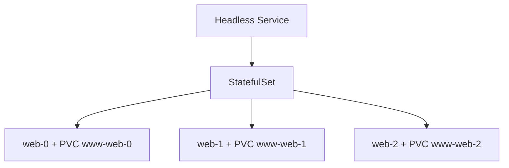
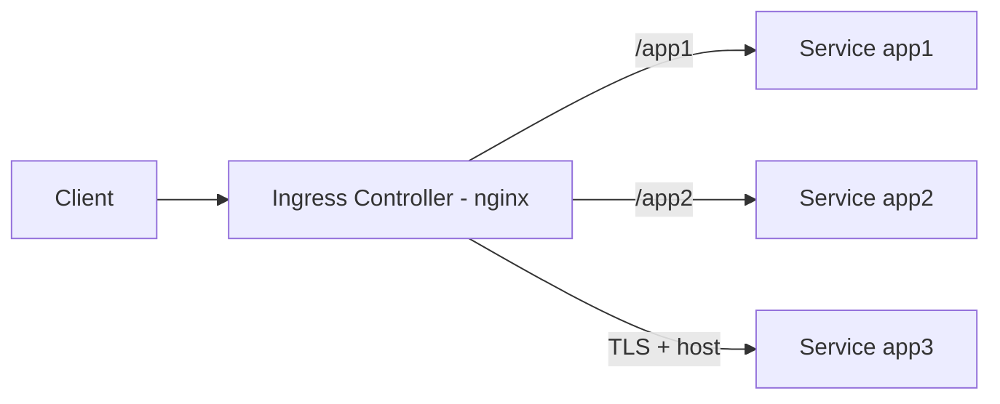
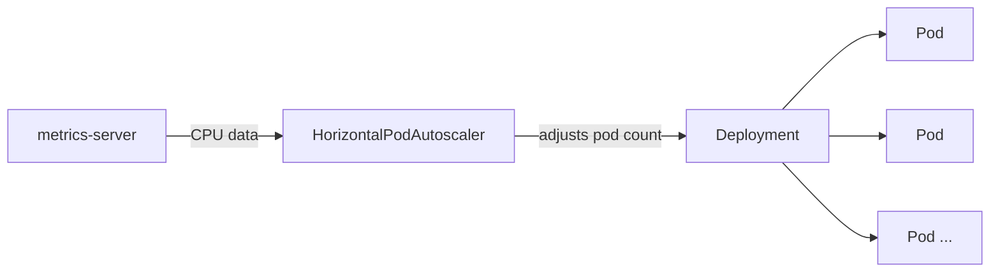
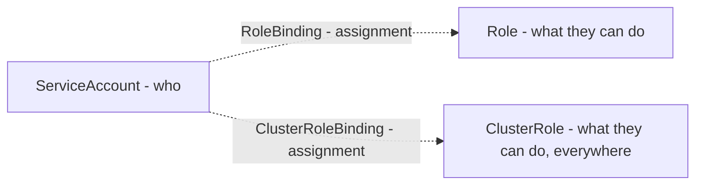

# ☸️ Kubernetes Other Resources — StatefulSets, Volumes, Ingress, Jobs & Cronjobs, Resources and Limits, DaemonSets, HPA, VPA, Permissions

Phase 30 covered Pod, ReplicaSet, Deployment, Service, ConfigMaps, Secrets, and Canary Deployment. This phase covered the roadmap's Other Resources section — nine topics, **grouped by function into five groups**, each with a software-ecosystem example, real function, cross-references to related phases, and real YAML/kubectl tests.

---

# Group 1 — Storage

## 1. StatefulSets



**Software example:** Like a database cluster (a PostgreSQL primary-replica setup) keeping each node's own disk files isolated — no node shares another's data, each has a stable identity and its own data.

**Real function:** In ReplicaSet, a deleted pod came back with a brand-new name/IP (as proven in Phase 30). StatefulSet guarantees the exact opposite — each pod gets its own personal PersistentVolumeClaim and a sequential, stable name (`web-0`, `web-1`, `web-2`).

**Cross-reference:** This is a **deliberate reversal** of Phase 30's ReplicaSet behavior ("a deleted pod doesn't come back, a new one is created") — necessary for stateful applications (databases).

Proved with a real test: wrote a message specific to `web-0`, deleted the pod entirely — the new pod came back **with the same name**, the message **was still there**. Also observed that with no StorageClass in the cluster, `web-0` stayed `Pending`, and **`web-1`/`web-2` were never created** until that resolved — indirect but real proof of StatefulSet's **sequential startup** guarantee (the next one doesn't start until the previous is ready). Installed `local-path-provisioner` to resolve the StorageClass issue.

**YAML:**

```yaml
apiVersion: v1
kind: Service
metadata:
  name: nginx
spec:
  clusterIP: None
  selector:
    app: nginx
  ports:
    - port: 80
---
apiVersion: apps/v1
kind: StatefulSet
metadata:
  name: web
spec:
  serviceName: "nginx"
  replicas: 3
  selector:
    matchLabels:
      app: nginx
  template:
    metadata:
      labels:
        app: nginx
    spec:
      containers:
        - name: nginx
          image: nginx:1.25
          volumeMounts:
            - name: www
              mountPath: /usr/share/nginx/html
  volumeClaimTemplates:
    - metadata:
        name: www
      spec:
        accessModes: ["ReadWriteOnce"]
        resources:
          requests:
            storage: 1Gi
```

---

## 2. Volumes

**Software example:** Like an application connecting to a database knowing it **can't create the database itself**, it needs to **connect to one that already exists** (like a `DATABASE_HOST` in config) — Static provisioning does exactly this "connect to already-existing infrastructure" job. Dynamic provisioning is like a cloud provider automatically spinning up a new disk when a request comes in.

**Real function:** In Static, an admin manually defines a `PersistentVolume` (pointing to an external resource like an NFS server). In Dynamic, a `StorageClass` + provisioner automatically creates a disk as PVC requests come in — `local-path-provisioner` used in StatefulSets is an example of this.

**Cross-reference:** This is the **infrastructure side** of StatefulSets' "each pod needs its own disk" need — StatefulSet says "I need a disk," the Volumes section explains **where that disk comes from**. Also noticed that **NFS** (used in the page's Static example) isn't Kubernetes' invention — developed by Sun Microsystems in 1984, a general Unix file-sharing protocol that predates Kubernetes by roughly 30 years.

Proved with a real test: that explicitly specifying `storageClassName` allows immediate binding without needing a default StorageClass; that `reclaimPolicy: Delete` auto-deletes the PV when the PVC is deleted; that the `accessModes` (ReadWriteOnce/ReadWriteMany) distinction directly connects to StatefulSets' isolation philosophy.

**YAML — Static PV:**

```yaml
apiVersion: v1
kind: PersistentVolume
metadata:
  name: nfs-pv
spec:
  capacity:
    storage: 10Gi
  accessModes:
    - ReadWriteMany
  persistentVolumeReclaimPolicy: Recycle
  nfs:
    path: /srv/nfs4
    server: 10.0.0.253
```

---

# Group 2 — Networking and Traffic Management

## 3. Ingress



**Software example:** Like a reverse proxy (nginx, covered in Phase 19) routing an incoming request from a single entry point to different backends based on path/domain — Ingress is the Kubernetes-integrated, automatically managed version of this.

**Real function:** An Ingress rule (YAML) only defines the **routing logic**; the real traffic is carried by the **Ingress Controller** (a separate nginx deployment). This separation is an application of the "separate config from code" principle learned with ConfigMap — changing the rule doesn't require restarting the controller.

**Cross-reference:** Researched that the page's installation link is outdated (the same pattern as Phase 30's CRI-O/kubeadm repo issues), used the official ingress-nginx manifest instead.

Proved with a real test: that `/app1` and `/app2` route to different Services through a single IP/port; that HTTPS works with TLS using a self-signed certificate (using Phase 30's Secret/base64 knowledge). The **TLS/x509 certificate standard** itself isn't Kubernetes-specific either — the certificate produced with `openssl` is the internet's general encryption/authentication standard, Kubernetes just uses this general standard through Secrets.

**YAML:**

```yaml
apiVersion: networking.k8s.io/v1
kind: Ingress
metadata:
  name: test-ingress
spec:
  ingressClassName: nginx
  tls:
    - hosts:
        - test.local
      secretName: myserver-tls
  rules:
    - host: test.local
      http:
        paths:
          - path: /
            pathType: Prefix
            backend:
              service:
                name: app3
                port:
                  number: 8080
```

---

# Group 3 — Workload Controllers

## 4. Jobs & Cronjobs

**Software example:** Like a database migration script — needs to run once and **finish**, unlike a Deployment which shouldn't ever restart indefinitely.

**Real function:** Job guarantees "stop once done" with `restartPolicy: Never`/`OnFailure` — the exact opposite of Deployment's `Always` (for things that need to run continuously). CronJob starts a **new Job repeatedly** on a schedule.

**Cross-reference:** Researched that the page's `batch/v1beta1` API was completely removed since Kubernetes v1.25 — a repeat of Phase 30's outdated repo address issue. The example image (`docker/whalesay`) has been unmaintained for years (old Schema 1 format), replaced with busybox.

Proved with a real test: that the `*/1 * * * *` schedule genuinely works, that two separate Jobs (with different timestamps) were created a minute apart. **This scheduling syntax** isn't Kubernetes' invention — it's Unix/Linux's decades-old **cron** standard, already deeply covered in Phase 15 (Cron Automation); CronJob simply borrows this general syntax as-is.

**YAML:**

```yaml
apiVersion: batch/v1
kind: CronJob
metadata:
  name: hello-cronjob
spec:
  schedule: "*/1 * * * *"
  jobTemplate:
    spec:
      template:
        spec:
          containers:
            - name: hello
              image: busybox
              command: ["sh", "-c", "date; echo Merhaba DevOps"]
          restartPolicy: Never
```

---

## 5. DaemonSets

**Software example:** Like a log-collection agent (covered in Phase 8's log analysis) needing to run on **every server** — no matter how many servers there are, missing even one means data loss. Manually installing an agent on every new server is a constant, risky burden.

**Real function:** DaemonSet's replica count isn't **set manually** like ReplicaSet's — it's **automatically equal to the node count** in the cluster. It doesn't work based on traffic, but on the logic "one per node as long as the node exists."

**Cross-reference:** In Phase 28, saw kube-proxy and CNI (Calico) run as DaemonSets — this phase grasped **why** they work that way (traffic-independent, an infrastructural necessity).

Proved with a real test: that in a single-node cluster, the DaemonSet created exactly **1** pod (`DESIRED: 1`).

**YAML:**

```yaml
apiVersion: apps/v1
kind: DaemonSet
metadata:
  name: example-daemonset
spec:
  selector:
    matchLabels:
      name: example-daemonset-pod
  template:
    metadata:
      labels:
        name: example-daemonset-pod
    spec:
      containers:
        - name: example-container
          image: nginx:latest
```

---

# Group 4 — Resource Management and Scaling

## 6. Resources and Limits

**Software example:** Like a cloud provider deciding which physical server to place a new VM request on, based on that server's free resources (Phase 28's kube-scheduler example) — if `requests` can't be satisfied, the request is rejected as "no room anywhere."

**Real function:** Two different failure types exist — insufficient `requests` leaves the pod **never started**, `Pending` (kube-scheduler level). Exceeding `limits` gets the pod **killed while running** (container-runtime/cgroups level, the same as Phase 25's Docker OOM kill).

**Cross-reference:** The `exitCode: 137, reason: OOMKilled` obtained while testing `limits` overflow is **exactly the same** output seen in Docker in Phase 25. The root cause behind this isn't Docker's or Kubernetes' invention either — **cgroups** (control groups), a kernel feature written by Google engineers in 2007 and added to the Linux kernel in 2008. Both Docker and Kubernetes use this **same, much older** kernel mechanism to constrain containers.

Proved with a real test: that a pod requesting `10` CPUs stayed `Pending` with an `Insufficient cpu` error, went `Running` instantly when requesting `500m`; that a container limited to `50Mi` got `OOMKilled` trying to fill `150M`.

**QoS Classes:** Based on the `requests`/`limits` combination, Kubernetes automatically assigns each pod a priority class — **BestEffort** if `requests` is undefined at all, **Burstable** if `requests`/`limits` differ, **Guaranteed** if they're equal. Under resource pressure, the node sacrifices pods in this order (BestEffort first, then Burstable, Guaranteed last). Proved with a real test: created three different YAMLs (no `resources` / different / equal) and confirmed with `kubectl get pod -o jsonpath='{.status.qosClass}'` that all three were correctly classified (`BestEffort`, `Burstable`, `Guaranteed`).

**YAML:**

```yaml
apiVersion: v1
kind: Pod
metadata:
  name: resource-ok
spec:
  containers:
    - name: resource-ok
      image: busybox
      resources:
        requests:
          cpu: "500m"
          memory: "128Mi"
        limits:
          cpu: "500m"
          memory: "128Mi"
```

---

## 7. Horizontal Pod Autoscaling (HPA)



**Software example:** Like an e-commerce site needing little server capacity at night and much more at noon — instead of keeping a fixed number of servers (wasteful at night, insufficient at noon), automatic adjustment based on demand.

**Real function:** HPA computes the pod count using a **proportional formula** (`new count = current × actual/target`) based on CPU data it gets from `metrics-server` (which, per Phase 28's "is everything OK controller" logic, periodically measures) — not a random "try, increase if not enough," but direct math.

**Cross-reference:** During `metrics-server` installation, hit the exact same error (`x509: cannot validate certificate`) as the "self-signed certificate" issue learned in Phase 30's TLS test, resolved with `--kubelet-insecure-tls`.

Proved with a real test: that under load, pod count increased between `1 → 4 → 8 → 10` (consistent with the proportional formula); separately proved a **gradual** increase (`2 → 3 → 4 → 5...`) using the `behavior` block (rule: at most 1 pod added every 15 seconds); observed that when load stopped, the pod count decreased **not immediately** but after a stabilization period. Covered the four metric types (Resource, Pods, Object, External) conceptually — an External metric (like message queue length) can catch the real bottleneck (waiting in queue) even when CPU is low.

**YAML:**

```yaml
apiVersion: autoscaling/v2
kind: HorizontalPodAutoscaler
metadata:
  name: php-apache
spec:
  scaleTargetRef:
    apiVersion: apps/v1
    kind: Deployment
    name: php-apache
  minReplicas: 2
  maxReplicas: 10
  metrics:
    - type: Resource
      resource:
        name: cpu
        target:
          type: Utilization
          averageUtilization: 20
```

---

## 8. Vertical Pod Autoscaling (VPA)

**Software example:** Like a monitoring tool (Prometheus) measuring real usage and automatically generating recommendations, instead of manually guessing and constantly updating an application's real resource needs.

**Real function:** While HPA changes the **count** of pods, VPA changes a single pod's **resource request** (`requests`/`limits`). But doing so requires **deleting and recreating** the pod (an application of Phase 30's "changing `template` triggers a rolling update" logic) — creating a brief downtime risk for single-replica applications.

**Cross-reference:** During installation, got a warning that `updateMode: Auto` is deprecated — a parallel pattern with Jobs & Cronjobs' `batch/v1beta1` and VPA's own old APIs.

Proved with a real test: that for a container requesting `10m`, VPA looked at real usage and recommended `350m`; that VPA **refused** to update a **single-replica** (`replicas: 1`) Deployment (the `globalMinReplicas=2` safety constraint, with a "Too few replicas" log message); that going up to `replicas: 2`, the pods were genuinely deleted and recreated with `350m`.

**YAML:**

```yaml
apiVersion: autoscaling.k8s.io/v1
kind: VerticalPodAutoscaler
metadata:
  name: vpa-demo
spec:
  targetRef:
    apiVersion: "apps/v1"
    kind: Deployment
    name: vpa-demo
  updatePolicy:
    updateMode: "Recreate"
```

---

# Group 5 — Security and Access Control

## 9. Permissions (RBAC)



**Software example:** Similar to a web application's user/role system — a **user list** (`ServiceAccount`), a **permission list** (`Role` — what operations are allowed), and a **user-to-role assignment record** (`RoleBinding`). This analogy itself exists because **RBAC** (Role-Based Access Control) is a general security model — formalized by NIST in the 1990s, used the same way in databases, operating systems, AWS IAM, existing long before Kubernetes.

**Real function:** `Role`/`RoleBinding` operate **specific to a namespace** — a fully-privileged account in one namespace has no privileges at all in another. `ClusterRole`/`ClusterRoleBinding` are valid **cluster-wide** — the `clusterrole` definitions seen in Phase 28's kube-apiserver YAML and the VPA installation are examples of this.

**Cross-reference:** Proved with a real test that the page's `rbac.authorization.k8s.io/v1beta1` (like `batch/v1beta1` in Jobs & Cronjobs) has also been completely removed, moved to `v1`.

Proved with a real test: that a `ServiceAccount` has permission in the namespace it's defined in (`kubectl auth can-i`) but none in a namespace it's not defined in; that adding a `ClusterRoleBinding` makes the same account valid in **every namespace** (even `kube-system`); but that it's valid **only for the defined operations** (`get`/`list`), remaining unprivileged for undefined operations (`create`) — proof of the "least privilege" principle.

**Real login flow:** The page's old method (`kubectl get sa -o jsonpath="{.secrets[0].name}"`) returns **empty in modern Kubernetes** — every `ServiceAccount` no longer automatically gets a token Secret (for security reasons). Used the current method (`kubectl create token`) and put this token in an **isolated kubeconfig file** — ran `kubectl --kubeconfig=devs-kubeconfig.yaml` using only this file, without ever touching admin credentials. `get pods` **worked** (defined in the Role), `auth can-i delete pods` returned **`no`** (not defined in the Role) — proving the real, end-to-end login experience of a restricted user.

**YAML:**

```yaml
apiVersion: v1
kind: ServiceAccount
metadata:
  name: devs
  namespace: myspace
---
kind: Role
apiVersion: rbac.authorization.k8s.io/v1
metadata:
  name: devs-full-access
  namespace: myspace
rules:
  - apiGroups: ["", "extensions", "apps"]
    resources: ["*"]
    verbs: ["*"]
---
kind: RoleBinding
apiVersion: rbac.authorization.k8s.io/v1
metadata:
  name: devs-user-view
  namespace: myspace
subjects:
  - kind: ServiceAccount
    name: devs
    namespace: myspace
roleRef:
  apiGroup: rbac.authorization.k8s.io
  kind: Role
  name: devs-full-access
```

---

## 📊 Summary (By Group)

| Group                    | Topic                | What Was Learned                                                                                    |
| ------------------------ | -------------------- | --------------------------------------------------------------------------------------------------- |
| **Storage**              | StatefulSets         | Persistent identity + persistent data — even if a pod is deleted, the same name/disk comes back     |
| **Storage**              | Volumes              | Static (manual, connecting to external resource) vs Dynamic (automatic creation)                    |
| **Networking**           | Ingress              | Path/host-based routing through a single IP/port, with TLS support                                  |
| **Workload Controllers** | Jobs & Cronjobs      | A job that should finish (Never/OnFailure) vs one that runs continuously (Always)                   |
| **Workload Controllers** | DaemonSets           | Replica count = node count, traffic-independent, an infrastructural necessity                       |
| **Resource Management**  | Resources and Limits | Insufficient requests → Pending; exceeding limits → OOMKilled; QoS classes determine eviction order |
| **Resource Management**  | HPA                  | Automatically, proportionally adjusts pod count based on CPU/external metrics                       |
| **Resource Management**  | VPA                  | Automatically adjusts a single pod's resource request, but requires delete-and-recreate             |
| **Security**             | Permissions (RBAC)   | Role/RoleBinding are namespace-specific, ClusterRole/ClusterRoleBinding are cluster-wide            |

---

ℹ️ _All tests were performed on a real Ubuntu VPS (on the Kubespray cluster) — each topic proven with a software-ecosystem example, its real function, cross-references to related phases, and real YAML/kubectl tests. Along the way, multiple outdated/removed API versions (batch/v1beta1, rbac.authorization.k8s.io/v1beta1, the VPA autoscaling Auto mode) and an unmaintained image (docker/whalesay) were identified and replaced with current equivalents._
