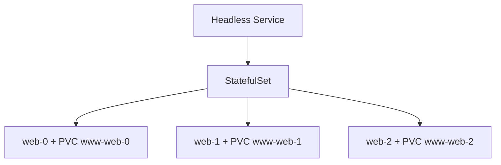
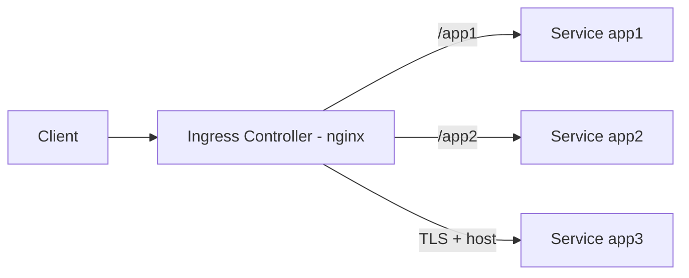
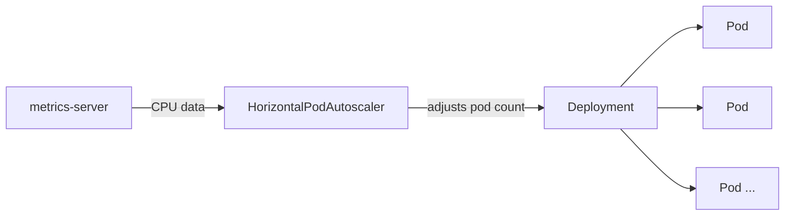
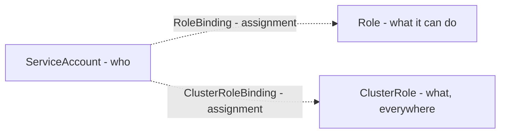

# ☸️ Kubernetes Other Resources — StatefulSets, Volumes, Ingress, Jobs & Cronjobs, Resources and Limits, DaemonSets, HPA, VPA, Permissions

30th phase covered Pod, ReplicaSet, Deployment, Service, ConfigMaps, Secrets, and Canary Deployment. This phase I worked through the roadmap's Other Resources section — nine topics, each with a software-ecosystem example, its real function, cross-references to related phases, and real YAML/kubectl tests.

---

## 1. StatefulSets



**Software example:** Like a database cluster's (PostgreSQL primary-replica) nodes each keeping their **own isolated disk files** — no node shares another's data, each has a fixed identity and data.

**Real function:** A deleted ReplicaSet pod came back with a brand-new name/IP (as I proved in Phase 30). StatefulSet guarantees the exact opposite — each pod gets its **own personal PersistentVolumeClaim** and a **sequential, stable name** (`web-0`, `web-1`, `web-2`).

**Cross-reference:** This is a **deliberate reversal** of ReplicaSet's "a deleted pod isn't revived, a new one is created" behavior from Phase 30 — necessary for stateful applications (databases).

Proved this with a real test: wrote a message unique to `web-0`, deleted the pod entirely — the new pod came back with the **same name**, the message was **still there**. Also observed that because the cluster had no StorageClass, `web-0` stayed `Pending`, and until that was resolved, **`web-1`/`web-2` were never created** — indirect but real evidence of StatefulSet's **ordered startup** guarantee (the next one never starts before the previous one is ready). Installed `local-path-provisioner` to resolve the StorageClass issue.

**YAML:**

```yaml
apiVersion: v1
kind: Service
metadata:
  name: nginx
spec:
  clusterIP: None
  selector:
    app: nginx
  ports:
    - port: 80
---
apiVersion: apps/v1
kind: StatefulSet
metadata:
  name: web
spec:
  serviceName: "nginx"
  replicas: 3
  selector:
    matchLabels:
      app: nginx
  template:
    metadata:
      labels:
        app: nginx
    spec:
      containers:
        - name: nginx
          image: nginx:1.25
          volumeMounts:
            - name: www
              mountPath: /usr/share/nginx/html
  volumeClaimTemplates:
    - metadata:
        name: www
      spec:
        accessModes: ["ReadWriteOnce"]
        resources:
          requests:
            storage: 1Gi
```

---

## 2. Volumes

**Software example:** Like an application connecting to a database that it **cannot create itself**, needing to **connect to an already-existing server** (like `DATABASE_HOST` in a config) — Static provisioning does exactly this "connect to already-existing infrastructure" job. Dynamic provisioning is like a cloud provider **automatically** opening a new disk when a request comes in.

**Real function:** In Static, an admin manually defines a `PersistentVolume` (pointing to an external resource like an NFS server). In Dynamic, a `StorageClass` + provisioner **automatically** creates a disk as PVC requests come in — the `local-path-provisioner` I used in StatefulSets is an example of this.

**Cross-reference:** This is the **infrastructure side** of StatefulSets' "each pod needs its own disk" requirement — StatefulSet says "I need a disk," the Volumes section explains **where that disk comes from**. Also realized **NFS** (used in the page's Static example) isn't Kubernetes' invention — developed by Sun Microsystems in 1984, a general Unix file-sharing protocol that existed roughly 30 years before Kubernetes.

Proved with a real test: explicitly specifying `storageClassName` allows instant binding without needing a default StorageClass; `reclaimPolicy: Delete` automatically deletes the PV when the PVC is deleted; the `accessModes` (ReadWriteOnce/ReadWriteMany) difference directly connects to StatefulSets' isolation philosophy.

**YAML — Static PV:**

```yaml
apiVersion: v1
kind: PersistentVolume
metadata:
  name: nfs-pv
spec:
  capacity:
    storage: 10Gi
  accessModes:
    - ReadWriteMany
  persistentVolumeReclaimPolicy: Recycle
  nfs:
    path: /srv/nfs4
    server: 10.0.0.253
```

---

## 3. Ingress



**Software example:** Like an nginx reverse proxy (which I covered in Phase 19) routing incoming traffic from a single entry point to different backends by path/domain — Ingress is Kubernetes' integrated, automatically managed version of this.

**Real function:** An Ingress rule (YAML) only defines the **routing logic**; the actual traffic is carried by the **Ingress Controller** (a separate nginx deployment). This separation is an application of the "separate config from code" principle I learned with ConfigMap — no need to restart the controller when a rule changes.

**Cross-reference:** Researched that the page's installation link was outdated (the same pattern as Phase 30's CRI-O/kubeadm repo issues) and used the official ingress-nginx manifest instead.

Proved with a real test: a single IP/port routing `/app1` and `/app2` to different Services; TLS over HTTPS working with a self-signed certificate (using what I learned about Secret/base64 in Phase 30). **TLS/x509 certificate standards** themselves aren't Kubernetes-specific either — the certificate I generated with `openssl` is the internet's general encryption/authentication standard, Kubernetes just uses this general standard via Secret.

**YAML:**

```yaml
apiVersion: networking.k8s.io/v1
kind: Ingress
metadata:
  name: test-ingress
spec:
  ingressClassName: nginx
  tls:
    - hosts:
        - test.local
      secretName: myserver-tls
  rules:
    - host: test.local
      http:
        paths:
          - path: /
            pathType: Prefix
            backend:
              service:
                name: app3
                port:
                  number: 8080
```

---

## 4. Jobs & Cronjobs

**Software example:** Like a database migration script — needs to run once and **finish**, shouldn't restart forever like a Deployment.

**Real function:** Job guarantees "stop once finished" via `restartPolicy: Never`/`OnFailure` — the exact opposite of Deployment's `Always` (for things that need to run continuously). CronJob repeatedly starts a **new Job** on a schedule.

**Cross-reference:** Researched that the page's `batch/v1beta1` API has been completely removed since Kubernetes v1.25 — a repeat of Phase 30's outdated repo address pattern. The example image (`docker/whalesay`) has been unmaintained for years (old Schema 1 format), replaced with busybox.

Proved with a real test: the `*/1 * * * *` schedule genuinely worked, two separate Jobs (with different timestamps) were created a minute apart. **This scheduling syntax** isn't Kubernetes' invention — it's Unix/Linux's decades-old **cron** standard, which I already covered in depth in Phase 15 (Cron Automation); CronJob just borrows this general syntax as-is.

**YAML:**

```yaml
apiVersion: batch/v1
kind: CronJob
metadata:
  name: hello-cronjob
spec:
  schedule: "*/1 * * * *"
  jobTemplate:
    spec:
      template:
        spec:
          containers:
            - name: hello
              image: busybox
              command: ["sh", "-c", "date; echo Merhaba DevOps"]
          restartPolicy: Never
```

---

## 5. Resources and Limits

**Software example:** Like a cloud provider deciding which physical server to place a new VM request on based on that server's available resources (Phase 28's kube-scheduler example) — if `requests` can't be met, the request is rejected with "no room on any server."

**Real function:** There are two different problem types — insufficient `requests` leaves a pod stuck `Pending` **without ever starting** (kube-scheduler level). Exceeding `limits` causes the pod to be killed **while running** (container-runtime/cgroups level, the same as Phase 25's Docker OOM kill).

**Cross-reference:** The `exitCode: 137, reason: OOMKilled` I got testing `limits` overrun is the **exact same** output I saw with Docker in Phase 25. The real root cause of this is neither Docker's nor Kubernetes' invention — **cgroups** (control groups), a kernel feature written by Google engineers in 2007 and merged into the Linux kernel in 2008. Both Docker and Kubernetes use this **same, much older** kernel mechanism to constrain containers.

Proved with a real test: a pod requesting `10` CPUs stayed `Pending` with an `Insufficient cpu` error, went `Running` instantly when requesting `500m`; a container with a `50Mi` limit got `OOMKilled` trying to fill `150M`.

**QoS Classes:** Based on the `requests`/`limits` combination, Kubernetes automatically assigns every pod a priority class — **BestEffort** if `requests` is never defined, **Burstable** if `requests`/`limits` differ, **Guaranteed** if they're equal. Under resource pressure, a node sacrifices pods in that order (BestEffort first, then Burstable, Guaranteed last). Proved with a real test: created three different YAMLs (no resources / different / equal) and confirmed via `kubectl get pod -o jsonpath='{.status.qosClass}'` that all three landed in the correct class (`BestEffort`, `Burstable`, `Guaranteed`).

**YAML:**

```yaml
apiVersion: v1
kind: Pod
metadata:
  name: resource-ok
spec:
  containers:
    - name: resource-ok
      image: busybox
      resources:
        requests:
          cpu: "500m"
          memory: "128Mi"
        limits:
          cpu: "500m"
          memory: "128Mi"
```

---

## 6. DaemonSets

**Software example:** Like a log-collection agent (which I covered in Phase 8's log analysis) needing to run **on every server** — no matter how many servers there are, skipping even one means data loss. Manually installing an agent on every new server is a constant, risky workload.

**Real function:** DaemonSet's replica count **isn't set manually** like ReplicaSet's — it **automatically equals the node count** in the cluster. It works on the logic of "1 per node as long as the node exists," independent of traffic.

**Cross-reference:** In Phase 28 I'd seen that kube-proxy and CNI (Calico) run as DaemonSets — this phase I grasped **why** they work that way (an infrastructural necessity, independent of traffic).

Proved with a real test: on my single-node cluster, DaemonSet created exactly **1** pod (`DESIRED: 1`).

**YAML:**

```yaml
apiVersion: apps/v1
kind: DaemonSet
metadata:
  name: example-daemonset
spec:
  selector:
    matchLabels:
      name: example-daemonset-pod
  template:
    metadata:
      labels:
        name: example-daemonset-pod
    spec:
      containers:
        - name: example-container
          image: nginx:latest
```

---

## 7. Horizontal Pod Autoscaling (HPA)



**Software example:** Like an e-commerce site needing little server capacity at night and a lot at noon — instead of keeping a fixed number of servers (wasteful at night, insufficient at noon), automatically adjusting to demand.

**Real function:** HPA calculates pod count using a **proportion formula** (`new count = current × actual/target`) from CPU data it gets from `metrics-server` (which periodically measures things, similar to Phase 28's "is everything okay controller" logic) — not a random "try, increase if not enough," but direct math.

**Cross-reference:** Setting up `metrics-server`, got the exact same error (`x509: cannot validate certificate`) as the self-signed certificate issue I learned about in Phase 30's TLS test, resolved it with `--kubelet-insecure-tls`.

Proved with a real test: pod count increased `1 → 4 → 8 → 10` under load (matching the proportion formula); also proved a **gradual** increase (`2 → 3 → 4 → 5...`) with a `behavior` block (a rule allowing at most 1 pod added every 15 seconds); saw pod count decrease **not immediately** but after a stabilization period once load stopped. Worked through the four metric types (Resource, Pods, Object, External) conceptually — an External metric (like message queue length) can catch a real bottleneck (waiting in a queue) even when CPU is low.

**YAML:**

```yaml
apiVersion: autoscaling/v2
kind: HorizontalPodAutoscaler
metadata:
  name: php-apache
spec:
  scaleTargetRef:
    apiVersion: apps/v1
    kind: Deployment
    name: php-apache
  minReplicas: 2
  maxReplicas: 10
  metrics:
    - type: Resource
      resource:
        name: cpu
        target:
          type: Utilization
          averageUtilization: 20
```

---

## 8. Vertical Pod Autoscaling (VPA)

**Software example:** Like a monitoring tool (Prometheus) measuring real usage and automatically generating a recommendation, instead of manually guessing an app's real resource need and constantly updating it.

**Real function:** HPA changes pod **count**, VPA changes a single pod's **resource request** (`requests`/`limits`). But to do this it has to **delete and recreate** the pod (an application of Phase 30's "template change triggers rolling update" logic) — which creates a brief downtime risk for single-replica applications.

**Cross-reference:** Got a deprecation warning for `updateMode: Auto` during installation — a parallel pattern to Jobs & Cronjobs' `batch/v1beta1` and VPA's own outdated API.

Proved with a real test: for a container requesting `10m`, VPA recommended `350m` based on real usage; VPA **refused** to update a **single-replica** (`replicas: 1`) Deployment (a `globalMinReplicas=2` safety constraint, seen in the "Too few replicas" log message); once scaled to `replicas: 2`, the pods were genuinely deleted and recreated with `350m`.

**YAML:**

```yaml
apiVersion: autoscaling.k8s.io/v1
kind: VerticalPodAutoscaler
metadata:
  name: vpa-demo
spec:
  targetRef:
    apiVersion: "apps/v1"
    kind: Deployment
    name: vpa-demo
  updatePolicy:
    updateMode: "Recreate"
```

---

## 9. Permissions (RBAC)



**Software example:** Similar to a web application's user/role system — a **user list** (`ServiceAccount`), a **permission list** (`Role` — what operations are allowed), and a **user-to-role assignment** record (`RoleBinding`). This analogy itself exists because **RBAC** (Role-Based Access Control) is a general security model — formalized by NIST in the 1990s, used the same way in databases, operating systems, AWS IAM — a concept that existed long before Kubernetes.

**Real function:** `Role`/`RoleBinding` work **per-namespace** — an account fully authorized in one namespace has no authority at all in another. `ClusterRole`/`ClusterRoleBinding` are valid **cluster-wide** — the `clusterrole` definitions I saw in kube-apiserver's YAML in Phase 28 and during VPA installation are examples of this.

**Cross-reference:** Proved with a real test that the page's `rbac.authorization.k8s.io/v1beta1` (like Jobs & Cronjobs' `batch/v1beta1`) has also been completely removed, switched to `v1`.

Proved with a real test: a `ServiceAccount` was authorized (`kubectl auth can-i`) in the namespace it was defined in, unauthorized in one it wasn't; once a `ClusterRoleBinding` was added, the same account became valid in **every namespace** (even `kube-system`); but only for the **defined operations** (`get`/`list`) — remained unauthorized for operations not defined (`create`) — proof of the "least privilege" principle.

**Real login flow:** The page's old method (`kubectl get sa -o jsonpath="{.secrets[0].name}"`) returns **empty** on modern Kubernetes — ServiceAccounts no longer automatically get a token Secret (for security reasons). Used the current method (`kubectl create token`) and placed the token into an **isolated kubeconfig file** — ran `kubectl --kubeconfig=devs-kubeconfig.yaml` using only this file, never touching admin credentials. `get pods` **worked** (defined in the Role), `auth can-i delete pods` returned **`no`** (not defined in the Role) — proved the restricted user's real, end-to-end login experience.

**YAML:**

```yaml
apiVersion: v1
kind: ServiceAccount
metadata:
  name: devs
  namespace: myspace
---
kind: Role
apiVersion: rbac.authorization.k8s.io/v1
metadata:
  name: devs-full-access
  namespace: myspace
rules:
  - apiGroups: ["", "extensions", "apps"]
    resources: ["*"]
    verbs: ["*"]
---
kind: RoleBinding
apiVersion: rbac.authorization.k8s.io/v1
metadata:
  name: devs-user-view
  namespace: myspace
subjects:
  - kind: ServiceAccount
    name: devs
    namespace: myspace
roleRef:
  apiGroup: rbac.authorization.k8s.io
  kind: Role
  name: devs-full-access
```

---

## 📊 Summary

| Topic                | What I Learned                                                                                                                                                |
| -------------------- | ------------------------------------------------------------------------------------------------------------------------------------------------------------- |
| StatefulSets         | Persistent identity + persistent data — same name/disk comes back even after deletion                                                                         |
| Volumes              | Static (manual, connect to external resource) vs Dynamic (automatic creation)                                                                                 |
| Ingress              | Path/host-based routing through a single IP/port, TLS-capable                                                                                                 |
| Jobs & Cronjobs      | Work that must finish (Never/OnFailure) vs work that runs continuously (Always)                                                                               |
| Resources and Limits | Insufficient requests → Pending; exceeding limits → OOMKilled (cgroups, Linux kernel); QoS classes (BestEffort/Burstable/Guaranteed) determine eviction order |
| DaemonSets           | Replica count = node count, independent of traffic, an infrastructural necessity                                                                              |
| HPA                  | Automatically, proportionally adjusts pod count based on CPU/external metrics                                                                                 |
| VPA                  | Automatically adjusts a single pod's resource request, but requires delete-and-recreate                                                                       |
| Permissions (RBAC)   | Role/RoleBinding are per-namespace, ClusterRole/ClusterRoleBinding are cluster-wide                                                                           |

---

ℹ️ _All tests were performed on a real Ubuntu VPS (on the Kubespray cluster) — each topic proven with a software-ecosystem example, its real function, cross-references to related phases, and real YAML/kubectl tests. Along the way, multiple deprecated/removed API versions (batch/v1beta1, rbac.authorization.k8s.io/v1beta1, VPA's Auto update mode) and an unmaintained image (docker/whalesay) were identified and replaced with current equivalents._
