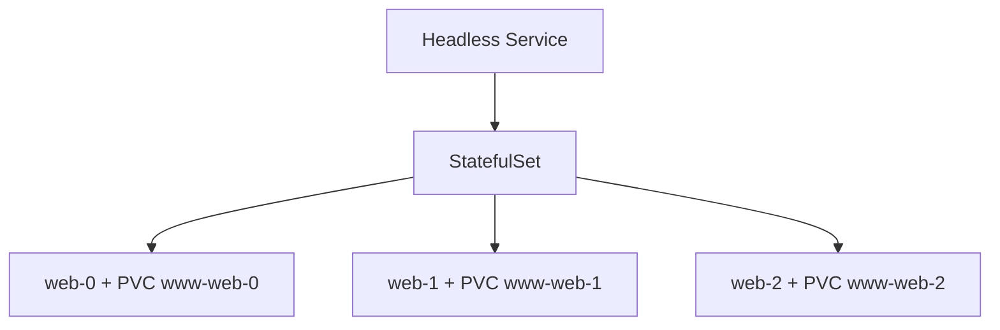
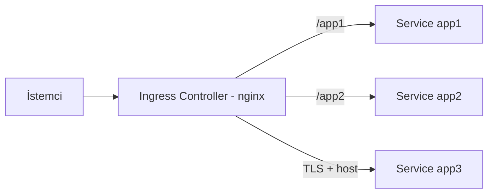
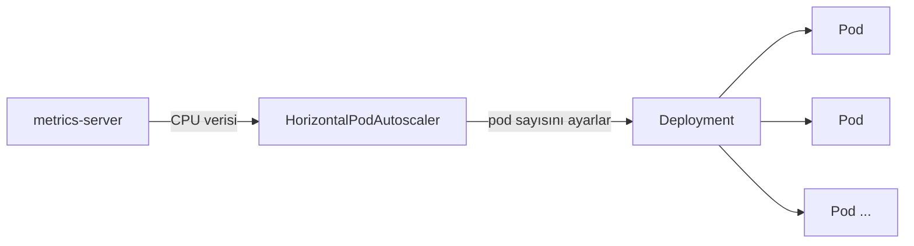
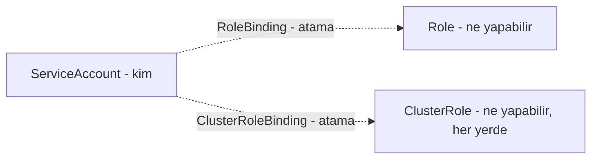

# ☸️ Kubernetes Diğer Kaynaklar — StatefulSets, Volumes, Ingress, Jobs & Cronjobs, Kaynaklar ve Limitler, DaemonSets, HPA, VPA, Yetkiler

30. fazda Pod, ReplicaSet, Deployment, Service, ConfigMaps, Secrets ve Kanarya Deployment'ı işlemiştim. Bu fazda roadmap'in Diğer Kaynaklar bölümünü işledim — dokuz konu, **işlevine göre beş grupta**, hepsi yazılım ekosisteminden örnekle, gerçek işleviyle, ilgili fazlara çapraz referansla, ve gerçek YAML/kubectl testleriyle.

---

# Grup 1 — Depolama

## 1. StatefulSets



**Yazılım örneği:** Bir veritabanı cluster'ının (PostgreSQL primary-replica gibi) her node'unun **kendi disk dosyalarını** izole tutması gibi — hiçbir node bir diğerinin verisini paylaşmıyor, her birinin kimliği ve verisi sabit.

**Gerçek işlevi:** ReplicaSet'te silinen bir pod, yepyeni bir isim/IP ile geri geliyordu (30. fazda kanıtladığım gibi). StatefulSet bunun tam tersini garanti ediyor — her pod'a **kendi kişisel PersistentVolumeClaim'ini** ve **sıralı, kararlı bir ismi** (`web-0`, `web-1`, `web-2`) veriyor.

**Çapraz referans:** Bu, 30. fazdaki ReplicaSet'in "silinen pod geri gelmez, yenisi yaratılır" davranışının **kasıtlı olarak tersine çevrilmiş** hali — durumlu (stateful) uygulamalar (veritabanları) için gerekli.

Gerçek testle kanıtladım: `web-0`'a kendine özel bir mesaj yazdım, pod'u tamamen sildim — yeni pod **aynı isimle** geri geldi, mesaj **hâlâ oradaydı**. Ayrıca cluster'da hiç StorageClass olmadığı için `web-0`'ın `Pending`'de kaldığını, ve o çözülene kadar **`web-1`/`web-2`'nin hiç oluşturulmadığını** gözlemledim — bu, StatefulSet'in **sıralı başlatma** garantisinin (bir öncekinin hazır olması beklenmeden bir sonrakinin başlamaması) dolaylı ama gerçek kanıtı. `local-path-provisioner` kurup StorageClass sorununu çözdüm.

**YAML:**

```yaml
apiVersion: v1
kind: Service
metadata:
  name: nginx
spec:
  clusterIP: None
  selector:
    app: nginx
  ports:
    - port: 80
---
apiVersion: apps/v1
kind: StatefulSet
metadata:
  name: web
spec:
  serviceName: "nginx"
  replicas: 3
  selector:
    matchLabels:
      app: nginx
  template:
    metadata:
      labels:
        app: nginx
    spec:
      containers:
        - name: nginx
          image: nginx:1.25
          volumeMounts:
            - name: www
              mountPath: /usr/share/nginx/html
  volumeClaimTemplates:
    - metadata:
        name: www
      spec:
        accessModes: ["ReadWriteOnce"]
        resources:
          requests:
            storage: 1Gi
```

---

## 2. Volumes

**Yazılım örneği:** Bir uygulamanın veritabanına bağlanırken, veritabanını **kendisi oluşturamayacağını**, zaten var olan bir sunucuya (config'deki `DATABASE_HOST` gibi) **bağlanması gerektiğini** bilmesi gibi — Static provisioning, tam bu "zaten var olan altyapıya bağlanma" işini yapıyor. Dynamic provisioning ise bir bulut sağlayıcının, talep gelince **otomatik olarak** yeni bir disk açması gibi.

**Gerçek işlevi:** Static'te bir yönetici elle bir `PersistentVolume` tanımlıyor (NFS sunucusu gibi dışarıdaki bir kaynağa işaret ederek). Dynamic'te bir `StorageClass` + provisioner, PVC isteği geldikçe **otomatik** disk oluşturuyor — StatefulSets'te kullandığım `local-path-provisioner` bunun örneği.

**Çapraz referans:** Bu, StatefulSets'teki "her pod'un kendi diski" ihtiyacının **altyapı tarafı** — StatefulSet "bana disk lazım" der, Volumes bölümü o diskin **nereden geldiğini** açıklıyor. Ayrıca **NFS**'in (sayfadaki Static örnekte kullanılan), Kubernetes'in icadı olmadığını fark ettim — 1984'te Sun Microsystems tarafından geliştirilmiş, Kubernetes'ten yaklaşık 30 yıl önce var olan genel bir Unix dosya paylaşım protokolü.

Gerçek testle kanıtladım: `storageClassName`'i açıkça belirtmenin, varsayılan StorageClass'a gerek kalmadan anında bağlanma sağladığını; `reclaimPolicy: Delete`'in, PVC silinince PV'yi de otomatik sildiğini; `accessModes` (ReadWriteOnce/ReadWriteMany) farkının, StatefulSets'in izolasyon felsefesiyle doğrudan bağlantılı olduğunu.

**YAML — Static PV:**

```yaml
apiVersion: v1
kind: PersistentVolume
metadata:
  name: nfs-pv
spec:
  capacity:
    storage: 10Gi
  accessModes:
    - ReadWriteMany
  persistentVolumeReclaimPolicy: Recycle
  nfs:
    path: /srv/nfs4
    server: 10.0.0.253
```

---

# Grup 2 — Ağ ve Trafik Yönetimi

## 3. Ingress



**Yazılım örneği:** Bir reverse proxy'nin (nginx, 19. fazda işlediğim), tek bir giriş noktasından gelen isteği path/domain'e göre farklı arka uçlara yönlendirmesi gibi — Ingress, bunun Kubernetes'e entegre, otomatik yönetilen hali.

**Gerçek işlevi:** Ingress kuralı (YAML) sadece **yönlendirme mantığını** tanımlıyor, gerçek trafiği **Ingress Controller** (ayrı bir nginx deployment'ı) taşıyor. Bu ayrım, ConfigMap'te öğrendiğim "config'i koddan ayırma" prensibinin bir uygulaması — kural değişince controller'ı yeniden başlatmaya gerek yok.

**Çapraz referans:** Sayfadaki kurulum linkinin güncel olmadığını (30. fazdaki CRI-O/kubeadm repo sorunlarıyla aynı örüntü) araştırıp resmi ingress-nginx manifestini kullandım.

Gerçek testle kanıtladım: tek bir IP/port üzerinden `/app1` ve `/app2`'nin farklı Service'lere yönlendiğini; TLS ile HTTPS'in, kendinden imzalı bir sertifikayla (30. fazdaki Secret/base64 bilgimi kullanarak) çalıştığını. **TLS/x509 sertifika standardının** kendisi de Kubernetes'e özel değil — `openssl` ile ürettiğim sertifika, internetin genel şifreleme/kimlik doğrulama standardı, Kubernetes sadece bu genel standardı Secret üzerinden kullanıyor.

**YAML:**

```yaml
apiVersion: networking.k8s.io/v1
kind: Ingress
metadata:
  name: test-ingress
spec:
  ingressClassName: nginx
  tls:
    - hosts:
        - test.local
      secretName: myserver-tls
  rules:
    - host: test.local
      http:
        paths:
          - path: /
            pathType: Prefix
            backend:
              service:
                name: app3
                port:
                  number: 8080
```

---

# Grup 3 — İş Yükü Kontrolcüleri

## 4. Jobs & Cronjobs

**Yazılım örneği:** Bir veritabanı migration scripti gibi — bir kere çalışıp **bitmesi** gerekiyor, Deployment gibi sonsuza kadar yeniden başlamamalı.

**Gerçek işlevi:** Job, `restartPolicy: Never`/`OnFailure` ile "bitince dursun" garantisi veriyor — Deployment'ın `Always`'inin (sürekli çalışması gereken işler için) tam tersi. CronJob, zamanlanmış olarak **tekrar tekrar yeni bir Job** başlatıyor.

**Çapraz referans:** Sayfadaki `batch/v1beta1` API'sinin Kubernetes v1.25'ten beri tamamen kaldırıldığını araştırdım — 30. fazdaki eski repo adresleri sorununun bir tekrarı. Örnek image (`docker/whalesay`) yıllardır bakımsız (eski Schema 1 format), busybox ile değiştirdim.

Gerçek testle kanıtladım: `*/1 * * * *` zamanlamasının gerçekten çalıştığını, bir dakika arayla iki ayrı Job'un (farklı zaman damgalarıyla) oluştuğunu. **Bu zamanlama sözdizimi**, Kubernetes'in icadı değil — Faz 15'te (Cron Otomasyonu) zaten derinlemesine işlediğim, Unix/Linux'un onlarca yıllık **cron** standardı; CronJob sadece bu genel sözdizimini olduğu gibi ödünç alıyor.

**YAML:**

```yaml
apiVersion: batch/v1
kind: CronJob
metadata:
  name: hello-cronjob
spec:
  schedule: "*/1 * * * *"
  jobTemplate:
    spec:
      template:
        spec:
          containers:
            - name: hello
              image: busybox
              command: ["sh", "-c", "date; echo Merhaba DevOps"]
          restartPolicy: Never
```

---

## 5. DaemonSets

**Yazılım örneği:** Bir log toplama ajanının (Faz 8'de log analizini işlediğim), **her sunucuda** çalışması gerekmesi gibi — sunucu sayısı kaç olursa olsun, birini bile atlamak veri kaybı demek. Elle her yeni sunucuya ajan kurmak, sürekli ve riskli bir iş yükü.

**Gerçek işlevi:** DaemonSet'in kopya sayısı, ReplicaSet'teki gibi **elle belirlenmiyor** — cluster'daki **node sayısına otomatik eşit** oluyor. Trafiğe göre değil, "node var olduğu sürece 1 tane" mantığıyla çalışıyor.

**Çapraz referans:** 28. fazda kube-proxy ve CNI'nin (Calico) DaemonSet olarak çalıştığını görmüştüm — bu fazda **neden** öyle çalıştığını (trafikten bağımsız, altyapısal zorunluluk) kavradım.

Gerçek testle kanıtladım: tek node'lu cluster'ımda DaemonSet'in tam **1** pod oluşturduğunu (`DESIRED: 1`).

**YAML:**

```yaml
apiVersion: apps/v1
kind: DaemonSet
metadata:
  name: example-daemonset
spec:
  selector:
    matchLabels:
      name: example-daemonset-pod
  template:
    metadata:
      labels:
        name: example-daemonset-pod
    spec:
      containers:
        - name: example-container
          image: nginx:latest
```

---

# Grup 4 — Kaynak Yönetimi ve Ölçekleme

## 6. Kaynaklar ve Limitler

**Yazılım örneği:** Bir bulut sağlayıcının, yeni bir VM isteğini fiziksel sunuculardan hangisine yerleştireceğine, o sunucunun boş kaynaklarına göre karar vermesi gibi (28. fazdaki kube-scheduler örneği) — `requests` yetersizse, "hiçbir sunucuda yer yok" denilip istek reddediliyor.

**Gerçek işlevi:** İki farklı sorun türü var — `requests` yetersizliği, pod'u **hiç başlatmadan** `Pending`'de bırakıyor (kube-scheduler seviyesi). `limits` aşımı ise pod **çalışırken** öldürülmesine yol açıyor (container-runtime/cgroups seviyesi, 25. fazdaki Docker OOM kill'in aynısı).

**Çapraz referans:** `limits` aşımını test ederken elde ettiğim `exitCode: 137, reason: OOMKilled`, 25. fazda Docker'da gördüğümle **birebir aynı** çıktı. Bunun asıl kök nedeni de ne Docker'ın ne Kubernetes'in icadı — **cgroups** (control groups), 2007'de Google mühendisleri tarafından yazılıp 2008'de Linux çekirdeğine eklenen bir çekirdek özelliği. Hem Docker hem Kubernetes, container'ları sınırlamak için bu **aynı, çok daha eski** çekirdek mekanizmasını kullanıyor.

Gerçek testle kanıtladım: `10` CPU isteyen bir pod'un `Insufficient cpu` hatasıyla `Pending` kaldığını, `500m` isteyince anında `Running` olduğunu; `50Mi` limitli bir container'ın `150M` doldurmaya çalışınca `OOMKilled` olduğunu.

**QoS Sınıfları:** `requests`/`limits` kombinasyonuna göre Kubernetes her pod'a otomatik bir öncelik sınıfı veriyor — `requests` hiç tanımlanmamışsa **BestEffort**, `requests`/`limits` farklıysa **Burstable**, ikisi eşitse **Guaranteed**. Kaynak sıkıntısında node, pod'ları bu sırayla (önce BestEffort, sonra Burstable, en son Guaranteed) feda ediyor. Gerçek testle kanıtladım: üç farklı YAML'ı (`resources` yok / farklı / eşit) oluşturup `kubectl get pod -o jsonpath='{.status.qosClass}'` ile üçünün de doğru sınıfa (`BestEffort`, `Burstable`, `Guaranteed`) ayrıldığını gördüm.

**YAML:**

```yaml
apiVersion: v1
kind: Pod
metadata:
  name: resource-ok
spec:
  containers:
    - name: resource-ok
      image: busybox
      resources:
        requests:
          cpu: "500m"
          memory: "128Mi"
        limits:
          cpu: "500m"
          memory: "128Mi"
```

---

## 7. Yatay Pod Ölçekleme (HPA)



**Yazılım örneği:** Bir e-ticaret sitesinin gece az, öğlen çok sunucu kaynağına ihtiyaç duyması gibi — sabit sayıda sunucu tutmak (gece israf, öğlen yetersiz) yerine, talebe göre otomatik ayarlama.

**Gerçek işlevi:** HPA, `metrics-server`'dan (28. fazdaki "her şey yolunda mı kontrolcüsü" mantığıyla periyodik ölçüm yapan) aldığı CPU verisiyle, **orantı formülüyle** (`yeni sayı = mevcut × gerçek/hedef`) pod sayısını hesaplıyor — rastgele "dene, yetmezse artır" değil, doğrudan matematik.

**Çapraz referans:** `metrics-server` kurulumunda, 30. fazdaki TLS testimde öğrendiğim "kendinden imzalı sertifika" sorunuyla aynı hatayı (`x509: cannot validate certificate`) aldım, `--kubelet-insecure-tls` ile çözdüm.

Gerçek testle kanıtladım: yük verince pod sayısının `1 → 4 → 8 → 10` arasında (orantı formülüyle uyumlu) arttığını; `behavior` bloğuyla (her 15 saniyede en fazla 1 pod ekleme kuralı) **kademeli** bir artışı (`2 → 3 → 4 → 5...`) da ayrıca kanıtladım; yük kesilince pod sayısının **hemen değil**, kararlılaştırma süresinden sonra azaldığını gördüm. Dört metrik türünü (Resource, Pods, Object, External) kavramsal olarak işledim — External metrik (mesaj kuyruğu uzunluğu gibi), CPU düşük olsa bile gerçek darboğazı (sırada bekleme) yakalayabiliyor.

**YAML:**

```yaml
apiVersion: autoscaling/v2
kind: HorizontalPodAutoscaler
metadata:
  name: php-apache
spec:
  scaleTargetRef:
    apiVersion: apps/v1
    kind: Deployment
    name: php-apache
  minReplicas: 2
  maxReplicas: 10
  metrics:
    - type: Resource
      resource:
        name: cpu
        target:
          type: Utilization
          averageUtilization: 20
```

---

## 8. Dikey Pod Ölçekleme (VPA)

**Yazılım örneği:** Bir uygulamanın gerçek kaynak ihtiyacını elle tahmin edip sürekli güncellemek yerine, bir izleme aracının (Prometheus gibi) gerçek kullanımı ölçüp otomatik öneri üretmesi gibi.

**Gerçek işlevi:** HPA pod **sayısını** değiştirirken, VPA tek bir pod'un **kaynak talebini** (`requests`/`limits`) değiştiriyor. Ama bunu yaparken pod'u **silip yeniden oluşturmak zorunda** (Faz 30'daki `template` değişince rolling update tetiklenmesi mantığının bir uygulaması) — bu da tek kopyalı uygulamalarda kısa bir kesinti riski yaratıyor.

**Çapraz referans:** Kurulum sırasında `updateMode: Auto`'nun kullanımdan kaldırıldığı uyarısını aldım — Jobs & Cronjobs'taki `batch/v1beta1` ve VPA'nın kendi eski API'leri arasındaki paralel örüntü.

Gerçek testle kanıtladım: `10m` istekli bir container için VPA'nın gerçek kullanıma bakıp `350m` önerdiğini; VPA'nın **tek kopyalı** (`replicas: 1`) bir Deployment'ı güncellemeyi **reddettiğini** (`globalMinReplicas=2` güvenlik kısıtı, "Too few replicas" log mesajıyla); `replicas: 2`'ye çıkınca pod'ların gerçekten silinip `350m` ile yeniden oluştuğunu.

**YAML:**

```yaml
apiVersion: autoscaling.k8s.io/v1
kind: VerticalPodAutoscaler
metadata:
  name: vpa-demo
spec:
  targetRef:
    apiVersion: "apps/v1"
    kind: Deployment
    name: vpa-demo
  updatePolicy:
    updateMode: "Recreate"
```

---

# Grup 5 — Güvenlik ve Erişim Kontrolü

## 9. Yetkiler (RBAC)



**Yazılım örneği:** Bir web uygulamasının kullanıcı/rol sistemine benzer — bir **kullanıcı listesi** (`ServiceAccount`), bir **izin listesi** (`Role` — hangi işlemler yapılabilir), ve bir **kullanıcıya rol atama** kaydı (`RoleBinding`). Aslında bu benzetmenin kendisi, **RBAC**'ın (Role-Based Access Control) genel bir güvenlik modeli olmasından kaynaklanıyor — 1990'larda NIST tarafından resmileştirilmiş, veritabanlarında, işletim sistemlerinde, AWS IAM'de aynı mantıkla kullanılan, Kubernetes'ten çok önce var olan bir kavram.

**Gerçek işlevi:** `Role`/`RoleBinding` **namespace'e özel** çalışıyor — bir namespace'te tam yetkili bir hesap, başka bir namespace'te hiçbir yetkiye sahip olmuyor. `ClusterRole`/`ClusterRoleBinding` ise **cluster genelinde** geçerli — 28. fazda kube-apiserver'ın YAML'ında, VPA kurulumunda gördüğüm `clusterrole` tanımları bunun örnekleri.

**Çapraz referans:** Sayfadaki `rbac.authorization.k8s.io/v1beta1`'in de (Jobs & Cronjobs'taki `batch/v1beta1` gibi) tamamen kaldırılmış olduğunu gerçek testle kanıtladım, `v1`'e geçtim.

Gerçek testle kanıtladım: bir `ServiceAccount`'ın tanımlandığı namespace'te (`kubectl auth can-i`) yetkili, tanımlanmadığı namespace'te yetkisiz olduğunu; bir `ClusterRoleBinding` eklenince aynı hesabın **her namespace'te** (hatta `kube-system`'da bile) geçerli olduğunu; ama sadece **tanımlanan işlemler** (`get`/`list`) için geçerli olup, tanımlanmayan işlemler (`create`) için hâlâ yetkisiz kaldığını — "en az yetki" prensibinin kanıtı.

**Gerçek login akışı:** Sayfadaki eski yöntem (`kubectl get sa -o jsonpath="{.secrets[0].name}"`) modern Kubernetes'te **boş dönüyor** — artık her `ServiceAccount`'a otomatik bir token Secret'ı verilmiyor (güvenlik gerekçesiyle). Güncel yöntemi (`kubectl create token`) kullanıp, bu token'ı **izole bir kubeconfig dosyasına** yerleştirdim — admin kimlik bilgilerine hiç dokunmadan, sadece bu dosyayla `kubectl --kubeconfig=devs-kubeconfig.yaml` çalıştırdım. `get pods` **çalıştı** (Role'de tanımlıydı), `auth can-i delete pods` **`no`** döndü (Role'de tanımlı değildi) — kısıtlı kullanıcının gerçek, uçtan uca giriş deneyimi kanıtlandı.

**YAML:**

```yaml
apiVersion: v1
kind: ServiceAccount
metadata:
  name: devs
  namespace: myspace
---
kind: Role
apiVersion: rbac.authorization.k8s.io/v1
metadata:
  name: devs-full-access
  namespace: myspace
rules:
  - apiGroups: ["", "extensions", "apps"]
    resources: ["*"]
    verbs: ["*"]
---
kind: RoleBinding
apiVersion: rbac.authorization.k8s.io/v1
metadata:
  name: devs-user-view
  namespace: myspace
subjects:
  - kind: ServiceAccount
    name: devs
    namespace: myspace
roleRef:
  apiGroup: rbac.authorization.k8s.io
  kind: Role
  name: devs-full-access
```

---

## 📊 Özet (Gruplara Göre)

| Grup                      | Konu                  | Ne Öğrendim                                                                                        |
| ------------------------- | --------------------- | -------------------------------------------------------------------------------------------------- |
| **Depolama**              | StatefulSets          | Kalıcı kimlik + kalıcı veri — pod silinse bile aynı isim/disk geri gelir                           |
| **Depolama**              | Volumes               | Static (elle, dışarıdaki kaynağa bağlanma) vs Dynamic (otomatik oluşturma)                         |
| **Ağ ve Trafik**          | Ingress               | Tek IP/port üzerinden path/host bazlı yönlendirme, TLS destekli                                    |
| **İş Yükü Kontrolcüleri** | Jobs & Cronjobs       | Bitmesi gereken iş (Never/OnFailure) vs sürekli çalışan iş (Always)                                |
| **İş Yükü Kontrolcüleri** | DaemonSets            | Kopya sayısı = node sayısı, trafikten bağımsız, altyapısal zorunluluk                              |
| **Kaynak Yönetimi**       | Kaynaklar ve Limitler | requests yetersizliği → Pending; limits aşımı → OOMKilled; QoS sınıfları tahliye sırasını belirler |
| **Kaynak Yönetimi**       | HPA                   | Pod sayısını CPU/harici metriklere göre otomatik, orantılı ayarlar                                 |
| **Kaynak Yönetimi**       | VPA                   | Tek pod'un kaynak talebini otomatik ayarlar, ama sil-yeniden-oluştur gerektirir                    |
| **Güvenlik**              | Yetkiler (RBAC)       | Role/RoleBinding namespace'e özel, ClusterRole/ClusterRoleBinding cluster geneli                   |

---

ℹ️ _Tüm testler gerçek bir Ubuntu VPS üzerinde (Kubespray cluster'ında) yapılmıştır — her konu yazılım ekosisteminden bir örnekle, gerçek işleviyle, ilgili fazlara çapraz referansla, ve gerçek YAML/kubectl testleriyle kanıtlanmıştır. Süreç boyunca birden fazla eski/kaldırılmış API sürümü (batch/v1beta1, rbac.authorization.k8s.io/v1beta1, autoscaling VPA Auto modu) ve bakımsız image (docker/whalesay) tespit edilip güncel karşılıklarıyla değiştirilmiştir._
