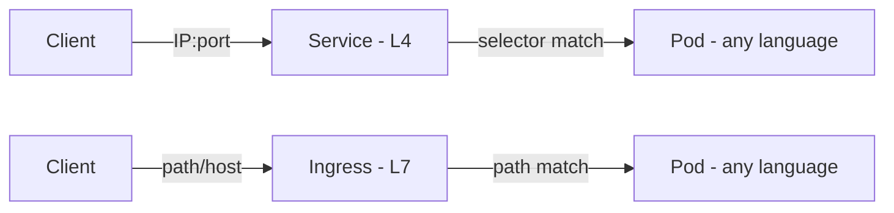
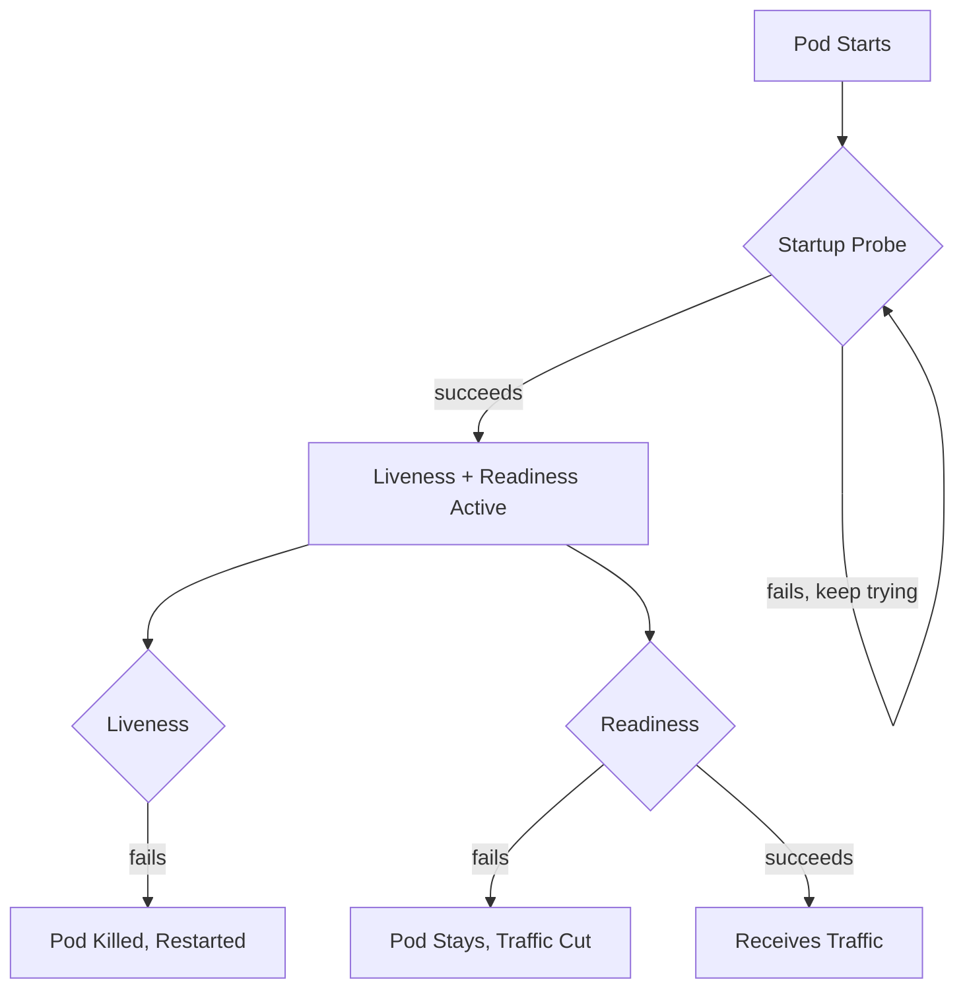
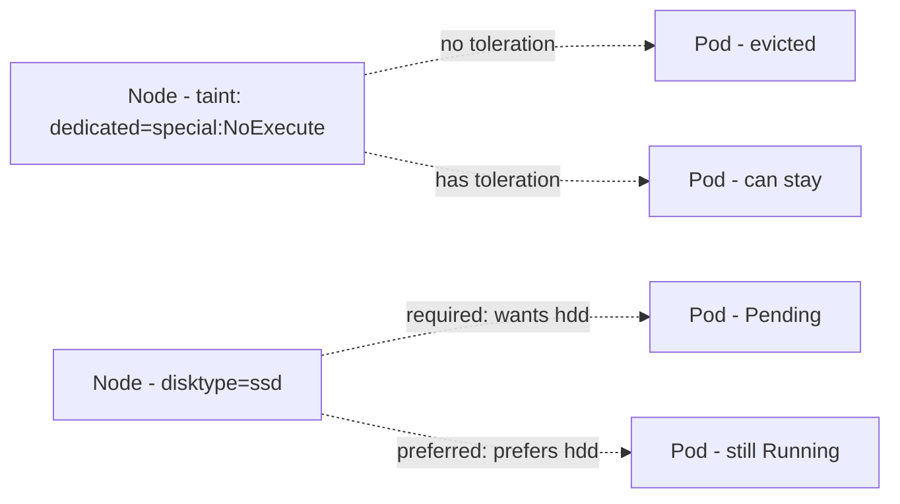

# ☸️ Kubernetes Important Resources — Labels, Rolling Updates, Liveness and Readiness, Taints and Affinity

31st phase completed the Other Resources section (StatefulSets, Volumes, Ingress, Jobs & Cronjobs, Resources and Limits, DaemonSets, HPA, VPA, Permissions). This phase I worked through the roadmap's Important Resources section — four topics, each with a software-ecosystem example, real function, cross-references, and real tests.

---

## 1. Labels



**Software example:** Like a CSS selector (`.class`, `[attribute=value]`) picking DOM elements **by tag** — it doesn't care which JavaScript library built the HTML element, only whether the class/attribute matches.

**Real function:** Proved that a Service treats pods written in different programming languages (Python, Go, Node.js) **identically** — because Service only operates at the **IP:port level** (L4/Transport layer), it never looks at the content of an HTTP request. `kubectl explain service.spec`'s schema has **no** `path`/`host` field at all — a direct contrast with `kubectl explain ingress.spec.rules.http.paths`, which genuinely shows a `path` field in the same query.

**Cross-reference:** This L4/L7 distinction is a real Kubernetes design decision reflecting the OSI model I covered in Phase 18 — it clarified **why** Ingress (Phase 31) can route by path/host while Service cannot.

Also proved **set-based selectors** (beyond equality-based `key=value`) with a real test — caught resources matching multiple values in a single query using `in`, `notin`, `exists` operators, and confirmed this also works in a `Deployment`'s `matchExpressions` field.

**YAML:**

```yaml
apiVersion: apps/v1
kind: Deployment
metadata:
  name: matchexpr-demo
spec:
  selector:
    matchExpressions:
      - key: environment
        operator: In
        values: ["production", "qa"]
  template:
    metadata:
      labels:
        environment: production
    spec:
      containers:
        - name: app
          image: busybox
          command: ["sleep", "infinity"]
```

---

## 2. Rolling Updates

**Software example:** Like a CI/CD pipeline defining a deployment policy such as "update at most this many servers at once" — balancing update speed against downtime risk.

**Real function:** Proved that the "new pod first, then old pod" behavior seen in Phase 30 is actually a result of the default **`25% maxUnavailable, 25% maxSurge`** strategy — these numbers are **configurable**. Tested "zero loss" updates with `maxUnavailable: 0, maxSurge: 1`; each time, 1 new pod opened first (`4→5`), then 1 old pod closed (`5→4`), never dropping below 4.

**Cross-reference:** This showed that Phase 30's default rolling update behavior is an **adjustable strategy**, not a fixed rule.

Also proved with real timestamps that `minReadySeconds` adds an extra safety layer to rolling updates — the next step doesn't happen until **at least `minReadySeconds`** after a pod becomes `Ready`, giving tolerance for an app's "warm-up" period.

**YAML:**

```yaml
apiVersion: apps/v1
kind: Deployment
metadata:
  name: myboot
spec:
  replicas: 4
  minReadySeconds: 10
  strategy:
    type: RollingUpdate
    rollingUpdate:
      maxUnavailable: 0
      maxSurge: 1
  selector:
    matchLabels:
      app: myboot
  template:
    metadata:
      labels:
        app: myboot
    spec:
      containers:
        - name: myboot
          image: quay.io/rhdevelopers/myboot:v1
```

---

## 3. Liveness, Readiness, and Startup



**Software example:** Like a load balancer (AWS ELB, nginx upstream) sending periodic health check requests to backend servers and **pulling out** the failed ones — this general "health check" pattern existed before Kubernetes in load balancers, and I'd already seen it with Docker's `HEALTHCHECK` in Phase 26.

**Real function:** Proved with a real test that the three probes have **different outcomes**:

- **Readiness** fails → pod **stays `Running`, `RESTARTS` doesn't increase**, only gets pulled from traffic (`0/1`)
- **Liveness** fails → pod **gets killed and restarted**
- **Startup** → while active, Liveness/Readiness **don't run at all**, preventing slow-starting apps from being killed too early

**Cross-reference:** This is the fully-applied version of the "self-healing" concept I covered conceptually in Phase 28, and Docker's `HEALTHCHECK` from Phase 26 — there I only **saw** the status in `docker ps`, here Kubernetes **actually acts** on that information automatically.

Proved with real tests: calling the `/misbehave` endpoint dropped Readiness to `0/1` without ever increasing `RESTARTS` (persistently, for 5+ minutes); the `failureThreshold × periodSeconds` formula gives roughly the right duration (measured with real timestamps); Startup Probe **protected** a 15-second artificial "slow start" from Liveness killing it too early.

**YAML:**

```yaml
apiVersion: apps/v1
kind: Deployment
metadata:
  name: spring-boot-deployment
spec:
  replicas: 1
  selector:
    matchLabels:
      app: spring-boot-app
  template:
    metadata:
      labels:
        app: spring-boot-app
    spec:
      containers:
        - name: spring-boot-container
          image: <your-spring-boot-image>
          livenessProbe:
            httpGet:
              path: /actuator/health/liveness
              port: 8080
            initialDelaySeconds: 10
            periodSeconds: 5
            failureThreshold: 3
          readinessProbe:
            httpGet:
              path: /actuator/health/readiness
              port: 8080
            initialDelaySeconds: 10
            periodSeconds: 5
            failureThreshold: 3
          startupProbe:
            httpGet:
              path: /actuator/health/startup
              port: 8080
            failureThreshold: 30
            periodSeconds: 10
```

---

## 4. Taints & Affinity



**Software example:** Like a cloud provider reserving "specialized hardware" servers (GPU servers) for **authorized** workloads only — an "obstacle" (taint) is placed so general workloads don't land there **by mistake**, only workloads with **permission to bypass** it (toleration) can go there.

**Real function:** A taint is added to a node, a toleration to a pod — without a match, the pod **can't be scheduled** on that node. Affinity works the opposite direction: the pod specifies **which node it wants** (the reverse of taint/toleration specifying "which pods a node accepts").

**Cross-reference:** In Phase 29's kubeadm installation, the "remove control-plane taint" step was just a command back then — today fully grasped what it **actually meant** (a default `NoSchedule` taint placed on the control-plane node, blocking normal pods from landing there).

Proved five separate scenarios with real tests: a pod schedules successfully when a Taint+Toleration match; without a toleration the pod stays `Pending`; **`NoSchedule`** only blocks **new** pods but **`NoExecute`** instantly evicts **already-running** ones too (proved when `with-toleration-pod` moved to `Terminating` immediately after adding `NoExecute`); a pod stays `Pending` when `requiredDuringSchedulingIgnoredDuringExecution` isn't met; a pod still goes `Running` even when `preferredDuringSchedulingIgnoredDuringExecution` isn't met.

**YAML — Taint/Toleration:**

```yaml
apiVersion: v1
kind: Pod
metadata:
  name: mypod
spec:
  tolerations:
    - key: "key1"
      operator: "Equal"
      value: "value1"
      effect: "NoSchedule"
  containers:
    - name: mycontainer
      image: myimage
```

**YAML — Node Affinity:**

```yaml
apiVersion: apps/v1
kind: Deployment
metadata:
  name: node-affinity-demo
spec:
  replicas: 1
  selector:
    matchLabels:
      app: node-affinity-app
  template:
    metadata:
      labels:
        app: node-affinity-app
    spec:
      affinity:
        nodeAffinity:
          requiredDuringSchedulingIgnoredDuringExecution:
            nodeSelectorTerms:
              - matchExpressions:
                  - key: disktype
                    operator: In
                    values: ["ssd"]
          preferredDuringSchedulingIgnoredDuringExecution:
            - weight: 1
              preference:
                matchExpressions:
                  - key: another-label-key
                    operator: In
                    values: ["another-label-value"]
      containers:
        - name: nginx-container
          image: nginx
```

---

## 📊 Summary

| Topic                  | What I Learned                                                                                                            |
| ---------------------- | ------------------------------------------------------------------------------------------------------------------------- |
| Labels                 | Service is L4 (looks at IP:port), Ingress is L7 (reads path/host); set-based selectors (in/notin/exists)                  |
| Rolling Updates        | maxSurge/maxUnavailable are configurable; minReadySeconds adds extra safety wait                                          |
| Liveness and Readiness | Readiness fail → traffic cut, pod stays; Liveness fail → pod killed; Startup prevents premature death                     |
| Taints and Affinity    | NoSchedule only blocks new pods, NoExecute evicts running ones too; required affinity is mandatory, preferred is flexible |

---

ℹ️ _All tests were performed on a real Ubuntu VPS (on the Kubespray cluster) — each topic proven with a software-ecosystem example, its real function, cross-references to related phases, and real YAML/kubectl tests._
