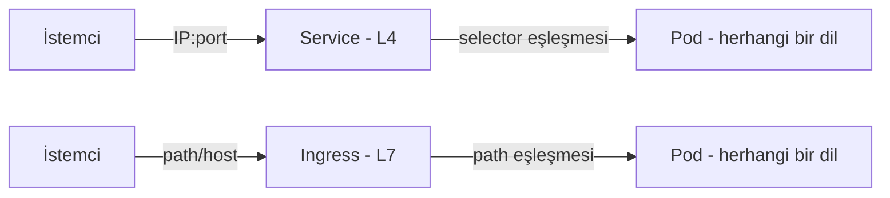
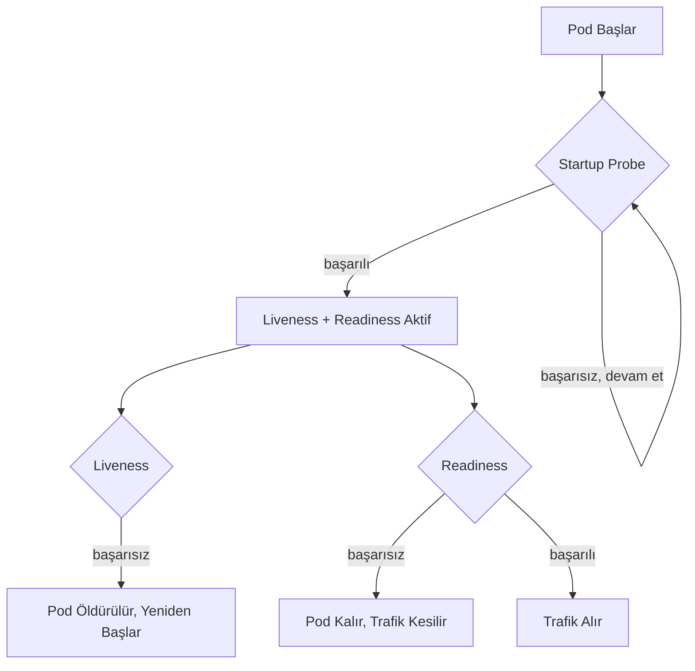
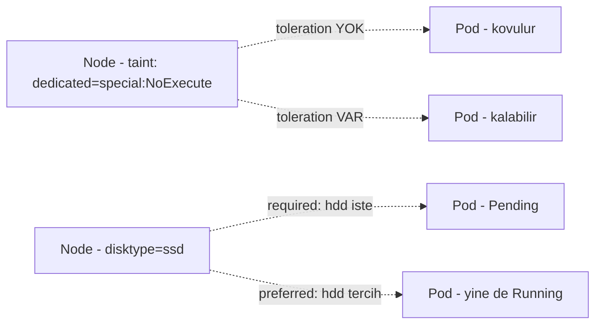

# ☸️ Kubernetes Önemli Kaynaklar — Etiketler, Sürekli Güncellemeler, Canlılık ve Hazırlık, İtme ve Çekme

31. fazda Diğer Kaynaklar bölümünü (StatefulSets, Volumes, Ingress, Jobs & Cronjobs, Kaynaklar ve Limitler, DaemonSets, HPA, VPA, Yetkiler) tamamlamıştım. Bu fazda roadmap'in Önemli Kaynaklar bölümünü işledim — dört konu, hepsi yazılım ekosisteminden örnekle, gerçek işlevle, çapraz referansla, ve gerçek testlerle.

---

## 1. Etiketler (Labels)



**Yazılım örneği:** Bir CSS selector'ının (`.class`, `[attribute=value]`) DOM elemanlarını **etikete göre** seçmesi gibi — hangi HTML elemanının hangi JavaScript kütüphanesiyle oluşturulduğuna bakmıyor, sadece class/attribute eşleşmesine bakıyor.

**Gerçek işlevi:** Bir Service'in, farklı programlama dillerinde (Python, Go, Node.js) yazılmış pod'lara **aynı şekilde** davrandığını kanıtladım — çünkü Service **sadece IP:port** seviyesinde (L4/Transport katmanı) çalışıyor, hiçbir zaman HTTP isteğinin içeriğine bakmıyor. `kubectl explain service.spec` şemasında `path`/`host` alanı **hiç yok** — bu, `kubectl explain ingress.spec.rules.http.paths`'in aynı sorguda gerçekten `path` alanını göstermesiyle tam bir tezat oluşturuyor.

**Çapraz referans:** Bu L4/L7 ayrımı, Faz 18'de işlediğim OSI modelinin gerçek bir Kubernetes tasarım kararına yansıması — Faz 31'deki Ingress'in path/host'a göre yönlendirme yapabilmesinin **neden** Service'in yapamadığı bir şey olduğunu netleştirdi.

Ayrıca **set-based selector'ları** (equality-based `key=value`'nun ötesinde) gerçek testle kanıtladım — `in`, `notin`, `exists` operatörleriyle birden fazla değere uyan kaynakları tek sorguda yakaladım, ve bunun bir `Deployment`'ın `matchExpressions` alanında da çalıştığını gördüm.

**YAML:**

```yaml
apiVersion: apps/v1
kind: Deployment
metadata:
  name: matchexpr-demo
spec:
  selector:
    matchExpressions:
      - key: environment
        operator: In
        values: ["production", "qa"]
  template:
    metadata:
      labels:
        environment: production
    spec:
      containers:
        - name: app
          image: busybox
          command: ["sleep", "infinity"]
```

---

## 2. Sürekli Güncellemeler (Rolling Updates)

**Yazılım örneği:** Bir CI/CD pipeline'ının, "aynı anda en fazla şu kadar sunucu güncellensin" gibi bir dağıtım politikası tanımlaması gibi — güncelleme hızı ile kesinti riski arasında bir denge kurulması.

**Gerçek işlevi:** Faz 30'da gördüğüm "önce yeni pod, sonra eski pod" davranışının, aslında **`25% maxUnavailable, 25% maxSurge`** varsayılan stratejisinin bir sonucu olduğunu kanıtladım — bu sayılar **değiştirilebilir.** `maxUnavailable: 0, maxSurge: 1` ile "hiç kayıp olmadan" güncellemeyi test ettim; her seferinde önce 1 yeni pod açılıp (`4→5`), sonra 1 eski pod kapanıyordu (`5→4`), hiçbir an 4'ün altına inmeden.

**Çapraz referans:** Bu, Faz 30'daki varsayılan rolling update davranışının **ayarlanabilir bir strateji** olduğunu gösterdi, sabit bir kural değil.

`minReadySeconds`'ın da rolling update'e ekstra bir güvenlik katmanı eklediğini, gerçek zaman damgalarıyla ölçerek kanıtladım — yeni pod `Ready` olduktan **en az `minReadySeconds` kadar** sonra bir sonraki adıma geçiliyor, uygulamanın "ısınma" süresine tolerans tanıyor.

**YAML:**

```yaml
apiVersion: apps/v1
kind: Deployment
metadata:
  name: myboot
spec:
  replicas: 4
  minReadySeconds: 10
  strategy:
    type: RollingUpdate
    rollingUpdate:
      maxUnavailable: 0
      maxSurge: 1
  selector:
    matchLabels:
      app: myboot
  template:
    metadata:
      labels:
        app: myboot
    spec:
      containers:
        - name: myboot
          image: quay.io/rhdevelopers/myboot:v1
```

---

## 3. Canlılık ve Hazırlık (Liveness, Readiness, Startup)



**Yazılım örneği:** Bir yük dengeleyicinin (AWS ELB, nginx upstream gibi) arka uç sunuculara periyodik health check istekleri atıp, başarısız olanı **havuzdan çıkarması** gibi — bu genel "health check" deseni, Kubernetes'ten önce de yük dengeleyicilerde, Faz 26'da Docker'da (`HEALTHCHECK`) gördüğümüz gibi var olan bir kavram.

**Gerçek işlevi:** Üç probe'un **farklı sonuçları** olduğunu gerçek testle kanıtladım:

- **Readiness** başarısız → pod **`Running` kalır, `RESTARTS` artmaz**, sadece trafikten çıkarılır (`0/1`)
- **Liveness** başarısız → pod **öldürülüp yeniden başlatılır**
- **Startup** → aktif olduğu sürece Liveness/Readiness **hiç çalışmıyor**, yavaş başlayan uygulamaların erken öldürülmesini önlüyor

**Çapraz referans:** Bu, Faz 28'de kavramsal olarak işlediğim "self-healing" ve Faz 26'daki Docker `HEALTHCHECK`'in, Kubernetes'teki tam uygulamalı hali — orada sadece `docker ps`'te durumu **görüyorduk**, burada Kubernetes bu bilgiye göre **otomatik aksiyon** alıyor.

Gerçek testlerle: `/misbehave` endpoint'ini çağırınca Readiness'ın `0/1`'e düşürdüğünü ama `RESTARTS`'ı hiç artırmadığını (5+ dakika kalıcı olarak); `failureThreshold × periodSeconds` formülünün yaklaşık süreyi verdiğini (gerçek saniye ölçümüyle); Startup Probe'un, 15 saniyelik yapay bir "yavaş başlangıcı", Liveness'ın erken öldürmesinden **koruduğunu** kanıtladım.

**YAML:**

```yaml
apiVersion: apps/v1
kind: Deployment
metadata:
  name: spring-boot-deployment
spec:
  replicas: 1
  selector:
    matchLabels:
      app: spring-boot-app
  template:
    metadata:
      labels:
        app: spring-boot-app
    spec:
      containers:
        - name: spring-boot-container
          image: <your-spring-boot-image>
          livenessProbe:
            httpGet:
              path: /actuator/health/liveness
              port: 8080
            initialDelaySeconds: 10
            periodSeconds: 5
            failureThreshold: 3
          readinessProbe:
            httpGet:
              path: /actuator/health/readiness
              port: 8080
            initialDelaySeconds: 10
            periodSeconds: 5
            failureThreshold: 3
          startupProbe:
            httpGet:
              path: /actuator/health/startup
              port: 8080
            failureThreshold: 30
            periodSeconds: 10
```

---

## 4. İtme ve Çekme (Taints & Affinity)



**Yazılım örneği:** Bir bulut sağlayıcının "özel donanımlı" sunucuları (GPU'lu sunucular gibi) sadece **izinli** iş yüklerine ayırması gibi — genel iş yükleri oraya **yanlışlıkla** yerleşmesin diye bir "engel" (taint) konuyor, sadece bu engeli **aşma izni** (toleration) olan iş yükleri oraya gidebiliyor.

**Gerçek işlevi:** Taint bir node'a, toleration bir pod'a ekleniyor — eşleşme olmazsa pod o node'a **zamanlanamıyor**. Affinity ise tam tersi yönde çalışıyor: pod'un **hangi node'u istediğini** belirtiyor (taint/toleration'ın "hangi pod'ları kabul ettiğini" belirtmesinin tersine).

**Çapraz referans:** Faz 29'da kubeadm kurulumunda "control-plane taint kaldırma" adımını yapmıştım — o zaman sadece bir komut çalıştırmıştım, bugün bunun **gerçekte ne anlama geldiğini** (control-plane node'una varsayılan bir `NoSchedule` taint'i konması, normal pod'ların oraya gitmesini engellemesi) tam olarak kavradım.

Gerçek testlerle beş ayrı senaryo kanıtladım: Taint+Toleration uyumu ile pod'un zamanlanabildiğini; Toleration olmadan pod'un `Pending` kaldığını; **`NoSchedule`**'ın sadece **yeni** pod'ları engellediğini ama **`NoExecute`**'un **zaten çalışan** pod'ları da anında kovduğunu (`with-toleration-pod`'un `NoExecute` eklenince hemen `Terminating`'e geçmesiyle); `requiredDuringSchedulingIgnoredDuringExecution` karşılanmazsa pod'un `Pending` kaldığını; `preferredDuringSchedulingIgnoredDuringExecution` karşılanmasa bile pod'un yine de `Running` olduğunu.

**YAML — Taint/Toleration:**

```yaml
apiVersion: v1
kind: Pod
metadata:
  name: mypod
spec:
  tolerations:
    - key: "key1"
      operator: "Equal"
      value: "value1"
      effect: "NoSchedule"
  containers:
    - name: mycontainer
      image: myimage
```

**YAML — Node Affinity:**

```yaml
apiVersion: apps/v1
kind: Deployment
metadata:
  name: node-affinity-demo
spec:
  replicas: 1
  selector:
    matchLabels:
      app: node-affinity-app
  template:
    metadata:
      labels:
        app: node-affinity-app
    spec:
      affinity:
        nodeAffinity:
          requiredDuringSchedulingIgnoredDuringExecution:
            nodeSelectorTerms:
              - matchExpressions:
                  - key: disktype
                    operator: In
                    values: ["ssd"]
          preferredDuringSchedulingIgnoredDuringExecution:
            - weight: 1
              preference:
                matchExpressions:
                  - key: another-label-key
                    operator: In
                    values: ["another-label-value"]
      containers:
        - name: nginx-container
          image: nginx
```

---

## 📊 Özet

| Konu                  | Ne Öğrendim                                                                                                             |
| --------------------- | ----------------------------------------------------------------------------------------------------------------------- |
| Etiketler             | Service L4 (IP:port'a bakar), Ingress L7 (path/host okur); set-based selector'lar (in/notin/exists)                     |
| Sürekli Güncellemeler | maxSurge/maxUnavailable ayarlanabilir; minReadySeconds ekstra güvenlik bekletmesi ekler                                 |
| Canlılık ve Hazırlık  | Readiness fail → trafik kesilir, pod kalır; Liveness fail → pod öldürülür; Startup, erken ölümü önler                   |
| İtme ve Çekme         | NoSchedule sadece yeni pod'ları engeller, NoExecute zaten çalışanı da kovar; required affinity zorunlu, preferred esnek |

---

ℹ️ _Tüm testler gerçek bir Ubuntu VPS üzerinde (Kubespray cluster'ında) yapılmıştır — her konu yazılım ekosisteminden bir örnekle, gerçek işleviyle, ilgili fazlara çapraz referansla, ve gerçek YAML/kubectl testleriyle kanıtlanmıştır._
