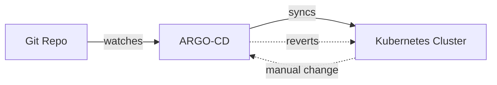
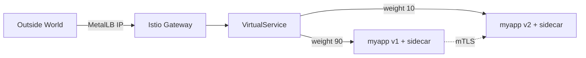

# ☸️ Kubernetes Additional Tools — ARGO-CD, Dashboard, Helm, MetalLB, Service Mesh, kubeadm, kustomize

32nd phase completed the Important Resources section. This phase I worked through the roadmap's Additional Tools section — seven tools, all proven with real tests.

---

## 1. ARGO-CD



**Software example:** Like a CI/CD pipeline automatically reflecting a Git change to production — except ARGO-CD does this with a **"pull" not "push"** model: the cluster itself continuously checks Git.

**Real function:** The fully working version of the GitOps concept I covered conceptually in Phase 28. Git repo = "desired state" (single source of truth), ARGO-CD = a controller that continuously compares this state to the cluster, detects drift (`OutOfSync`), and optionally corrects it (`Sync`).

**Cross-reference:** Proved that ARGO-CD has its **own** authorization system (`accounts`, `policy.csv`), completely separate from Kubernetes RBAC covered in Phase 31.

Proved with a real test: manually changed pod count with `kubectl scale`, ARGO-CD **detected** it as `OutOfSync`, and once sync was triggered, **reverted it to the real value in the repo** — proof of GitOps' power to undo manual intervention. Proved `readonly-user` got a **`PermissionDenied`** error without `sync` permission.

**YAML:**

```yaml
apiVersion: argoproj.io/v1alpha1
kind: Application
metadata:
  name: argocd-demo
  namespace: argocd
spec:
  project: default
  source:
    repoURL: https://github.com/justmeandopensource/argocd-demo
    targetRevision: HEAD
    path: yamls
  destination:
    server: https://kubernetes.default.svc
    namespace: default
```

---

## 2. Dashboard

**Software example:** Like a server management panel (cPanel) offering a web interface instead of the command line.

**Real function:** A visual client for the Kubernetes API — a clickable interface instead of `kubectl get pods`.

**Cross-reference:** The installation is a real application of Phase 31's RBAC (`ServiceAccount`+`ClusterRoleBinding`) and Phase 30's base64 token decoding knowledge.

Researched that the page's installation link (`recommended.yaml` generic address) is **outdated** — Dashboard only installs via **Helm** since `v7.0.0`, the page still shows the old manifest method. Used a version-pinned (`v2.7.0`) manifest instead. Proved with a real test: got the admin token, accessed a protected API endpoint (`/api/v1/pod`) with an `Authorization: Bearer` header, and retrieved a **real pod list with live metrics**.

**YAML:**

```yaml
apiVersion: v1
kind: ServiceAccount
metadata:
  name: admin-user
  namespace: kubernetes-dashboard
---
apiVersion: rbac.authorization.k8s.io/v1
kind: ClusterRoleBinding
metadata:
  name: admin-user
roleRef:
  apiGroup: rbac.authorization.k8s.io
  kind: ClusterRole
  name: cluster-admin
subjects:
  - kind: ServiceAccount
    name: admin-user
    namespace: kubernetes-dashboard
```

---

## 3. Helm

**Software example:** Like a package manager (`apt`/`yum` on Linux) installing and removing an application and all its dependencies with a single command.

**Real function:** Packages a group of Kubernetes resources (Deployment+Service+ConfigMap+Secret) as a single "chart," customizable via templating (`{{ .Values.x }}`) through `values.yaml`.

**Cross-reference:** Proved that the page's `stable` repo (`kubernetes-charts.storage.googleapis.com`) was **removed in 2020**, and Helm itself rejects that address — used the current Bitnami repo instead.

Proved with a real test: created multiple resources (including StatefulSets) with a single `helm install`, removed all of them with a single `helm uninstall`. Proved `--set replicaCount=5` genuinely produces `replicas: 5` in the template, and that with multiple `values` files, the **later one** takes priority (`7` won, overriding `3`).

**YAML:**

```yaml
# values.yaml
replicaCount: 1
image:
  repository: nginx
---
# templates/deployment.yaml (excerpt)
spec:
  replicas: { { .Values.replicaCount } }
```

---

## 4. MetalLB

**Software example:** A tool that **software-emulates**, on your own physical/VPS servers, the LoadBalancer IP that cloud providers (AWS, GCP) automatically provide.

**Real function:** In Phase 30, saw a `LoadBalancer` type Service stay `<pending>` (no cloud provider) — MetalLB fills exactly this gap: define an IP pool, and it assigns **real IPs** to LoadBalancer Services.

**Cross-reference:** Proved the page's old `ConfigMap`-based configuration has moved to a **CRD-based** method (`IPAddressPool`/`L2Advertisement`) since `v0.13`; found that the page's unversioned `master` branch install is officially flagged as "unstable," used a version-pinned (`v0.16.1`) manifest instead.

Proved with a real test that Phase 30's `<pending>` issue is **fully resolved** — the `LoadBalancer` Service got a real IP (`91.151.88.100`) from the pool, and genuinely accessed it from the outside world with `curl`. Learned that underneath this mechanism runs **ARP**, a networking protocol from 1982 — not Kubernetes' invention.

**YAML:**

```yaml
apiVersion: metallb.io/v1beta1
kind: IPAddressPool
metadata:
  name: first-pool
  namespace: metallb-system
spec:
  addresses:
    - 91.151.88.100-91.151.88.110
---
apiVersion: metallb.io/v1beta1
kind: L2Advertisement
metadata:
  name: example
  namespace: metallb-system
spec:
  ipAddressPools:
    - first-pool
```

---

## 5. Service Mesh (Istio)



**Software example:** Like placing an "invisible assistant" (sidecar proxy) next to every microservice to handle traffic — security/routing/monitoring get added **without the application code ever knowing**.

**Real function:** Automatic sidecar injection (`1/2` → `2/2`), real percentage-based traffic routing (**independent** of Phase 30's canary's pod-count-dependent constraint), and mandatory mTLS for service-to-service encryption.

**Cross-reference:** Compared against Phase 30's Canary Deployment (`3×v1+1×v3` pod ratio) — Istio's `weight: 90/10` is **completely independent of pod count**, far more precise. Experienced a real, automatic example of today's taint/toleration knowledge live (a `disk-pressure` taint). In the Gateway test, achieved true end-to-end access through MetalLB's real IP.

Proved with a real test: out of 50 requests, `46 v1 / 4 v2` (`92%/8%`, close to the target `90%/10%`) distribution. Proved with a comparative test that with `PeerAuthentication: STRICT`, a request from a sidecar-less pod was **rejected**, while one from a sidecar-equipped pod **succeeded**.

**YAML:**

```yaml
apiVersion: networking.istio.io/v1
kind: VirtualService
metadata:
  name: myapp-vs
spec:
  hosts:
    - myapp
  http:
    - route:
        - destination:
            host: myapp
            subset: v1
          weight: 90
        - destination:
            host: myapp
            subset: v2
          weight: 10
---
apiVersion: security.istio.io/v1
kind: PeerAuthentication
metadata:
  name: default
  namespace: meshtest
spec:
  mtls:
    mode: STRICT
```

---

## 6. kubeadm (HA Topology)

**Software example:** Like a database cluster keeping multiple replicas on different servers so it isn't dependent on a single server.

**Real function:** Learned that kubeadm offers two HA (High Availability) topologies — **stacked etcd** (etcd co-located with control-plane nodes, kubeadm's default, minimum 3 nodes) and **external etcd** (etcd on separate machines, more resilient but requires twice the servers, minimum 3+3).

**Cross-reference:** This topic **could not be tested due to a genuine infrastructure constraint** — HA topology by definition requires multiple servers, and I only have one VPS. Realized my own single-node cluster is unknowingly already using a **1-node "stacked" topology** (etcd on the same machine as control-plane).

---

## 7. kustomize

**Software example:** Like being able to apply different edits (comments, additions) to a Word document in "track changes" mode without ever altering the master copy — unlike Helm, kustomize uses **no templating syntax at all**, applying "patches" on top of plain YAML.

**Real function:** Define a `base` set of YAML, then customize it for different environments (dev/prod) with separate `overlays` (name prefix, replica count, etc.).

**Cross-reference:** Compared directly against Helm — while Helm uses templating (`{{ .Values.x }}`), kustomize's `base/deployment.yaml` is **completely plain, ordinary YAML.**

Proved with a real test: from the same `base`, the `dev` overlay produced `dev-myapp`/`replicas:1`, the `prod` overlay produced `prod-myapp`/`replicas:3` — with no manual copying. Proved `kubectl kustomize` is **built into** `kubectl`, and `kubectl apply -k` can apply it to a real cluster.

**YAML:**

```yaml
# base/kustomization.yaml
resources:
  - deployment.yaml
---
# overlays/prod/kustomization.yaml
resources:
  - ../../base
namePrefix: prod-
patches:
  - target:
      kind: Deployment
      name: myapp
    patch: |-
      - op: replace
        path: /spec/replicas
        value: 3
```

---

## 📊 Summary

| Tool                 | What It's For                                                         |
| -------------------- | --------------------------------------------------------------------- |
| ARGO-CD              | Makes Git the single source of truth, auto-syncs the cluster (GitOps) |
| Dashboard            | Web interface for the Kubernetes API                                  |
| Helm                 | Application packaging + templating (package manager)                  |
| MetalLB              | Gives LoadBalancer real IPs outside the cloud                         |
| Service Mesh (Istio) | Automatic sidecars, precise traffic management, mandatory mTLS        |
| kubeadm (HA)         | Multiple control-planes for resilience against single-node failure    |
| kustomize            | Template-free, patch-based environment customization                  |

---

ℹ️ _All tests were performed on a real Ubuntu VPS (on the Kubespray cluster) — except kubeadm HA topology (genuine infrastructure constraint, requires multiple servers), each tool proven with a software-ecosystem example, its real function, cross-references to related phases, and real YAML/kubectl tests. Along the way, multiple outdated/removed sources (Helm's stable repo, MetalLB's ConfigMap method, Dashboard's manifest install) were identified and replaced with current equivalents._
