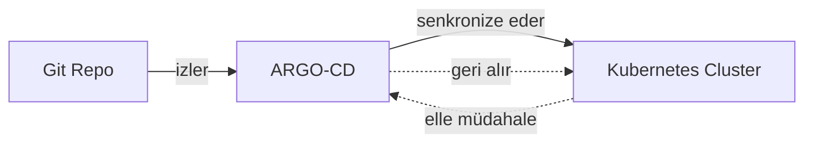
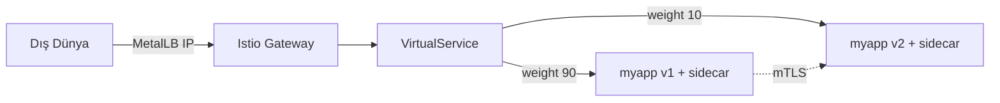

# ☸️ Kubernetes Ek Araçlar — ARGO-CD, Dashboard, Helm, MetalLB, Service Mesh, kubeadm, kustomize

32. fazda Önemli Kaynaklar bölümünü tamamlamıştım. Bu fazda roadmap'in Ek Araçlar bölümünü işledim — yedi araç, hepsi gerçek testlerle kanıtlandı.

---

## 1. ARGO-CD



**Yazılım örneği:** Bir CI/CD pipeline'ının, Git'teki değişikliği otomatik olarak production'a yansıtması gibi — ama ARGO-CD, bunu **"push" değil "pull"** modeliyle yapıyor: cluster'ın kendisi Git'i sürekli kontrol ediyor.

**Gerçek işlevi:** Faz 28'de kavramsal olarak işlediğim GitOps'un tam çalışan hali. Git repo = "istenen durum" (tek gerçek kaynak), ARGO-CD = bu durumu cluster'la sürekli karşılaştırıp farkı (`OutOfSync`) tespit eden ve isteğe bağlı düzelten (`Sync`) bir kontrolcü.

**Çapraz referans:** Faz 31'deki Kubernetes RBAC'ından tamamen ayrı, ARGO-CD'nin **kendi** yetkilendirme sistemi (`accounts`, `policy.csv`) olduğunu kanıtladım.

Gerçek testle: elle `kubectl scale` ile pod sayısını değiştirdim, ARGO-CD bunu `OutOfSync` olarak **tespit etti**, senkronizasyon tetikleyince **repo'daki gerçek değere geri döndürdü** — GitOps'un "elle müdahaleyi geri alma" gücünün kanıtı. `readonly-user` hesabının `sync` yetkisi olmadan **`PermissionDenied`** hatası aldığını kanıtladım.

**YAML:**

```yaml
apiVersion: argoproj.io/v1alpha1
kind: Application
metadata:
  name: argocd-demo
  namespace: argocd
spec:
  project: default
  source:
    repoURL: https://github.com/justmeandopensource/argocd-demo
    targetRevision: HEAD
    path: yamls
  destination:
    server: https://kubernetes.default.svc
    namespace: default
```

---

## 2. Dashboard

**Yazılım örneği:** Bir sunucu yönetim panelinin (cPanel gibi) komut satırı yerine web arayüzü sunması gibi.

**Gerçek işlevi:** Kubernetes API'sinin görsel bir istemcisi — `kubectl get pods` yerine tıklanabilir bir arayüz.

**Çapraz referans:** Kurulum, Faz 31'deki RBAC (`ServiceAccount`+`ClusterRoleBinding`) ve Faz 30'daki base64 token çözme bilgisinin gerçek bir uygulaması.

Sayfanın kurulum linkinin (`recommended.yaml` genel adres) **eski** olduğunu araştırdım — Dashboard `v7.0.0`'dan itibaren artık **sadece Helm** ile kuruluyor, sayfa hâlâ eski manifest yöntemini gösteriyor. Sürüm etiketli (`v2.7.0`) bir manifest kullandım. Gerçek testle: admin token'ı alıp, `Authorization: Bearer` header'ıyla korumalı bir API endpoint'ine (`/api/v1/pod`) erişip **gerçek pod listesini, canlı metriklerle** aldığımı kanıtladım.

**YAML:**

```yaml
apiVersion: v1
kind: ServiceAccount
metadata:
  name: admin-user
  namespace: kubernetes-dashboard
---
apiVersion: rbac.authorization.k8s.io/v1
kind: ClusterRoleBinding
metadata:
  name: admin-user
roleRef:
  apiGroup: rbac.authorization.k8s.io
  kind: ClusterRole
  name: cluster-admin
subjects:
  - kind: ServiceAccount
    name: admin-user
    namespace: kubernetes-dashboard
```

---

## 3. Helm

**Yazılım örneği:** Linux'ta `apt`/`yum` gibi bir paket yöneticisinin, bir uygulamayı ve tüm bağımlılıklarını tek komutla kurup kaldırması gibi.

**Gerçek işlevi:** Bir Kubernetes uygulama grubunu (Deployment+Service+ConfigMap+Secret) tek bir "chart" olarak paketleyip, `values.yaml` üzerinden şablonlama (`{{ .Values.x }}`) ile özelleştirmeyi sağlıyor.

**Çapraz referans:** Sayfadaki `stable` reposunun (`kubernetes-charts.storage.googleapis.com`) **2020'de kaldırıldığını**, Helm'in kendisinin bile bu adresi reddettiğini kanıtladım — güncel Bitnami reposunu kullandım.

Gerçek testle: `helm install` ile tek komutta StatefulSet'ler dahil çoklu kaynak oluşturdum, `helm uninstall` ile hepsini tek komutla kaldırdım. `--set replicaCount=5` ile şablonun gerçekten `replicas: 5` ürettiğini, birden fazla `values` dosyasında **sonra verilenin** öncelikli olduğunu (`7` kazandı, `3`'ü geçersiz kıldı) kanıtladım.

**YAML:**

```yaml
# values.yaml
replicaCount: 1
image:
  repository: nginx
---
# templates/deployment.yaml (parça)
spec:
  replicas: { { .Values.replicaCount } }
```

---

## 4. MetalLB

**Yazılım örneği:** Bulut sağlayıcıların (AWS, GCP) otomatik sağladığı LoadBalancer IP'sini, kendi fiziksel/VDS sunucularında **yazılımla taklit eden** bir araç.

**Gerçek işlevi:** Faz 30'da `LoadBalancer` tipi Service'in `<pending>` kaldığını (bulut sağlayıcı olmadığı için) görmüştüm — MetalLB, bu boşluğu dolduruyor: bir IP havuzu tanımlayıp, LoadBalancer Service'lere **gerçek IP** atıyor.

**Çapraz referans:** Sayfadaki eski `ConfigMap` tabanlı yapılandırmanın, `v0.13`'ten itibaren **CRD tabanlı** (`IPAddressPool`/`L2Advertisement`) yönteme geçtiğini kanıtladım; sayfadaki sürümsüz `master` branch kurulumunun resmi olarak "kararsız" diye işaretlendiğini buldum, sürüm etiketli (`v0.16.1`) manifesti kullandım.

Gerçek testle: Faz 30'daki `<pending>` sorununun **tam çözüldüğünü** kanıtladım — `LoadBalancer` Service, havuzdan gerçek bir IP (`91.151.88.100`) aldı, ve bu IP üzerinden **gerçekten** `curl` ile dış dünyadan erişim sağladım. Bu mekanizmanın altında, Kubernetes'in icadı olmayan **ARP** (1982'den kalma bir ağ protokolü) çalıştığını öğrendim.

**YAML:**

```yaml
apiVersion: metallb.io/v1beta1
kind: IPAddressPool
metadata:
  name: first-pool
  namespace: metallb-system
spec:
  addresses:
    - 91.151.88.100-91.151.88.110
---
apiVersion: metallb.io/v1beta1
kind: L2Advertisement
metadata:
  name: example
  namespace: metallb-system
spec:
  ipAddressPools:
    - first-pool
```

---

## 5. Service Mesh (Istio)



**Yazılım örneği:** Her mikroservisin yanına, trafiği yöneten "görünmez bir asistan" (sidecar proxy) yerleştirilmesi gibi — uygulama kodunun **hiç haberi olmadan**, güvenlik/yönlendirme/izleme ekleniyor.

**Gerçek işlevi:** Otomatik sidecar enjeksiyonu (`1/2` → `2/2`), gerçek yüzde bazlı trafik yönlendirme (Faz 30'daki kanaryanın pod-sayısı-bağımlı kısıtından **bağımsız**), ve zorunlu mTLS ile hizmetten hizmete şifreleme.

**Çapraz referans:** Faz 30'daki Kanarya Deployment (`3×v1+1×v3` pod oranı) ile karşılaştırdım — Istio'nun `weight: 90/10`'u **pod sayısından tamamen bağımsız**, çok daha hassas. Bugünkü taint/toleration bilgimin gerçek, otomatik bir örneğini (`disk-pressure` taint'i) canlı deneyimledim. Gateway testinde MetalLB'nin verdiği gerçek IP üzerinden uçtan uca erişim sağladım.

Gerçek testle: 50 istekten `46 v1 / 4 v2` (`%92/%8`, hedef `%90/%10`'a yakın) dağılımı kanıtladım. `PeerAuthentication: STRICT` ile, sidecar'sız bir pod'dan gelen isteğin **reddedildiğini**, sidecar'lı bir pod'dan gelen isteğin **başarılı** olduğunu karşılaştırmalı olarak kanıtladım.

**YAML:**

```yaml
apiVersion: networking.istio.io/v1
kind: VirtualService
metadata:
  name: myapp-vs
spec:
  hosts:
    - myapp
  http:
    - route:
        - destination:
            host: myapp
            subset: v1
          weight: 90
        - destination:
            host: myapp
            subset: v2
          weight: 10
---
apiVersion: security.istio.io/v1
kind: PeerAuthentication
metadata:
  name: default
  namespace: meshtest
spec:
  mtls:
    mode: STRICT
```

---

## 6. kubeadm (HA Topolojisi)

**Yazılım örneği:** Bir veritabanı cluster'ının, tek bir sunucuya bağımlı kalmaması için birden fazla kopyasının (replica) farklı sunucularda tutulması gibi.

**Gerçek işlevi:** kubeadm'in iki HA (Yüksek Erişilebilirlik) topolojisi sunduğunu öğrendim — **stacked etcd** (etcd, control-plane node'larıyla aynı makinede, kubeadm'in varsayılanı, minimum 3 node) ve **external etcd** (etcd ayrı makinelerde, daha dayanıklı ama 2 kat sunucu gerektiriyor, minimum 3+3).

**Çapraz referans:** Bu konu **gerçek bir altyapı kısıtı nedeniyle test edilemedi** — HA topolojisi tanımı gereği birden fazla sunucu gerektiriyor, benim tek VPS'im var. Kendi tek node'lu cluster'ımın, farkında olmadan zaten **1 node'luk bir "stacked" topoloji** kullandığını fark ettim (etcd, control-plane ile aynı makinede).

---

## 7. kustomize

**Yazılım örneği:** Bir Word belgesinin ana kopyasını hiç değiştirmeden, "izleme modunda" farklı düzenlemeler (yorumlar, ekler) uygulayabilmen gibi — Helm'in tam tersine, kustomize **hiçbir şablon syntax'ı** kullanmıyor, düz YAML üzerine "patch" (yama) uyguluyor.

**Gerçek işlevi:** Bir `base` (temel) YAML seti tanımlayıp, farklı ortamlar (dev/prod) için ayrı `overlay`'lerle (isim öneki, replica sayısı gibi) özelleştirme.

**Çapraz referans:** Helm ile doğrudan karşılaştırdım — Helm şablonlama (`{{ .Values.x }}`) kullanırken, kustomize'ın `base/deployment.yaml`'ı **tamamen düz, sıradan bir YAML.**

Gerçek testle: aynı `base`'den, `dev` overlay'i `dev-myapp`/`replicas:1`, `prod` overlay'i `prod-myapp`/`replicas:3` üretti — hiç elle kopyalama olmadan. `kubectl kustomize`'ın `kubectl`'e **yerleşik** olduğunu, `kubectl apply -k` ile gerçek cluster'a uygulanabildiğini kanıtladım.

**YAML:**

```yaml
# base/kustomization.yaml
resources:
  - deployment.yaml
---
# overlays/prod/kustomization.yaml
resources:
  - ../../base
namePrefix: prod-
patches:
  - target:
      kind: Deployment
      name: myapp
    patch: |-
      - op: replace
        path: /spec/replicas
        value: 3
```

---

## 📊 Özet

| Araç                 | Ne İşe Yarar                                                               |
| -------------------- | -------------------------------------------------------------------------- |
| ARGO-CD              | Git'i tek gerçek kaynak yapıp, cluster'ı otomatik senkronize eder (GitOps) |
| Dashboard            | Kubernetes API'sinin web arayüzü                                           |
| Helm                 | Uygulama paketleme + şablonlama (paket yöneticisi)                         |
| MetalLB              | Bulut dışı ortamlarda LoadBalancer'a gerçek IP kazandırır                  |
| Service Mesh (Istio) | Otomatik sidecar, hassas trafik yönetimi, zorunlu mTLS                     |
| kubeadm (HA)         | Çoklu control-plane ile tek node arızasına karşı dayanıklılık              |
| kustomize            | Şablonsuz, patch tabanlı ortam özelleştirmesi                              |

---

ℹ️ _Tüm testler gerçek bir Ubuntu VPS üzerinde (Kubespray cluster'ında) yapılmıştır — kubeadm HA topolojisi hariç (gerçek altyapı kısıtı, çoklu sunucu gerektiriyor), her araç yazılım ekosisteminden bir örnekle, gerçek işleviyle, ilgili fazlara çapraz referansla, ve gerçek YAML/kubectl testleriyle kanıtlanmıştır. Süreç boyunca birden fazla eski/kaldırılmış kaynak (Helm stable reposu, MetalLB ConfigMap yöntemi, Dashboard manifest kurulumu) tespit edilip güncel karşılıklarıyla değiştirilmiştir._
