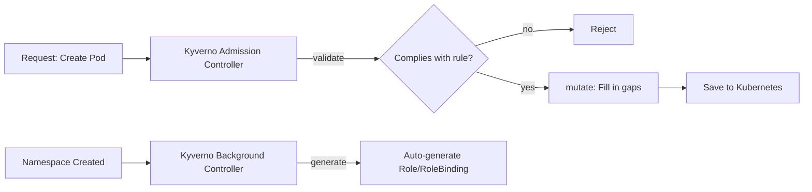

# ☸️ Kubernetes Security Tools — Kyverno, NeuVector

At Edib Bey's direct request, covered two security tools outside the roadmap (Kyverno, NeuVector). In the process, also completed the **trying Vagrant on own computer** backlog item pending since Phase 29.

---

## 1. Kyverno



**Software example:** Like a security guard controlling entry to a building — only lets in those who comply with the rules (validate), makes those missing something complete it (mutate: "put on your badge"), and when a new department opens, automatically issues the required access cards (generate).

**Real function:** Kyverno is a policy engine that integrates into Kubernetes as an **admission webhook** — far more flexible than Phase 34's Pod Security Admission, because instead of **ready-made rules**, it can enforce **any rule you write yourself**.

**Cross-reference:** Compared against Phase 34's PSA test — PSA could only **reject**, Kyverno can **reject**, **auto-correct**, and **generate other resources**. Researched that `ClusterPolicy` (`kyverno.io`) has begun deprecation in favor of `policies.kyverno.io` (`ValidatingPolicy` etc.).

Proved with real tests:

- **Validate:** A pod without a `team` label was rejected at admission time with a **`Forbidden`** error; a labeled pod was created successfully.
- **Mutate:** An unlabeled pod got `team=unassigned` **auto-added**; with the `+(team)` conditional syntax, proved an **already-labeled** pod's label was **left untouched** (only added when missing).
- **Generate:** Creating a new namespace, with **nothing written manually**, automatically produced a `ResourceQuota` (own example) and, following an example from Edib Bey's resource, a **`Role` + `RoleBinding` pair**.

**Real debugging:** Applying Edib Bey's example hit two real obstacles — (1) in current Kyverno the `apiVersion` field in the `generate` block is now **mandatory** (it wasn't before), (2) Kyverno's own `background-controller` **cannot grant an RBAC permission it doesn't itself have** (Kubernetes' privilege-escalation protection — an advanced application of Phase 31's "least privilege" principle). Resolved by adding a `ClusterRole` granting Kyverno the needed permission.

**YAML:**

```yaml
apiVersion: kyverno.io/v1
kind: ClusterPolicy
metadata:
  name: generate-role-and-rolebinding
spec:
  rules:
    - name: create-default-role
      match:
        resources:
          kinds:
            - Namespace
      generate:
        apiVersion: rbac.authorization.k8s.io/v1
        kind: Role
        name: default-role
        namespace: "{{request.object.metadata.name}}"
        data:
          rules:
            - apiGroups: [""]
              resources: ["pods"]
              verbs: ["get", "list"]
```

---

## 2. NeuVector

**Software example:** Like a building's continuously running security cameras and alarm system — unlike Kyverno's "ID check at the door," NeuVector **continuously scans everything inside the building**, reporting known dangers (vulnerabilities).

**Real function:** NeuVector scans running containers and node operating systems **in real time**, comparing them against a current CVE (known vulnerability) database.

**Cross-reference:** Installation requires the `pod-security.kubernetes.io/enforce=privileged` label — the **exact opposite** requirement of Phase 34's `restricted` PSA test, showing NeuVector's own components (particularly the `enforcer`) need deep system access.

**Real infrastructure constraint and its resolution:** When installed on the VPS used throughout the internship, the `scanner`/`enforcer` components kept getting **`Evicted`** — due to the node entering a `DiskPressure` condition (a **persistent** version this time of Phase 33's temporary disk-pressure experience). This was a genuine resource shortage, not a config/code error.

**Resolution — Vagrant (backlog resolution):** Used this opportunity to complete the **"trying Vagrant on own computer"** item pending since Phase 29. Found a Rocky Linux VM on own computer that had been set up before and never used (`vagrant global-status`), increased its resources (`1.9GB→7.7GB RAM`, `2→4 CPUs`), and **set up a kubeadm cluster from scratch** (with Rocky Linux's `dnf` package manager, SELinux settings — different steps from Ubuntu). NeuVector ran on this new, resource-rich environment **without any eviction**.

Proved with a real test: logged into the web UI (with the real password retrieved from the bootstrap secret), saw **374 real CVEs** (with CVSS scores and "fixed version" suggestions) live.

**YAML/Command:**

```bash
kubectl label namespace neuvector "pod-security.kubernetes.io/enforce=privileged"
helm install neuvector neuvector/core --namespace neuvector
kubectl get secret --namespace neuvector neuvector-bootstrap-secret \
  -o go-template='{{.data.bootstrapPassword|base64decode}}{{"\n"}}'
```

---

## 3. Vagrant (Backlog Resolution)

**Software example:** Like setting up a fully isolated, "resettable" test lab inside your own computer.

**Real function:** `Vagrant` lets you define and manage virtual machines (VMs) as code (a `Vagrantfile`) — a real Linux environment on your own computer, no VPS needed.

**Cross-reference:** In Phase 29, this topic was covered only **conceptually**, never actually tried. Today, when a **real need** (NeuVector's resource shortage) arose, this backlog item was **naturally** completed.

Proved with a real test: found a previously forgotten VM with `vagrant global-status`; added a `vmware_desktop` provider block to the `Vagrantfile` to increase resources (fixing a Ruby syntax error in the process); set up a **fresh Kubernetes cluster from scratch** with kubeadm inside the VM.

**YAML (Vagrantfile addition):**

```ruby
config.vm.provider "vmware_desktop" do |v|
  v.vmx["memsize"] = "8192"
  v.vmx["numvcpus"] = "4"
end
```

---

## 📊 Summary

| Tool      | What It's For                                                               |
| --------- | --------------------------------------------------------------------------- |
| Kyverno   | Controls Kubernetes resource creation with rules (reject/fix/auto-generate) |
| NeuVector | Real-time scans running systems and reports known vulnerabilities           |
| Vagrant   | Sets up an isolated test environment on your own computer, no VPS needed    |

---

ℹ️ _Kyverno tests were done both on the internship VPS and the Vagrant VM; the NeuVector test only on the Vagrant VM (after failing on the VPS due to a genuine resource constraint). Multiple real obstacles were identified and resolved along the way (Kyverno's older `apiVersion` requirement, RBAC privilege-escalation protection, VPS disk capacity)._
