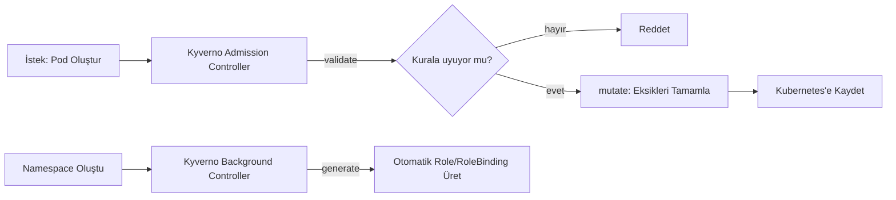

# ☸️ Kubernetes Güvenlik Araçları — Kyverno, NeuVector

Roadmap'in dışında iki güvenlik aracını (Kyverno, NeuVector) işledim. Bu süreçte ayrıca Faz 29'dan beri backlog'da bekleyen **Vagrant'ı kendi bilgisayarında deneme** maddesini de tamamladım.

---

## 1. Kyverno



**Yazılım örneği:** Bir binaya giriş kontrolü yapan bir güvenlik görevlisi gibi — sadece kurallara uyanları içeri alıyor (validate), eksik olanı tamamlatıyor (mutate: "kimliğini tak" gibi), ve yeni bir departman açıldığında otomatik olarak gerekli erişim kartlarını üretiyor (generate).

**Gerçek işlevi:** Kyverno, Kubernetes'e **admission webhook** olarak entegre olan bir politika motoru — Faz 34'teki Pod Security Admission'dan çok daha esnek, çünkü **hazır kurallar** yerine **kendi yazdığın herhangi bir kuralı** uygulayabiliyor.

**Çapraz referans:** Faz 34'teki PSA testiyle karşılaştırınca — PSA sadece **reddedebiliyordu**, Kyverno hem **reddedebiliyor** hem **otomatik düzeltebiliyor** hem de **başka kaynaklar üretebiliyor.** Kurulumda `ClusterPolicy`'nin (`kyverno.io`) kullanımdan kaldırılmaya başlandığını, yerine `policies.kyverno.io` (`ValidatingPolicy` vb.) geldiğini araştırdım.

Gerçek testle kanıtladım:

- **Validate:** `team` etiketi olmayan bir pod, admission aşamasında **`Forbidden`** hatasıyla reddedildi; etiketli pod başarıyla oluştu.
- **Mutate:** Etiketsiz bir pod'a `team=unassigned` **otomatik eklendi**; `+(team)` koşullu sözdizimiyle, **zaten etiketli** bir pod'un etiketine **hiç dokunulmadığı** (sadece eksikse eklendiği) kanıtlandı.
- **Generate:** Yeni bir namespace açılınca, **elle hiçbir şey yazmadan**, bir `ResourceQuota` (kendi örneğim) ve ardından örnekle **bir `Role` + `RoleBinding` çifti** otomatik oluştu.

**Gerçek hata ayıklama:** Örneği uygularken iki gerçek engelle karşılaştım — (1) güncel Kyverno'da `generate` bloğunda `apiVersion` artık **zorunlu** (eskiden değildi), (2) Kyverno'nun kendi `background-controller`'ı, **kendisinin sahip olmadığı bir RBAC yetkisini başkasına veremiyor** (Kubernetes'in yetki yükseltme koruması — Faz 31'deki "en az yetki" prensibinin ileri bir uygulaması). Bir `ClusterRole` ekleyip Kyverno'ya gerekli izni vererek çözdüm.

**YAML:**

```yaml
apiVersion: kyverno.io/v1
kind: ClusterPolicy
metadata:
  name: generate-role-and-rolebinding
spec:
  rules:
    - name: create-default-role
      match:
        resources:
          kinds:
            - Namespace
      generate:
        apiVersion: rbac.authorization.k8s.io/v1
        kind: Role
        name: default-role
        namespace: "{{request.object.metadata.name}}"
        data:
          rules:
            - apiGroups: [""]
              resources: ["pods"]
              verbs: ["get", "list"]
```

---

## 2. NeuVector

**Yazılım örneği:** Bir binanın sürekli çalışan güvenlik kamerası ve alarm sistemi gibi — Kyverno'nun "kapıda kimlik kontrolü" yapmasının aksine, NeuVector **binanın içindeki her şeyi sürekli tarayıp**, bilinen tehlikeleri (güvenlik açıkları) raporluyor.

**Gerçek işlevi:** NeuVector, çalışan container'ları ve node'ların işletim sistemini **gerçek zamanlı** tarayıp, güncel bir CVE (bilinen güvenlik açığı) veritabanıyla karşılaştırıyor.

**Çapraz referans:** Kurulum, `pod-security.kubernetes.io/enforce=privileged` etiketi gerektiriyor — bu, Faz 34'teki `restricted` PSA testimizin **tam tersi** bir gereksinim, NeuVector'ın kendi bileşenlerinin (özellikle `enforcer`) derin sistem erişimine ihtiyaç duyduğunu gösteriyor.

**Gerçek altyapı kısıtı ve çözümü:** Staj boyunca kullanılan VPS'e kurulduğunda, `scanner`/`enforcer` bileşenleri **sürekli `Evicted`** oldu — node'un `DiskPressure` durumuna girmesi nedeniyle (Faz 33'teki geçici disk-pressure deneyiminin, bu sefer **kalıcı** bir versiyonu). Bu, gerçek bir kaynak yetersizliğiydi, kod/yapılandırma hatası değil.

**Çözüm — Vagrant (backlog çözümü):** Faz 29'dan beri bekleyen **"Vagrant'ı kendi bilgisayarında deneme"** maddesini bu vesileyle tamamladım. Kendi bilgisayarımda, daha önce kurup hiç kullanmadığım bir Rocky Linux VM'i bulup (`vagrant global-status`), kaynaklarını (`1.9GB→7.7GB RAM`, `2→4 CPU`) artırıp, **sıfırdan bir kubeadm cluster'ı kurdum** (Rocky Linux'un `dnf` paket yöneticisi, SELinux ayarı gibi Ubuntu'dan farklı adımlarla). Bu yeni, bol kaynaklı ortamda NeuVector **hiç tahliye olmadan** çalıştı.

Gerçek testle kanıtladım: Web arayüzüne (bootstrap secret'tan alınan gerçek şifreyle) giriş yaptım, **374 gerçek CVE**'yi (CVSS skorları, "düzeltilmiş sürüm" önerileriyle birlikte) canlı olarak gördüm.

**YAML/Komut:**

```bash
kubectl label namespace neuvector "pod-security.kubernetes.io/enforce=privileged"
helm install neuvector neuvector/core --namespace neuvector
kubectl get secret --namespace neuvector neuvector-bootstrap-secret \
  -o go-template='{{.data.bootstrapPassword|base64decode}}{{"\n"}}'
```

---

## 3. Vagrant (Backlog Çözümü)

**Yazılım örneği:** Bilgisayarının içinde, tamamen izole, "sıfırlanabilir" bir test laboratuvarı kurmak gibi.

**Gerçek işlevi:** `Vagrant`, sanal makineleri (VM) kod ile (bir `Vagrantfile`) tanımlayıp yönetmeyi sağlıyor — VPS'e ihtiyaç duymadan, kendi bilgisayarında gerçek bir Linux ortamı.

**Çapraz referans:** Faz 29'da bu konuyu sadece **kavramsal** işlemiş, hiç denememiştim. Bugün, **gerçek bir ihtiyaç** (NeuVector'ın kaynak yetersizliği) ortaya çıkınca, bu backlog maddesi **doğal olarak** tamamlandı.

Gerçek testle kanıtladım: `vagrant global-status` ile daha önce unutulmuş bir VM'i buldum; `Vagrantfile`'a `vmware_desktop` provider bloğu ekleyip kaynakları artırdım (bu süreçte bir Ruby sözdizimi hatasını da düzelttim); VM içine kubeadm ile **sıfırdan bir Kubernetes cluster'ı** kurdum.

**YAML (Vagrantfile eklentisi):**

```ruby
config.vm.provider "vmware_desktop" do |v|
  v.vmx["memsize"] = "8192"
  v.vmx["numvcpus"] = "4"
end
```

---

## 📊 Özet

| Araç      | Ne İşe Yarar                                                                                   |
| --------- | ---------------------------------------------------------------------------------------------- |
| Kyverno   | Kubernetes kaynaklarının oluşturulmasını kurallarla kontrol eder (reddet/düzelt/otomatik üret) |
| NeuVector | Çalışan sistemleri gerçek zamanlı tarayıp bilinen güvenlik açıklarını raporlar                 |
| Vagrant   | Kendi bilgisayarında, VPS'e ihtiyaç duymadan izole bir test ortamı kurar                       |

---

ℹ️ _Kyverno testleri hem staj VPS'inde hem Vagrant VM'inde, NeuVector testi sadece Vagrant VM'inde (gerçek kaynak kısıtı nedeniyle VPS'te başarısız olduktan sonra) yapılmıştır. Süreç boyunca birden fazla gerçek engel (Kyverno'nun eski `apiVersion` gereksinimi, RBAC yetki yükseltme koruması, VPS disk kapasitesi) tespit edilip çözülmüştür._
