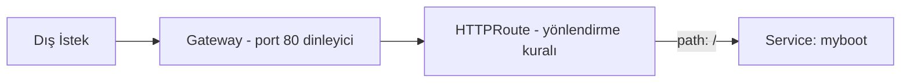

# ☸️ Kubernetes İleri Düzey Konular — Ağ Yapılandırması, Gateway API, Kubectl Shortcuts

Faz 35'te Kyverno ve NeuVector'ı işlemiştim. Bu fazda roadmap'in İleri Düzey Konular bölümünü işledim — üç konu, hepsi gerçek testlerle kanıtlandı.

---

## 1. Ağ Yapılandırması

**Yazılım örneği:** Bir elektrik prizinin fiziksel standardını (CNI spesifikasyonu) bilmek yetmez — hangi şirketin ürettiği kabloyu (Calico, Flannel gibi) kullandığını da bilmen gerekir. CNI, "arayüz standardı"; Calico, o standardı **uygulayan** bir üründür.

**Gerçek işlevi:** Faz 28'de CNI'yi sadece kavramsal olarak işlemiştim — bu fazda **gerçek dosyalarını** inceledim.

**Çapraz referans:** `/etc/cni/net.d/10-calico.conflist` dosyasında, Calico'nun **üç ayrı plugin'i zincirlediğini** gördüm: `calico` (ana ağ kurulumu), `portmap` (Faz 30'daki NodePort mantığının alt katmanı), ve **`bandwidth`** (hiç değinmediğim bir özellik). `/opt/cni/bin/`'de Calico'nun kendi ikili dosyalarının yanında, hiç kullanılmayan ama hazır duran `flannel`, `bridge`, `macvlan` gibi **başka CNI eklentilerinin de** kurulu olduğunu gördüm — CNI'nin gerçekten takılıp çıkarılabilir bir standart olduğunun kanıtı.

Araştırırken, GitHub'da **eski, belgelenmiş bir birim hatası** buldum: _"`kubernetes.io/egress-bandwidth: "1M"` yazınca, aslında sadece `1Kbit` uygulanıyor."_ Gerçek testle bunun **artık düzeldiğini** kanıtladım — `tc qdisc show` çıktısı doğru şekilde `rate 1Mbit` gösterdi, ve `iperf3` ile ölçülen gerçek trafik de bunu doğruladı: ilk saniye biriken "kredi" (`burst: ~20MB`) sayesinde `182 Mbit/s`'e çıktı, kredi bitince `0 bit/s`'e düştü — ortalamada `1 Mbit/s`'e zorlanan bir davranış (token bucket mekanizması).

**YAML:**

```yaml
apiVersion: v1
kind: Pod
metadata:
  name: bw-client
  annotations:
    kubernetes.io/egress-bandwidth: "1M"
spec:
  containers:
    - name: iperf
      image: networkstatic/iperf3
      command: ["sleep", "infinity"]
```

---

## 2. Gateway API



**Yazılım örneği:** Ingress'in "sadece HTTP yönlendirebilen" bir resepsiyon görevlisi olduğunu düşünürsen, Gateway API **çok dilli, her türlü misafiri** (HTTP, gRPC, ham TCP/UDP) yönlendirebilen bir resepsiyon şefi.

**Gerçek işlevi:** `Gateway` kaynağı bir "dinleyici" tanımlıyor (hangi port/protokol açık); `HTTPRoute` ise **asıl yönlendirme mantığını** taşıyor — Ingress'teki `rules` alanının yerini alan, ama çok daha esnek bir yapı.

**Çapraz referans:** Sayfadaki NGINX Gateway Fabric kurulum komutunun **eksik/hatalı** olduğunu buldum — `helm upgrade` diyordu ama önce hiç `helm install` adımı yoktu, sanki zaten kurulu bir sürümü güncelliyormuş gibi. Doğru ilk kurulum komutunu (`helm install`) araştırıp kullandım. Gateway API'nin CRD listesinde (`httproutes`, `grpcroutes`, `tcproutes`, `tlsroutes`, `udproutes`), Ingress'in **desteklemediği** protokollerin de olduğunu — Faz 31'deki `kubectl explain service.spec`'te path/host alanı olmadığını, Ingress'te ise sadece HTTP path/host olduğunu gösteren testle karşılaştırınca — gördüm.

Gerçek testle kanıtladım: kurulan `Gateway` + `HTTPRoute` zincirinin, Faz 30'daki `myboot` uygulamasına **gerçekten** trafik yönlendirdiğini (`curl` ile `NodePort` üzerinden gerçek cevap alındı).

**YAML:**

```yaml
apiVersion: gateway.networking.k8s.io/v1
kind: Gateway
metadata:
  name: my-nodeport-gateway
  namespace: nginx-gateway
spec:
  gatewayClassName: nginx
  listeners:
    - name: http
      protocol: HTTP
      port: 80
      allowedRoutes:
        namespaces:
          from: All
---
apiVersion: gateway.networking.k8s.io/v1
kind: HTTPRoute
metadata:
  name: my-app-route
  namespace: gwtest
spec:
  parentRefs:
    - name: my-nodeport-gateway
      namespace: nginx-gateway
  rules:
    - matches:
        - path:
            type: PathPrefix
            value: /
      backendRefs:
        - name: myboot
          port: 8080
```

---

## 3. Kubectl Shortcuts

**Yazılım örneği:** Bir klavyede sık kullanılan bir kombinasyona (`Ctrl+C`, `Ctrl+V`) kısayol atamak gibi — uzun bir komutu, hafızada tutulması kolay birkaç harfe indirmek.

**Gerçek işlevi:** `alias` (sabit metin kısaltması) ve `function` (parametre alabilen, mantık içerebilen kısaltma) — ikisi arasındaki fark, `kns` (namespace değiştiren) ve `kx` (pod içine giren) gibi **parametreli** kısayolların neden `alias` değil `function` olarak tanımlanması gerektiğini gösterdi.

**Çapraz referans:** Sayfadaki çok satırlı kısayol tanımlarını `.bashrc`'ye eklerken, **çok satırlı `heredoc` (`cat <<EOF`) bloğunun terminalde bozulduğunu** ve hiçbir şeyin gerçekte eklenmediğini gerçek testle fark ettim — dosyayı kontrol etmeden "eklendi" varsaymanın riskini kanıtladı. Tek satırlık `echo >>` komutlarıyla düzelttim.

Gerçek testle kanıtladım: `kns kube-system` komutunun, uzun `kubectl config set-context --current --namespace=kube-system` komutunu **birebir** yerine getirdiğini (sonraki `kgp` komutu gerçekten `kube-system` pod'larını listeledi); `kx with-label-pod` komutunun, `kubectl exec -it with-label-pod -- bash`'in yerine geçip **gerçekten pod'un içine girdiğini** (`root@with-label-pod:/#` prompt'u).

**YAML/Komut:**

```bash
kns() { kubectl config set-context --current --namespace="$1"; }
kx() { kubectl exec -it "$1" -- bash; }
```

---

## 📊 Özet

| Konu              | Ne Öğrendim                                                                                      |
| ----------------- | ------------------------------------------------------------------------------------------------ |
| Ağ Yapılandırması | CNI, gerçek dosyalarla somutlaştı; eski bir bandwidth birim hatasının artık düzeldiği kanıtlandı |
| Gateway API       | Ingress'in daha esnek, çok protokollü halefi; eksik kurulum komutu bulunup düzeltildi            |
| Kubectl Shortcuts | alias/function farkı, ve heredoc'un terminalde bozulma riski gerçek testle görüldü               |

---

ℹ️ _Tüm testler gerçek bir Ubuntu VPS üzerinde (Kubespray cluster'ında) yapılmıştır — her konu yazılım ekosisteminden bir örnekle, gerçek işleviyle, ilgili fazlara çapraz referansla, ve gerçek YAML/kubectl testleriyle kanıtlanmıştır. Süreç boyunca bir eski GitHub hatasının artık geçerli olmadığı, bir kurulum komutunun eksik olduğu, ve bir heredoc bloğunun terminalde sessizce başarısız olduğu tespit edilip düzeltilmiştir._
