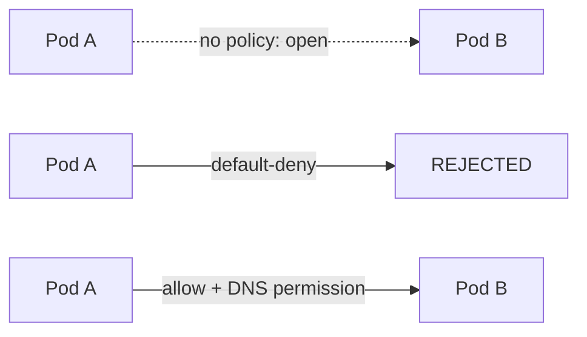

# ☸️ Kubernetes Security — Overview, Admission Controllers, Network Policy, RBAC, Admission Policy, Image Security, Manifest Security, CIS Benchmark, System Hardening, Kubespray Hardening

Phase 36 completed Advanced Topics. This phase covered the roadmap's **final section**, Security — nine topics, each proven with real tests, or (in one case) an honest "tried, couldn't resolve" note. This is the phase where **the entire Kubernetes roadmap is complete**.

---

## 0. Overview — Three Principles

The section's intro page defines the **three principles** everything else rests on: **Defense in Depth** (layered defense — not relying on a single safeguard), **Least Privilege** (granting only what's needed), **Attack Surface reduction** (shrinking the surface — closing unneeded services/ports). Every topic in this phase maps to at least one of these three.

---

## 1. Admission Controllers

**Software example:** A security checkpoint scanning every package entering a building — the package (request) is inspected before it enters the building (Kubernetes).

**Real function:** Admission controllers are plugins that inspect every request to the Kubernetes API **right before it's recorded**.

**Cross-reference:** Clarified the difference between Phase 31's `ResourceQuota` (a limit on the namespace's **total**) and this phase's `LimitRanger` (assigning default values to **each individual** pod).

Proved with real tests: that `NodeRestriction` is **genuinely enabled** in kube-apiserver (`enable-admission-plugins=NodeRestriction`); that in a namespace with a `LimitRange` defined, a pod opened with no `resources` specified **automatically** got `limits`/`requests` assigned.

**YAML:**

```yaml
apiVersion: v1
kind: LimitRange
metadata:
  name: default-limits
spec:
  limits:
    - default:
        cpu: "500m"
        memory: "256Mi"
      defaultRequest:
        cpu: "200m"
        memory: "128Mi"
      type: Container
```

---

## 2. Network Policy



**Software example:** Like an office building where every door is open by default, until security switches to a "default locked, only allowed doors open" policy.

**Real function:** Kubernetes' default network behavior is **open to everything** — Network Policy turns this into a **default-deny plus allow-list** logic.

**Cross-reference:** Phase 28/36's Calico (CNI) knowledge comes into play here — the component **enforcing** Network Policy is Calico itself.

Proved with real tests: that with no policy, two pods talk freely; that after `default-deny-all`, **both DNS and pod-to-pod traffic** were entirely cut off (proved DNS was affected too by isolating with a direct IP — a common gotcha); that adding specific `allow` rules (including DNS permission) restored access **exactly**.

**YAML:**

```yaml
apiVersion: networking.k8s.io/v1
kind: NetworkPolicy
metadata:
  name: default-deny-all
spec:
  podSelector: {}
  policyTypes:
    - Ingress
    - Egress
```

---

## 3. RBAC

**Software example:** Phase 31 compared RBAC to a company's user/role system — this phase deepened it with a "promotion" scenario where **the ID card stays fixed, only the job description changes**.

**Real function:** Phase 31 covered `ServiceAccount`-based RBAC — this phase created a **real Kubernetes `User`** from scratch (certificate-based, a completely different authentication method from ServiceAccount).

**Cross-reference:** `automountServiceAccountToken: false` is a real application of today's overview page's "Attack Surface reduction" principle — if a pod doesn't need the API, its identity token is never mounted at all.

Proved with real tests: that a pod with `automountServiceAccountToken: false` has **no** token directory at all; generated a real CSR with `openssl` (using Phase 31's TLS knowledge), approved it with `kubectl certificate approve`, creating a real user named **`jane`**; that when this user only had `list` permission, `get` returned **`no`** (verbs don't substitute for each other); that `--as` impersonation works without switching context; "promoted" `jane` to `cluster-admin` via a `ClusterRoleBinding` **without changing any certificate**.

**YAML:**

```yaml
apiVersion: certificates.k8s.io/v1
kind: CertificateSigningRequest
metadata:
  name: jane-csr
spec:
  groups:
    - system:authenticated
  request: <base64 CSR>
  signerName: kubernetes.io/kube-apiserver-client
  usages:
    - client auth
```

---

## 4. Admission Policy

**Software example:** RBAC asks "who can do what" (a simple yes/no) while Admission Policy asks "**in what way** is this being done" (a finer, content-aware question).

**Real function:** This topic was **already deeply covered** in Phase 35 (Kyverno/NeuVector) — the `validate`/`mutate`/`generate` capabilities were proven with real tests there.

**Cross-reference:** Clarified the difference between RBAC's "is it allowed" and Admission Policy's "is it allowed this way" with a concrete example (a user permitted to create pods but attempting a privileged one).

---

## 5. Image Security

**Software example:** Topics like multistage builds and non-root users were already deeply covered in Phase 25 (Docker Security) — this phase added **how this gets enforced at the Kubernetes level**.

**Real function:** A Dockerfile's `USER` setting is a decision **baked into the image, optional**; Kubernetes' `runAsNonRoot: true` is a rule **imposed from outside, mandatory**. Together, an example of "Defense in Depth."

**Cross-reference:** Directly connected to today's "least privilege" discussion — Kubernetes offering a **second security layer** even when the image's own setting falls short.

Proved with real tests: that the standard `nginx` image **runs as root** (`whoami` → `root`); that adding `runAsNonRoot: true` to the same image made Kubernetes reject the container **without ever starting it**, with the error `"container has runAsNonRoot and image will run as root"`.

---

## 6. Manifest Security

**Software example:** `readOnlyRootFilesystem` is like telling a tenant "you can't alter the apartment's walls" — the tenant (container) can use the apartment (filesystem) but can't make **permanent changes**.

**Real function:** `runAsNonRoot`, `readOnlyRootFilesystem`, `allowPrivilegeEscalation: false`, `capabilities: drop: ALL` — all four are different faces of the **same logic** (never grant an unneeded permission).

**Cross-reference:** Clarified how, even if an attacker breaches a container (Attack Surface is a separate topic), they're prevented from leaving a **permanent change** (Least Privilege).

Proved with a real test: that a container with `readOnlyRootFilesystem: true` got a **`Read-only file system`** error when trying to create a file with `touch`.

**YAML:**

```yaml
securityContext:
  readOnlyRootFilesystem: true
  allowPrivilegeEscalation: false
  privileged: false
  capabilities:
    drop:
      - ALL
```

---

## 7. CIS Benchmark

**Software example:** Like a building's fire safety audit — checking every single rule one by one (is there a fire door, does the alarm work), producing a **numerical scorecard** at the end.

**Real function:** `kube-bench` automatically checks **hundreds of rules** from the CIS Kubernetes Benchmark, producing a PASS/FAIL/WARN report.

**Cross-reference:** Found the page's install link (`github.com/.../blob/main/job.yaml`) pointed to **GitHub's HTML viewer page** (not raw YAML), used the correct `raw.githubusercontent.com` address instead. The results directly matched **today's other tests** — `NodeRestriction` **PASS** (confirming the Admission Controllers test), `--audit-log-path` **FAIL** (foreshadowing the System Hardening gap).

Proved with a real test: `63 PASS, 16 FAIL, 52 WARN` — the cluster's real, numerical security posture.

---

## 8. System Hardening

**Software example:** AppArmor/seccomp were already covered in Phase 25 — this phase focused on **Audit Logging**, since kube-bench had just proven it was missing.

**Real function:** Audit logging keeps a record of **every request** to the API server — who, when, what.

**Honest finding — an unresolved attempt:** Added the audit flags (`--audit-policy-file`, `--audit-log-path`) to the `kube-apiserver.yaml` static pod manifest with correct syntax, restarted `kubelet`, manually deleted the container/sandbox, temporarily removed and restored the manifest — **the cluster stayed healthy through every attempt** (a real, repeated demonstration of Kubernetes' self-healing ability), but the audit settings **never made it into the running process.** Per a clue found on the Kubespray Hardening page, this is likely due to **Kubespray's own Ansible mechanism** unexpectedly interfering with manual manifest edits — the exact cause was not found, and this is recorded as a **genuine, unresolved finding**.

Proved with a real test (Attack Surface): using `ss -tlpn`, found the server had ports open (`3128`, `88`, `80`, `443`, `8765`) **not belonging to Kubernetes** — concrete proof that today's "Kubernetes nodes should only do Kubernetes" principle is **genuinely violated** on this server (due to the VPS being shared with other projects).

---

## 9. Kubespray Hardening

**Software example:** Like a manufacturer's "security package" option — a single switch (`kubespray hardening: true`) turns on dozens of separate security settings **at once**.

**Real function:** Kubespray's hardening mode makes **simultaneous** changes to kube-apiserver (audit logging, TLS 1.2, encryption at rest, extra admission plugins), kubelet (certificate rotation, disabling the read-only port), etcd (host-mode), and scheduler/controller-manager (restricting to `127.0.0.1`).

**Cross-reference:** `kubelet_rotate_server_certificates` directly connects to today's **CSR/certificate approval** experience (the jane test) — enabling this setting requires a similar approval process **for nodes themselves**. Researched that the page's `pod-security.kubernetes.io/exempt: "true"` label is **not an official Kubernetes feature**, and proved with a real test it has **no effect whatsoever** — `baseline` enforcement kept rejecting a privileged pod even with this label present.

Proved with a real test: that even in a namespace labeled `pod-security.kubernetes.io/exempt: "true"`, the `baseline` policy **still rejected** a privileged pod — the page's claim on this is **incorrect information**.

---

## 📊 Summary

| Topic                 | What Was Learned                                                                                      |
| --------------------- | ----------------------------------------------------------------------------------------------------- |
| Overview              | Defense in Depth, Least Privilege, Attack Surface — the three principles underlying the whole section |
| Admission Controllers | NodeRestriction confirmed; LimitRanger auto-assigns default values                                    |
| Network Policy        | Default open → closed with default-deny → open again with specific rules (DNS included)               |
| RBAC                  | Real CSR-based User, --as impersonation, get/list distinction, "promotion" to cluster-admin           |
| Admission Policy      | RBAC asks "who," Admission Policy asks "in what way" (connects to Phase 35)                           |
| Image Security        | When an image's root setting conflicts with Kubernetes' runAsNonRoot rule, Kubernetes wins            |
| Manifest Security     | readOnlyRootFilesystem prevents a permanent change after a breach                                     |
| CIS Benchmark         | Real, numerical audit with kube-bench: 63 PASS, 16 FAIL, 52 WARN                                      |
| System Hardening      | Audit logging attempt unresolved (honest finding); Attack Surface violation proven via open ports     |
| Kubespray Hardening   | Proved the `pod-security.../exempt` label is fake; hardening mode changes dozens of settings at once  |

---

ℹ️ _All tests were performed on a real Ubuntu VPS (on the Kubespray cluster). This phase marks **the completion of the entire Kubernetes roadmap** — all nine main sections, from Fundamental Concepts to Security, proven with real tests. Along the way, multiple outdated/incorrect sources (kube-bench's broken GitHub link, the fake `pod-security.../exempt` label) were identified and corrected; one topic (Audit Logging) documents a genuine, honestly unresolved engineering challenge._
