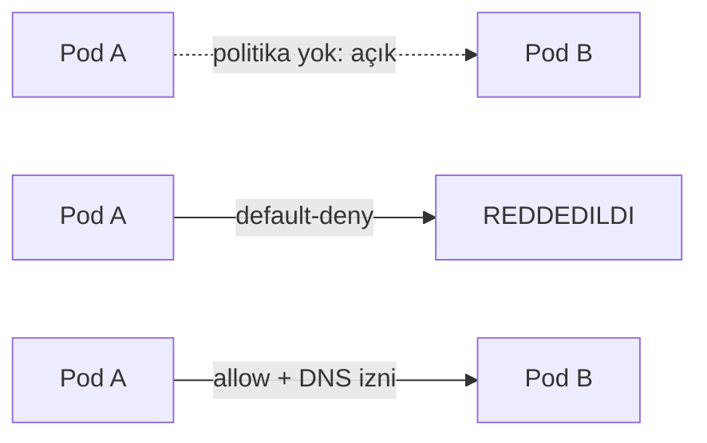

# ☸️ Kubernetes Güvenlik — Genel Bakış, Admission Controllers, Network Policy, RBAC, Admission Policy, İmaj Güvenliği, Manifest Güvenliği, CIS Benchmark, System Hardening, Kubespray Hardening

Faz 36'da İleri Düzey Konular'ı tamamlamıştım. Bu fazda roadmap'in **son bölümü** olan Güvenlik'i işledim — dokuz konu, hepsi gerçek testlerle, ya da (bir konuda) dürüst bir "denendi, çözülemedi" notuyla kanıtlandı. Bu, **tüm Kubernetes roadmap'inin tamamlandığı** fazdır.

---

## 0. Genel Bakış — Üç Prensip

Bölümün giriş sayfası, geri kalan her konunun dayandığı **üç prensibi** tanımlıyor: **Defense in Depth** (katmanlı savunma — tek bir önleme güvenmemek), **Least Privilege** (en az yetki — sadece ihtiyaç kadar izin vermek), **Attack Surface azaltma** (saldırı yüzeyini küçültmek — gereksiz servisleri/portları kapatmak). Bu fazdaki her konu, bu üçünden en az birine karşılık geliyor.

---

## 1. Admission Controllers

**Yazılım örneği:** Bir binaya giren her paketi tarayan güvenlik kontrol noktası — paket (istek) binaya (Kubernetes'e) girmeden önce kontrol ediliyor.

**Gerçek işlevi:** Admission controller'lar, Kubernetes API'sine gelen her isteği **kaydedilmeden hemen önce** inceleyen eklentiler.

**Çapraz referans:** Faz 31'deki `ResourceQuota` (namespace'in **toplamına** sınır) ile bu fazda test ettiğim `LimitRanger` (her pod'a **tek tek** varsayılan değer atama) arasındaki farkı netleştirdim.

Gerçek testle kanıtladım: kube-apiserver'da `NodeRestriction`'ın **gerçekten etkin** olduğunu (`enable-admission-plugins=NodeRestriction`); `LimitRange` tanımlı bir namespace'te, hiç `resources` belirtmeden açılan bir pod'a **otomatik olarak** `limits`/`requests` değerlerinin atandığını.

**YAML:**

```yaml
apiVersion: v1
kind: LimitRange
metadata:
  name: default-limits
spec:
  limits:
    - default:
        cpu: "500m"
        memory: "256Mi"
      defaultRequest:
        cpu: "200m"
        memory: "128Mi"
      type: Container
```

---

## 2. Network Policy



**Yazılım örneği:** Bir ofis binasında varsayılan olarak **her kapı açık** iken, güvenlik ekibinin "varsayılan kilitli, sadece izin verilenler açık" politikasına geçmesi gibi.

**Gerçek işlevi:** Kubernetes'in varsayılan ağ davranışı **her şeye açık** — Network Policy, bunu **varsayılan reddet + izin verilenler** mantığına çeviriyor.

**Çapraz referans:** Faz 28/36'daki Calico (CNI) bilgisi burada devreye giriyor — Network Policy'yi **uygulayan** bileşen Calico'nun kendisi.

Gerçek testle kanıtladım: politika yokken iki pod'un serbestçe konuştuğunu; `default-deny-all` sonrası **hem DNS hem pod-to-pod trafiğinin** tamamen kesildiğini (IP ile izole ederek DNS'in de etkilendiğini kanıtladım — sık yapılan bir hata); özel `allow` kuralları (DNS izni dahil) eklenince erişimin **tam olarak** geri geldiğini.

**YAML:**

```yaml
apiVersion: networking.k8s.io/v1
kind: NetworkPolicy
metadata:
  name: default-deny-all
spec:
  podSelector: {}
  policyTypes:
    - Ingress
    - Egress
```

---

## 3. RBAC

**Yazılım örneği:** Faz 31'de RBAC'ı bir şirketin kullanıcı/rol sistemine benzetmiştim — bu fazda, **kimlik kartının sabit kaldığı, sadece iş tanımının değiştiği** bir "terfi" senaryosuyla derinleştirdim.

**Gerçek işlevi:** Faz 31, `ServiceAccount` tabanlı RBAC'ı işlemişti — bu fazda **gerçek bir Kubernetes `User`**'ı (sertifika tabanlı, ServiceAccount'tan tamamen farklı bir kimlik doğrulama yöntemi) sıfırdan oluşturdum.

**Çapraz referans:** `automountServiceAccountToken: false`, bugünkü genel bakış sayfasının "Attack Surface azaltma" prensibinin gerçek uygulaması — bir pod'un API'ye ihtiyacı yoksa, kimlik token'ı hiç monte edilmiyor.

Gerçek testle kanıtladım: `automountServiceAccountToken: false` olan pod'da token dizininin **hiç olmadığını**; `openssl` ile (Faz 31'deki TLS bilgimle) gerçek bir CSR üretip, `kubectl certificate approve` ile onaylayıp, **`jane`** adlı gerçek bir kullanıcı oluşturduğumu; bu kullanıcının sadece `list` yetkisi olduğunda `get`'in **`no`** döndüğünü (fiillerin birbirinin yerine geçmediği); `--as` ile context değiştirmeden kimlik taklit etmenin çalıştığını; `jane`'i bir `ClusterRoleBinding` ile **hiçbir sertifika değişmeden** `cluster-admin`'e "terfi ettirdiğimi".

**YAML:**

```yaml
apiVersion: certificates.k8s.io/v1
kind: CertificateSigningRequest
metadata:
  name: jane-csr
spec:
  groups:
    - system:authenticated
  request: <base64 CSR>
  signerName: kubernetes.io/kube-apiserver-client
  usages:
    - client auth
```

---

## 4. Admission Policy

**Yazılım örneği:** RBAC "kim ne yapabilir" (basit evet/hayır) sorarken, Admission Policy "bu **ne şekilde** yapılıyor" (içeriğe bakan, daha ince) sorusunu soruyor.

**Gerçek işlevi:** Bu konu, Faz 35'te (Kyverno/NeuVector) **zaten derinlemesine** işlenmişti — `validate`/`mutate`/`generate` üç yeteneği gerçek testlerle kanıtlamıştım.

**Çapraz referans:** RBAC'ın "izin var mı" sorusuyla Admission Policy'nin "bu şekilde izin var mı" sorusu arasındaki farkı, somut bir örnekle (yetkili ama ayrıcalıklı pod açmaya çalışan bir kullanıcı) netleştirdim.

---

## 5. İmaj Güvenliği

**Yazılım örneği:** Multistage build, root olmayan kullanıcı gibi konular Faz 25'te (Docker Güvenliği) zaten derinlemesine işlenmişti — bu fazda, bunun **Kubernetes seviyesinde nasıl zorunlu kılındığını** ekledim.

**Gerçek işlevi:** Dockerfile'daki `USER` ayarı **image'e gömülü, isteğe bağlı** bir karar; Kubernetes'teki `runAsNonRoot: true` ise **dışarıdan dayatılan, zorunlu** bir kural. İkisi birlikte "Defense in Depth" örneği.

**Çapraz referans:** Bugünkü "least privilege" tartışmasıyla doğrudan bağlantılı — image'in kendi ayarı yetersiz kalsa bile Kubernetes'in **ikinci bir güvenlik katmanı** sunması.

Gerçek testle kanıtladım: standart `nginx` image'inin **root olarak çalıştığını** (`whoami` → `root`); aynı image'e `runAsNonRoot: true` koyunca, Kubernetes'in container'ı **hiç başlatmadan**, `"container has runAsNonRoot and image will run as root"` hatasıyla reddettiğini.

---

## 6. Manifest Güvenliği

**Yazılım örneği:** `readOnlyRootFilesystem`, bir kiracıya "dairenin duvarlarını değiştiremezsin" demek gibi — kiracı (container) daireyi (dosya sistemini) kullanabilir ama **kalıcı değişiklik** yapamaz.

**Gerçek işlevi:** `runAsNonRoot`, `readOnlyRootFilesystem`, `allowPrivilegeEscalation: false`, `capabilities: drop: ALL` — dördü de **aynı mantığın** (gereksiz yetkiyi hiç verme) farklı yüzleri.

**Çapraz referans:** Bir saldırganın container'a sızsa bile (Attack Surface farklı bir konu), **kalıcı bir değişiklik bırakamamasının** (Least Privilege) nasıl sağlandığını netleştirdim.

Gerçek testle kanıtladım: `readOnlyRootFilesystem: true` olan bir container'ın, `touch` ile dosya oluşturmaya çalışınca **`Read-only file system`** hatası aldığını.

**YAML:**

```yaml
securityContext:
  readOnlyRootFilesystem: true
  allowPrivilegeEscalation: false
  privileged: false
  capabilities:
    drop:
      - ALL
```

---

## 7. CIS Benchmark

**Yazılım örneği:** Bir binanın yangın güvenliği denetimi gibi — tek tek her kuralı (yangın kapısı var mı, alarm çalışıyor mu) kontrol edip, sonunda **sayısal bir karne** veriyor.

**Gerçek işlevi:** `kube-bench`, CIS Kubernetes Benchmark'ın **yüzlerce kuralını otomatik olarak** kontrol edip PASS/FAIL/WARN raporu üretiyor.

**Çapraz referans:** Sayfadaki kurulum linkinin (`github.com/.../blob/main/job.yaml`) **GitHub'ın HTML görüntüleme sayfasına** işaret ettiğini (ham YAML değil) bulup, doğru `raw.githubusercontent.com` adresini kullandım. Sonuçlar, **bugünkü diğer testlerimizle** birebir örtüştü — `NodeRestriction` **PASS** (Admission Controllers testimizi doğruladı), `--audit-log-path` **FAIL** (System Hardening'deki eksikliği önceden haber verdi).

Gerçek testle kanıtladım: `63 PASS, 16 FAIL, 52 WARN` — cluster'ın gerçek, sayısal güvenlik durumu.

---

## 8. System Hardening

**Yazılım örneği:** AppArmor/seccomp Faz 25'te zaten işlenmişti — bu fazda **Audit Logging**'e odaklandım, çünkü kube-bench bunun eksik olduğunu **az önce kanıtlamıştı.**

**Gerçek işlevi:** Audit logging, API server'a gelen **her isteğin** kim tarafından, ne zaman, ne yapıldığının kaydını tutuyor.

**Dürüst bulgu — çözülemeyen bir deneme:** `kube-apiserver.yaml` static pod manifest'ine audit flag'lerini (`--audit-policy-file`, `--audit-log-path`) doğru sözdizimiyle ekledim, `kubelet`'i yeniden başlattım, container'ı/sandbox'ı elle sildim, manifest'i geçici olarak kaldırıp geri koydum — **her denemede cluster sağlıklı kaldı** (Kubernetes'in kendi kendini onarma yeteneğinin gerçek, tekrarlanan kanıtı), ama audit ayarları **çalışan process'e hiç yansımadı.** Kubespray Hardening sayfasında bulduğum bir ipucuna göre, bu muhtemelen **Kubespray'in kendi Ansible mekanizmasının**, elle yapılan manifest değişikliklerini beklenmedik bir şekilde etkilemesinden kaynaklanıyor olabilir — kesin sebep bulunamadı, bu **gerçek, çözülmemiş bir bulgu** olarak kayda geçti.

Gerçek testle kanıtladım (Attack Surface): `ss -tlpn` ile, sunucuda Kubernetes'e ait olmayan (`3128`, `88`, `80`, `443`, `8765` gibi) portların **açık olduğunu** — bugünkü "Kubernetes node'ları sadece Kubernetes yapsın" prensibinin, bu sunucuda **gerçekten ihlal edildiğinin** somut kanıtı (VPS'in başka projelerle paylaşılması nedeniyle).

---

## 9. Kubespray Hardening

**Yazılım örneği:** Bir üreticinin "güvenlik paketi" seçeneği gibi — tek bir anahtarla (`kubespray hardening: true`), onlarca ayrı güvenlik ayarını **birden** açıyor.

**Gerçek işlevi:** Kubespray'in hardening modu, kube-apiserver'a (audit logging, TLS 1.2, encryption at rest, ek admission plugin'leri), kubelet'e (sertifika rotasyonu, read-only port kapatma), etcd'ye (host-mode) ve scheduler/controller-manager'a (`127.0.0.1`'e kısıtlama) **eş zamanlı** değişiklikler getiriyor.

**Çapraz referans:** `kubelet_rotate_server_certificates`, bugünkü **CSR/sertifika onaylama** deneyimimle (jane testi) doğrudan bağlantılı — bu ayar açılınca, **node'ların kendisi** için de benzer bir onay süreci gerekiyor. Sayfadaki `pod-security.kubernetes.io/exempt: "true"` etiketinin **resmi bir Kubernetes özelliği olmadığını** araştırıp, gerçek testle **hiçbir etkisi olmadığını** kanıtladım — `baseline` kısıtlaması, bu etiket varken bile ayrıcalıklı pod'u reddetmeye devam etti.

Gerçek testle kanıtladım: `pod-security.kubernetes.io/exempt: "true"` etiketli bir namespace'te bile, `baseline` politikasının ayrıcalıklı bir pod'u **hâlâ reddettiğini** — sayfadaki bu maddenin **yanlış bilgi** içerdiğini.

---

## 📊 Özet

| Konu                  | Ne Öğrendim                                                                                                   |
| --------------------- | ------------------------------------------------------------------------------------------------------------- |
| Genel Bakış           | Defense in Depth, Least Privilege, Attack Surface — tüm bölümün üç temel prensibi                             |
| Admission Controllers | NodeRestriction doğrulandı; LimitRanger otomatik varsayılan değer atıyor                                      |
| Network Policy        | Varsayılan açık → default-deny ile kapalı → özel izinlerle (DNS dahil) tekrar açık                            |
| RBAC                  | Gerçek CSR tabanlı User, --as taklit, get/list farkı, cluster-admin'e "terfi"                                 |
| Admission Policy      | RBAC "kim" sorar, Admission Policy "ne şekilde" sorar (Faz 35 ile bağlantılı)                                 |
| İmaj Güvenliği        | Image'in root ayarı ile Kubernetes'in runAsNonRoot kuralı çakışınca Kubernetes kazanır                        |
| Manifest Güvenliği    | readOnlyRootFilesystem, sızma sonrası kalıcı değişikliği engeller                                             |
| CIS Benchmark         | kube-bench ile gerçek, sayısal denetim: 63 PASS, 16 FAIL, 52 WARN                                             |
| System Hardening      | Audit logging denemesi çözülemedi (dürüst bulgu); açık portlarla Attack Surface ihlali kanıtlandı             |
| Kubespray Hardening   | `pod-security.../exempt` etiketinin sahte olduğu kanıtlandı; hardening modu onlarca ayarı birden değiştiriyor |

---

ℹ️ _Tüm testler gerçek bir Ubuntu VPS üzerinde (Kubespray cluster'ında) yapılmıştır. Bu faz, **Kubernetes roadmap'inin tamamının tamamlandığı** son fazdır — Temel Kavramlar'dan Güvenlik'e kadar dokuz ana bölüm, hepsi gerçek testlerle kanıtlanmıştır. Süreç boyunca birden fazla eski/yanlış kaynak (kube-bench'in bozuk GitHub linki, sahte `pod-security.../exempt` etiketi) tespit edilip düzeltilmiş; bir konuda (Audit Logging) ise dürüstçe çözülemeyen, gerçek bir mühendislik zorluğu belgelenmiştir._
